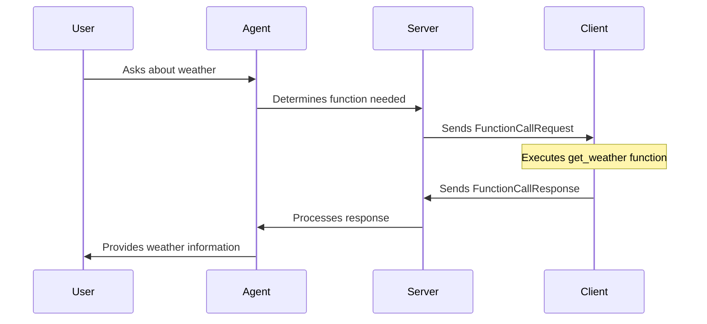

<Card
    href="https://playground.deepgram.com/?endpoint=agent"
>
  <div class="t-default text-base font-semibold">Deepgram API Playground</div>
  Try this feature out in our API Playground.
</Card>
<br/>

In this guide, you'll learn how to create a very basic voice agent using Deepgram's Agent API. Visit the [API Reference](/reference/build-a-voice-agent) for more details on how to use the Agent API.

<Warning>
You will need to migrate to the new ***Voice Agent API V1*** to continue to use the Voice Agent API. Please refer to the [Voice Agent API Migration Guide](/docs/voice-agent-v1-migration) for more information.
</Warning>

## Build a Basic Voice Agent

<Info>
  Before you start, you'll need to follow the steps in the [Make Your First API Request](/docs/make-your-first-api-request) guide to obtain a Deepgram API key, and configure your environment if you are choosing to use a Deepgram SDK.
</Info>

### 1. Set up your environment

In the steps below, you'll use the Terminal to:

1. Create a new directory for your project
2. Create a new file for your code
3. Export your Deepgram API key to the environment so you can use it in your code
4. Run any additional commands to initialize your project

<CodeGroup>
  ```shell Python
mkdir deepgram-agent-demo
cd deepgram-agent-demo
touch index.py
export DEEPGRAM_API_KEY="your_Deepgram_API_key_here"
  ```

  ```shell JavaScript
mkdir deepgram-agent-demo
cd deepgram-agent-demo
touch index.js
export DEEPGRAM_API_KEY="your_Deepgram_API_key_here"
npm init -y
  ```

  ```shell C#
# for MacOS
mkdir deepgram-agent-demo
cd deepgram-agent-demo
dotnet new console
export DEEPGRAM_API_KEY="your_Deepgram_API_key_here"

# for Windows Powershell
mkdir deepgram-agent-demo
cd deepgram-agent-demo
dotnet new console
$env:DEEPGRAM_API_KEY = "your_Deepgram_API_key_here"
  ```

  ```shell Go
mkdir deepgram-agent-demo
cd deepgram-agent-demo
touch index.go
go mod tidy
  ```
</CodeGroup>

### 2. Install the Deepgram SDK

Deepgram has several [SDKs](/docs/deepgram-sdks) that can make it easier to build a Voice Agent. Follow these steps below to use one of our SDKs to make your first Deepgram Voice Agent request.

In your terminal, navigate to the location on your drive where you created your project above, and install the Deepgram SDK and any other dependencies.

<CodeGroup>
  ```shell Python
  pip install deepgram-sdk
  ```

  ```shell JavaScript
  npm install @deepgram/sdk cross-fetch
  - or -
  yarn add @deepgram/sdk cross-fetch
  ```

  ```shell C#
  dotnet add package Deepgram
  ```

  ```shell Go
  go get github.com/deepgram/deepgram-go-sdk
  ```
</CodeGroup>

### 3. Import dependencies and set up the main function

Next, import the necessary dependencies and set up your main application function.

<CodeGroup>
  ```python Python
  # For help migrating to the new Python SDK, check out our migration guide:
  # https://github.com/deepgram/deepgram-python-sdk/blob/main/docs/Migrating-v3-to-v5.md

  # Import dependencies and set up the main function
  import requests
  import wave
  import io
  import time
  import os
  import json
  import threading
  from datetime import datetime

  from deepgram import DeepgramClient
  from deepgram.core.events import EventType
  from deepgram.extensions.types.sockets import (
      AgentV1Agent,
      AgentV1AudioConfig,
      AgentV1AudioInput,
      AgentV1AudioOutput,
      AgentV1DeepgramSpeakProvider,
      AgentV1Listen,
      AgentV1ListenProvider,
      AgentV1OpenAiThinkProvider,
      AgentV1SettingsMessage,
      AgentV1SocketClientResponse,
      AgentV1SpeakProviderConfig,
      AgentV1Think,
  )
  ```

  ```javascript JavaScript
  const { createClient, AgentEvents } = require("@deepgram/sdk");
  const { writeFile, appendFile } = require("fs/promises");
  const fetch = require("cross-fetch");
  const { join } = require("path");

  const agent = async () => {
      // The code in the following steps will go here
  };

  void agent();
  ```
  ```csharp C#
using Deepgram.Logger;
using Deepgram.Models.Authenticate.v1;
using Deepgram.Models.Agent.v2.WebSocket;
using System.Collections.Generic;
using System.Net.Http;

namespace SampleApp
{
    class Program
    {
        static async Task Main(string[] args)
        {
            try
            {
              // The code in the following steps will go here

  ```
  ```go Go
// Copyright 2024 Deepgram SDK contributors. All Rights Reserved.
// Use of this source code is governed by a MIT license that can be found in the LICENSE file.
// SPDX-License-Identifier: MIT

package main

// Import dependencies
import (
	"bufio"
	"context"
	"fmt"
	"io"
	"net/http"
	"os"
	"reflect"
	"runtime/debug"
	"strings"
	"sync"
	"time"

	msginterfaces "github.com/deepgram/deepgram-go-sdk/pkg/api/agent/v1/websocket/interfaces"
	client "github.com/deepgram/deepgram-go-sdk/pkg/client/agent"
	"github.com/deepgram/deepgram-go-sdk/pkg/client/interfaces"
)
// The code in the following steps will go here
  ```
</CodeGroup>

### 4. Initialize the Voice Agent

Now you can initialize the voice agent by creating an empty audio buffer to store incoming audio data, setting up a counter for output file naming, and defining a sample audio file URL. You can then establish a connection to Deepgram and set up a welcome handler to log when the connection is successfully established.

<CodeGroup>
  ```python Python
  # For help migrating to the new Python SDK, check out our migration guide:
  # https://github.com/deepgram/deepgram-python-sdk/blob/main/docs/Migrating-v3-to-v5.md

  def main():
    try:
        # Initialize the Voice Agent
        api_key = os.getenv("DEEPGRAM_API_KEY")
        if not api_key:
            raise ValueError("DEEPGRAM_API_KEY environment variable is not set")
        print("API Key found")

        # Initialize Deepgram client
        client = DeepgramClient(api_key=api_key)

        # Use connection as a context manager
        with client.agent.v1.connect() as connection:
            print("Created WebSocket connection...")

            # The code in the following steps will go here
  ```
  ```javascript JavaScript
  let audioBuffer = Buffer.alloc(0);
  let i = 0;
  const url = "https://dpgr.am/spacewalk.wav";
  const connection = deepgram.agent();
  connection.on(AgentEvents.Welcome, () => {
    console.log("Welcome to the Deepgram Voice Agent!");
    // The code in the following steps will go here
  });

  ```
  ```csharp C#
  // Initialize Library with default logging
                // Normal logging is "Info" level
                Deepgram.Library.Initialize(LogLevel.Debug);
                // OR very chatty logging
                //Deepgram.Library.Initialize(LogLevel.Verbose); // LogLevel.Default, LogLevel.Debug, LogLevel.Verbose

                Console.WriteLine("\n\nPress any key to stop and exit...\n\n\n");

                // Set "DEEPGRAM_API_KEY" environment variable to your Deepgram API Key
                DeepgramWsClientOptions options = new DeepgramWsClientOptions(null, null, true);
                var agentClient = ClientFactory.CreateAgentWebSocketClient(apiKey: "", options: options);

                // current time
                var lastAudioTime = DateTime.Now;
                var audioFileCount = 0;
  ```
  ```go Go
// Initialize the Voice Agent
type MyHandler struct {
	binaryChan                   chan *[]byte
	openChan                     chan *msginterfaces.OpenResponse
	welcomeResponse              chan *msginterfaces.WelcomeResponse
	conversationTextResponse     chan *msginterfaces.ConversationTextResponse
	userStartedSpeakingResponse  chan *msginterfaces.UserStartedSpeakingResponse
	agentThinkingResponse        chan *msginterfaces.AgentThinkingResponse
	agentStartedSpeakingResponse chan *msginterfaces.AgentStartedSpeakingResponse
	agentAudioDoneResponse       chan *msginterfaces.AgentAudioDoneResponse
	closeChan                    chan *msginterfaces.CloseResponse
	errorChan                    chan *msginterfaces.ErrorResponse
	unhandledChan                chan *[]byte
	injectionRefusedResponse     chan *msginterfaces.InjectionRefusedResponse
	keepAliveResponse            chan *msginterfaces.KeepAlive
	settingsAppliedResponse      chan *msginterfaces.SettingsAppliedResponse
	functionCallRequestResponse  chan *msginterfaces.FunctionCallRequestResponse
	chatLogFile                  *os.File
}

// Channel getter methods to implement AgentMessageChan interface
func (dch MyHandler) GetBinary() []*chan *[]byte {
	return []*chan *[]byte{&dch.binaryChan}
}

func (dch MyHandler) GetOpen() []*chan *msginterfaces.OpenResponse {
	return []*chan *msginterfaces.OpenResponse{&dch.openChan}
}

func (dch MyHandler) GetWelcome() []*chan *msginterfaces.WelcomeResponse {
	return []*chan *msginterfaces.WelcomeResponse{&dch.welcomeResponse}
}

func (dch MyHandler) GetConversationText() []*chan *msginterfaces.ConversationTextResponse {
	return []*chan *msginterfaces.ConversationTextResponse{&dch.conversationTextResponse}
}

func (dch MyHandler) GetUserStartedSpeaking() []*chan *msginterfaces.UserStartedSpeakingResponse {
	return []*chan *msginterfaces.UserStartedSpeakingResponse{&dch.userStartedSpeakingResponse}
}

func (dch MyHandler) GetAgentThinking() []*chan *msginterfaces.AgentThinkingResponse {
	return []*chan *msginterfaces.AgentThinkingResponse{&dch.agentThinkingResponse}
}

func (dch MyHandler) GetAgentStartedSpeaking() []*chan *msginterfaces.AgentStartedSpeakingResponse {
	return []*chan *msginterfaces.AgentStartedSpeakingResponse{&dch.agentStartedSpeakingResponse}
}

func (dch MyHandler) GetAgentAudioDone() []*chan *msginterfaces.AgentAudioDoneResponse {
	return []*chan *msginterfaces.AgentAudioDoneResponse{&dch.agentAudioDoneResponse}
}

func (dch MyHandler) GetClose() []*chan *msginterfaces.CloseResponse {
	return []*chan *msginterfaces.CloseResponse{&dch.closeChan}
}

func (dch MyHandler) GetError() []*chan *msginterfaces.ErrorResponse {
	return []*chan *msginterfaces.ErrorResponse{&dch.errorChan}
}

func (dch MyHandler) GetUnhandled() []*chan *[]byte {
	return []*chan *[]byte{&dch.unhandledChan}
}

func (dch MyHandler) GetInjectionRefused() []*chan *msginterfaces.InjectionRefusedResponse {
	return []*chan *msginterfaces.InjectionRefusedResponse{&dch.injectionRefusedResponse}
}

func (dch MyHandler) GetKeepAlive() []*chan *msginterfaces.KeepAlive {
	return []*chan *msginterfaces.KeepAlive{&dch.keepAliveResponse}
}

func (dch MyHandler) GetFunctionCallRequest() []*chan *msginterfaces.FunctionCallRequestResponse {
	return []*chan *msginterfaces.FunctionCallRequestResponse{&dch.functionCallRequestResponse}
}

func (dch MyHandler) GetSettingsApplied() []*chan *msginterfaces.SettingsAppliedResponse {
	return []*chan *msginterfaces.SettingsAppliedResponse{&dch.settingsAppliedResponse}
}

// Initialize the Voice Agent
func NewMyHandler() *MyHandler {
	// Create chat log file
	chatLogFile, err := os.OpenFile("chatlog.txt", os.O_APPEND|os.O_CREATE|os.O_WRONLY, 0644)
	if err != nil {
		fmt.Printf("Failed to create chat log file: %v\n", err)
		return nil
	}

	handler := &MyHandler{
		binaryChan:                   make(chan *[]byte),
		openChan:                     make(chan *msginterfaces.OpenResponse),
		welcomeResponse:              make(chan *msginterfaces.WelcomeResponse),
		conversationTextResponse:     make(chan *msginterfaces.ConversationTextResponse),
		userStartedSpeakingResponse:  make(chan *msginterfaces.UserStartedSpeakingResponse),
		agentThinkingResponse:        make(chan *msginterfaces.AgentThinkingResponse),
		agentStartedSpeakingResponse: make(chan *msginterfaces.AgentStartedSpeakingResponse),
		agentAudioDoneResponse:       make(chan *msginterfaces.AgentAudioDoneResponse),
		closeChan:                    make(chan *msginterfaces.CloseResponse),
		errorChan:                    make(chan *msginterfaces.ErrorResponse),
		unhandledChan:                make(chan *[]byte),
		injectionRefusedResponse:     make(chan *msginterfaces.InjectionRefusedResponse),
		keepAliveResponse:            make(chan *msginterfaces.KeepAlive),
		settingsAppliedResponse:      make(chan *msginterfaces.SettingsAppliedResponse),
		functionCallRequestResponse:  make(chan *msginterfaces.FunctionCallRequestResponse),
		chatLogFile:                  chatLogFile,
	}

	go func() {
		handler.Run()
	}()

	return handler
}
// The code in the following steps will go here
  };
  ```
</CodeGroup>

### 5. Configure the Agent

Next you will need to set up a very simplified version of the [Settings](/docs/voice-agent-settings) message to configure your Agent's behavior and set the required settings options for your Agent.

<Info>
  To learn more about all settings options available for an Agent, refer to the [Configure the Voice Agent](/docs/configure-voice-agent) documentation.
</Info>

<CodeGroup>
  ```python Python
    # Configure the Agent
            settings = AgentV1SettingsMessage(
                audio=AgentV1AudioConfig(
                    input=AgentV1AudioInput(
                        encoding="linear16",
                        sample_rate=24000,
                    ),
                    output=AgentV1AudioOutput(
                        encoding="linear16",
                        sample_rate=24000,
                        container="wav",
                    ),
                ),
                agent=AgentV1Agent(
                    language="en",
                    listen=AgentV1Listen(
                        provider=AgentV1ListenProvider(
                            type="deepgram",
                            model="nova-3",
                        )
                    ),
                    think=AgentV1Think(
                        provider=AgentV1OpenAiThinkProvider(
                            type="open_ai",
                            model="gpt-4o-mini",
                        ),
                        prompt="You are a friendly AI assistant.",
                    ),
                    speak=AgentV1SpeakProviderConfig(
                        provider=AgentV1DeepgramSpeakProvider(
                            type="deepgram",
                            model="aura-2-thalia-en",
                        )
                    ),
                    greeting="Hello! How can I help you today?",
                ),
            )
  ```

  ```javascript JavaScript
connection.configure({
      audio: {
        input: {
          encoding: "linear16",
          sample_rate: 24000,
        },
        output: {
          encoding: "linear16",
          sample_rate: 16000,
          container: "wav",
        },
      },
      agent: {
        language: "en",
        listen: {
          provider: {
            type: "deepgram",
            model: "nova-3",
          },
        },
        think: {
          provider: {
            type: "open_ai",
            model: "gpt-4o-mini",
          },
          prompt: "You are a friendly AI assistant.",
        },
        speak: {
          provider: {
            type: "deepgram",
            model: "aura-2-thalia-en",
          },
        },
        greeting: "Hello! How can I help you today?",
      },
    });

    console.log("Deepgram agent configured!");
  ```

  ```csharp C#
       // Start the connection
                var settingsConfiguration = new SettingsSchema();
                settingsConfiguration.Agent.Think.Provider.Type = "open_ai";
                settingsConfiguration.Agent.Think.Provider.Model = "gpt-4o-mini";
                settingsConfiguration.Audio.Output.SampleRate = 24000;
                settingsConfiguration.Audio.Output.Container = "wav";
                settingsConfiguration.Audio.Input.SampleRate = 24000;
                settingsConfiguration.Agent.Greeting = "Hello, how can I help you today?";
                settingsConfiguration.Agent.Listen.Provider.Model = "nova-3";
                settingsConfiguration.Agent.Listen.Provider.Keyterms = new List<string> { "Deepgram" };
                settingsConfiguration.Agent.Speak.Provider.Type = "deepgram";
                settingsConfiguration.Agent.Speak.Provider.Model = "aura-2-thalia-en";

                // To avoid issues with empty objects, Voice and Endpoint are instantiated as null. Construct them as needed.
                // settingsConfiguration.Agent.Speak.Provider.Voice = new CartesiaVoice();
                // settingsConfiguration.Agent.Speak.Provider.Voice.Id = "en-US-Wavenet-D";
                // settingsConfiguration.Agent.Speak.Endpoint = new Endpoint();
                // settingsConfiguration.Agent.Think.Endpoint = new Endpoint();

                bool bConnected = await agentClient.Connect(settingsConfiguration);
                if (!bConnected)
                {
                    Console.WriteLine("Failed to connect to Deepgram WebSocket server.");
                    return;
                }
  ```

  ```go Go
// Configure the Agent
func configureAgent() *interfaces.ClientOptions {
	// Initialize library
	client.Init(client.InitLib{
		LogLevel: client.LogLevelVerbose,
	})
  // The code in the following steps will go here
  };


  ```
</CodeGroup>

### 6. Send Keep Alive messages

Next you will send a keep-alive signal every 5 seconds to maintain the WebSocket connection. This prevents the connection from timing out during long audio processing. You will also fetch an audio file from the specified URL [spacewalk.wav](https://dpgr.am/spacewalk.wav) and stream the audio data in chunks to the Agent. Each chunk is sent as it becomes available in the readable stream.

<CodeGroup>
  ```python Python
      # Send settings to configure the agent
            print("Sending settings configuration...")
            connection.send_settings(settings)
            print("Settings sent successfully")

  ```
  ```javascript JavaScript

setInterval(() => {
      console.log("Keep alive!");
      connection.keepAlive();
    }, 5000);

    fetch(url)
      .then((r) => r.body)
      .then((res) => {
        res.on("readable", () => {
          console.log("Sending audio chunk");
          connection.send(res.read());
        });
      });
  ```
  ```csharp C#
  N/A
  ```
  ```go Go
  // Set client keep alive options
	return &interfaces.ClientOptions{
		EnableKeepAlive: true,
	}
}
```
</CodeGroup>

### 7. Setup Event Handlers and Other Functions

Next you will use this code to set up event handlers for the voice agent to manage the entire conversation lifecycle, from connection opening to closing. It handles audio processing by collecting chunks into a buffer and saving completed responses as WAV files, while also managing interruptions, logging conversations, and handling errors.

<CodeGroup>
  ```python Python
         # Setup Event Handlers
            audio_buffer = bytearray()
            file_counter = 0
            processing_complete = False

            def on_open(event):
                print("Connection opened")

            def on_message(message: AgentV1SocketClientResponse):
                nonlocal audio_buffer, file_counter, processing_complete

                # Handle binary audio data
                if isinstance(message, bytes):
                    audio_buffer.extend(message)
                    print(f"Received audio data: {len(message)} bytes")
                    return

                # Handle different message types
                msg_type = getattr(message, "type", "Unknown")
                print(f"Received {msg_type} event")

                # Handle specific event types
                if msg_type == "Welcome":
                    print(f"Welcome: {message}")
                    with open("chatlog.txt", 'a') as chatlog:
                        chatlog.write(f"Welcome: {message}\n")

                elif msg_type == "SettingsApplied":
                    print(f"Settings applied: {message}")
                    with open("chatlog.txt", 'a') as chatlog:
                        chatlog.write(f"Settings applied: {message}\n")

                elif msg_type == "ConversationText":
                    print(f"Conversation: {message}")
                    with open("chatlog.txt", 'a') as chatlog:
                        chatlog.write(f"{json.dumps(message.__dict__)}\n")

                elif msg_type == "UserStartedSpeaking":
                    print(f"User started speaking")
                    with open("chatlog.txt", 'a') as chatlog:
                        chatlog.write(f"User started speaking\n")

                elif msg_type == "AgentThinking":
                    print(f"Agent thinking")
                    with open("chatlog.txt", 'a') as chatlog:
                        chatlog.write(f"Agent thinking\n")

                elif msg_type == "AgentStartedSpeaking":
                    audio_buffer = bytearray()  # Reset buffer for new response
                    print(f"Agent started speaking")
                    with open("chatlog.txt", 'a') as chatlog:
                        chatlog.write(f"Agent started speaking\n")

                elif msg_type == "AgentAudioDone":
                    print(f"Agent audio done")
                    if len(audio_buffer) > 0:
                        with open(f"output-{file_counter}.wav", 'wb') as f:
                            f.write(create_wav_header())
                            f.write(audio_buffer)
                        print(f"Created output-{file_counter}.wav")
                    audio_buffer = bytearray()
                    file_counter += 1
                    processing_complete = True

            def on_error(error):
                print(f"Error: {error}")
                with open("chatlog.txt", 'a') as chatlog:
                    chatlog.write(f"Error: {error}\n")

            def on_close(event):
                print(f"Connection closed")
                with open("chatlog.txt", 'a') as chatlog:
                    chatlog.write(f"Connection closed\n")

            # Register event handlers
            connection.on(EventType.OPEN, on_open)
            connection.on(EventType.MESSAGE, on_message)
            connection.on(EventType.ERROR, on_error)
            connection.on(EventType.CLOSE, on_close)
            print("Event handlers registered")

            # Send settings to configure the agent
            print("Sending settings configuration...")
            connection.send_settings(settings)
            print("Settings sent successfully")

            # Start listening for events in a background thread
            print("Starting event listener...")
            listener_thread = threading.Thread(target=connection.start_listening, daemon=True)
            listener_thread.start()

            # Wait a moment for connection to establish
            time.sleep(1)

            # Stream audio
            print("Downloading and sending audio...")
            response = requests.get("https://dpgr.am/spacewalk.wav", stream=True)
            # Skip WAV header
            header = response.raw.read(44)

            # Verify WAV header
            if header[0:4] != b'RIFF' or header[8:12] != b'WAVE':
                print("Invalid WAV header")
                return

            chunk_size = 8192
            total_bytes_sent = 0
            chunk_count = 0
            for chunk in response.iter_content(chunk_size=chunk_size):
                if chunk:
                    print(f"Sending chunk {chunk_count}: {len(chunk)} bytes")
                    connection.send_media(chunk)
                    total_bytes_sent += len(chunk)
                    chunk_count += 1
                    time.sleep(0.1)  # Small delay between chunks

            print(f"Total audio data sent: {total_bytes_sent} bytes in {chunk_count} chunks")
            print("Waiting for agent response...")

            # Wait for processing
            print("Waiting for processing to complete...")
            start_time = time.time()
            timeout = 30  # 30 second timeout

            while not processing_complete and (time.time() - start_time) < timeout:
                time.sleep(1)
                print(f"Still waiting for agent response... ({int(time.time() - start_time)}s elapsed)")

            if not processing_complete:
                print("Processing timed out after 30 seconds")
            else:
                print("Processing complete. Check output-*.wav and chatlog.txt for results.")

            print("Finished")

    except Exception as e:
        print(f"Error: {str(e)}")

# WAV Header Functions
def create_wav_header(sample_rate=24000, bits_per_sample=16, channels=1):
    """Create a WAV header with the specified parameters"""
    byte_rate = sample_rate * channels * (bits_per_sample // 8)
    block_align = channels * (bits_per_sample // 8)

    header = bytearray(44)
    # RIFF header
    header[0:4] = b'RIFF'
    header[4:8] = b'\x00\x00\x00\x00'  # File size (to be updated later)
    header[8:12] = b'WAVE'
    # fmt chunk
    header[12:16] = b'fmt '
    header[16:20] = b'\x10\x00\x00\x00'  # Subchunk1Size (16 for PCM)
    header[20:22] = b'\x01\x00'  # AudioFormat (1 for PCM)
    header[22:24] = channels.to_bytes(2, 'little')  # NumChannels
    header[24:28] = sample_rate.to_bytes(4, 'little')  # SampleRate
    header[28:32] = byte_rate.to_bytes(4, 'little')  # ByteRate
    header[32:34] = block_align.to_bytes(2, 'little')  # BlockAlign
    header[34:36] = bits_per_sample.to_bytes(2, 'little')  # BitsPerSample
    # data chunk
    header[36:40] = b'data'
    header[40:44] = b'\x00\x00\x00\x00'  # Subchunk2Size (to be updated later)

    return header

if __name__ == "__main__":
    main()
  ```
  ```javascript JavaScript

  connection.on(AgentEvents.Open, () => {
    console.log("Connection opened");
  });

  connection.on(AgentEvents.Close, () => {
    console.log("Connection closed");
    process.exit(0);
  });

  connection.on(AgentEvents.ConversationText, async (data) => {
    await appendFile(join(__dirname, `chatlog.txt`), JSON.stringify(data) + "\n");
  });

  connection.on(AgentEvents.UserStartedSpeaking, () => {
    if (audioBuffer.length) {
      console.log("Interrupting agent.");
      audioBuffer = Buffer.alloc(0);
    }
  });

  connection.on(AgentEvents.Metadata, (data) => {
    console.dir(data, { depth: null });
  });

  connection.on(AgentEvents.Audio, (data) => {
    console.log("Audio chunk received");
    // Concatenate the audio chunks into a single buffer
    const buffer = Buffer.from(data);
    audioBuffer = Buffer.concat([audioBuffer, buffer]);
  });

  connection.on(AgentEvents.Error, (err) => {
    console.error("Error!");
    console.error(JSON.stringify(err, null, 2));
    console.error(err.message);
  });

  connection.on(AgentEvents.AgentAudioDone, async () => {
    console.log("Agent audio done");
    await writeFile(join(__dirname, `output-${i}.wav`), audioBuffer);
    audioBuffer = Buffer.alloc(0);
    i++;
  });

  connection.on(AgentEvents.Unhandled, (data) => {
    console.dir(data, { depth: null });
  });
};

  ```
  ```csharp C#
  // Subscribe to the EventResponseReceived event
                var subscribeResult = await agentClient.Subscribe(new EventHandler<OpenResponse>((sender, e) =>
                {
                    Console.WriteLine($"----> {e.Type} received");
                }));
                if (!subscribeResult)
                {
                    Console.WriteLine("Failed to subscribe to OpenResponse event");
                    return;
                }

                subscribeResult = await agentClient.Subscribe(new EventHandler<AudioResponse>((sender, e) =>
                {
                    Console.WriteLine($"----> {e.Type} received");

                    // if the last audio response is more than 5 seconds ago, add a wav header
                    if (DateTime.Now.Subtract(lastAudioTime).TotalSeconds > 7)
                    {
                        audioFileCount = audioFileCount + 1; // increment the audio file count

                        // delete the file if it exists
                        if (File.Exists($"output_{audioFileCount}.wav"))
                        {
                            File.Delete($"output_{audioFileCount}.wav");
                        }

                        using (BinaryWriter writer = new BinaryWriter(File.Open($"output_{audioFileCount}.wav", FileMode.Append)))
                        {
                            Console.WriteLine("Adding WAV header to output.wav");
                            byte[] wavHeader = new byte[44];
                            int sampleRate = 48000;
                            short bitsPerSample = 16;
                            short channels = 1;
                            int byteRate = sampleRate * channels * (bitsPerSample / 8);
                            short blockAlign = (short)(channels * (bitsPerSample / 8));

                            wavHeader[0] = 0x52; // R
                            wavHeader[1] = 0x49; // I
                            wavHeader[2] = 0x46; // F
                            wavHeader[3] = 0x46; // F
                            wavHeader[4] = 0x00; // Placeholder for file size (will be updated later)
                            wavHeader[5] = 0x00; // Placeholder for file size (will be updated later)
                            wavHeader[6] = 0x00; // Placeholder for file size (will be updated later)
                            wavHeader[7] = 0x00; // Placeholder for file size (will be updated later)
                            wavHeader[8] = 0x57; // W
                            wavHeader[9] = 0x41; // A
                            wavHeader[10] = 0x56; // V
                            wavHeader[11] = 0x45; // E
                            wavHeader[12] = 0x66; // f
                            wavHeader[13] = 0x6D; // m
                            wavHeader[14] = 0x74; // t
                            wavHeader[15] = 0x20; // Space
                            wavHeader[16] = 0x10; // Subchunk1Size (16 for PCM)
                            wavHeader[17] = 0x00; // Subchunk1Size
                            wavHeader[18] = 0x00; // Subchunk1Size
                            wavHeader[19] = 0x00; // Subchunk1Size
                            wavHeader[20] = 0x01; // AudioFormat (1 for PCM)
                            wavHeader[21] = 0x00; // AudioFormat
                            wavHeader[22] = (byte)channels; // NumChannels
                            wavHeader[23] = 0x00; // NumChannels
                            wavHeader[24] = (byte)(sampleRate & 0xFF); // SampleRate
                            wavHeader[25] = (byte)((sampleRate >> 8) & 0xFF); // SampleRate
                            wavHeader[26] = (byte)((sampleRate >> 16) & 0xFF); // SampleRate
                            wavHeader[27] = (byte)((sampleRate >> 24) & 0xFF); // SampleRate
                            wavHeader[28] = (byte)(byteRate & 0xFF); // ByteRate
                            wavHeader[29] = (byte)((byteRate >> 8) & 0xFF); // ByteRate
                            wavHeader[30] = (byte)((byteRate >> 16) & 0xFF); // ByteRate
                            wavHeader[31] = (byte)((byteRate >> 24) & 0xFF); // ByteRate
                            wavHeader[32] = (byte)blockAlign; // BlockAlign
                            wavHeader[33] = 0x00; // BlockAlign
                            wavHeader[34] = (byte)bitsPerSample; // BitsPerSample
                            wavHeader[35] = 0x00; // BitsPerSample
                            wavHeader[36] = 0x64; // d
                            wavHeader[37] = 0x61; // t
                            wavHeader[38] = 0x74; // t
                            wavHeader[39] = 0x61; // a
                            wavHeader[40] = 0x00; // Placeholder for data chunk size (will be updated later)
                            wavHeader[41] = 0x00; // Placeholder for data chunk size (will be updated later)
                            wavHeader[42] = 0x00; // Placeholder for data chunk size (will be updated later)
                            wavHeader[43] = 0x00; // Placeholder for data chunk size (will be updated later)

                            writer.Write(wavHeader);
                        }
                    }

                    if (e.Stream != null)
                    {
                        using (BinaryWriter writer = new BinaryWriter(File.Open($"output_{audioFileCount}.wav", FileMode.Append)))
                        {
                            writer.Write(e.Stream.ToArray());
                        }
                    }

                    // record the last audio time
                    lastAudioTime = DateTime.Now;
                }));
                if (!subscribeResult)
                {
                    Console.WriteLine("Failed to subscribe to AudioResponse event");
                    return;
                }

                subscribeResult = await agentClient.Subscribe(new EventHandler<AgentAudioDoneResponse>((sender, e) =>
                {
                    Console.WriteLine($"----> {e} received");
                }));
                if (!subscribeResult)
                {
                    Console.WriteLine("Failed to subscribe to AgentAudioDoneResponse event");
                    return;
                }

                subscribeResult = await agentClient.Subscribe(new EventHandler<AgentStartedSpeakingResponse>((sender, e) =>
                {
                    Console.WriteLine($"----> {e} received");
                }));
                if (!subscribeResult)
                {
                    Console.WriteLine("Failed to subscribe to AgentStartedSpeakingResponse event");
                    return;
                }

                subscribeResult = await agentClient.Subscribe(new EventHandler<AgentThinkingResponse>((sender, e) =>
                {
                    Console.WriteLine($"----> {e} received");
                }));
                if (!subscribeResult)
                {
                    Console.WriteLine("Failed to subscribe to AgentThinkingResponse event");
                    return;
                }

                subscribeResult = await agentClient.Subscribe(new EventHandler<ConversationTextResponse>((sender, e) =>
                {
                    Console.WriteLine($"----> {e} received");
                }));
                if (!subscribeResult)
                {
                    Console.WriteLine("Failed to subscribe to ConversationTextResponse event");
                    return;
                }

                subscribeResult = await agentClient.Subscribe(new EventHandler<UserStartedSpeakingResponse>((sender, e) =>
                {
                    Console.WriteLine($"----> {e} received");
                }));
                if (!subscribeResult)
                {
                    Console.WriteLine("Failed to subscribe to UserStartedSpeakingResponse event");
                    return;
                }

                subscribeResult = await agentClient.Subscribe(new EventHandler<WelcomeResponse>((sender, e) =>
                {
                    Console.WriteLine($"----> {e} received");
                }));
                if (!subscribeResult)
                {
                    Console.WriteLine("Failed to subscribe to WelcomeResponse event");
                    return;
                }

                subscribeResult = await agentClient.Subscribe(new EventHandler<CloseResponse>((sender, e) =>
                {
                    Console.WriteLine($"----> {e} received");
                }));
                if (!subscribeResult)
                {
                    Console.WriteLine("Failed to subscribe to CloseResponse event");
                    return;
                }

                subscribeResult = await agentClient.Subscribe(new EventHandler<SettingsAppliedResponse>((sender, e) =>
                {
                    Console.WriteLine($"----> {e} received");
                }));
                if (!subscribeResult)
                {
                    Console.WriteLine("Failed to subscribe to SettingsAppliedResponse event");
                    return;
                }

                subscribeResult = await agentClient.Subscribe(new EventHandler<InjectionRefusedResponse>((sender, e) =>
                {
                    Console.WriteLine($"----> {e} received");
                }));
                if (!subscribeResult)
                {
                    Console.WriteLine("Failed to subscribe to InjectionRefusedResponse event");
                    return;
                }

                subscribeResult = await agentClient.Subscribe(new EventHandler<PromptUpdatedResponse>((sender, e) =>
                {
                    Console.WriteLine($"----> {e} received");
                }));
                if (!subscribeResult)
                {
                    Console.WriteLine("Failed to subscribe to PromptUpdatedResponse event");
                    return;
                }

                subscribeResult = await agentClient.Subscribe(new EventHandler<SpeakUpdatedResponse>((sender, e) =>
                {
                    Console.WriteLine($"----> {e} received.");
                }));
                if (!subscribeResult)
                {
                    Console.WriteLine("Failed to subscribe to SpeakUpdatedResponse event");
                    return;
                }

                subscribeResult = await agentClient.Subscribe(new EventHandler<UnhandledResponse>((sender, e) =>
                {
                    Console.WriteLine($"----> {e} received");
                }));
                if (!subscribeResult)
                {
                    Console.WriteLine("Failed to subscribe to UnhandledResponse event");
                    return;
                }

                subscribeResult = await agentClient.Subscribe(new EventHandler<ErrorResponse>((sender, e) =>
                {
                    Console.WriteLine($"----> {e} received. Error: {e.Message}");
                }));
                if (!subscribeResult)
                {
                    Console.WriteLine("Failed to subscribe to ErrorResponse event");
                    return;
                }

                // Fetch and stream audio from URL
                string url = "https://dpgr.am/spacewalk.wav";
                using (var httpClient = new HttpClient())
                {
                    var response = await httpClient.GetAsync(url);
                    var stream = await response.Content.ReadAsStreamAsync();
                    var buffer = new byte[8192];
                    int bytesRead;

                    while ((bytesRead = await stream.ReadAsync(buffer, 0, buffer.Length)) > 0)
                    {
                        var chunk = new byte[bytesRead];
                        Array.Copy(buffer, chunk, bytesRead);
                        await agentClient.SendBinaryImmediately(chunk);
                    }
                }

                // Wait for the user to press a key
                Console.ReadKey();

                // Stop the connection
                await agentClient.Stop();

                // Terminate Libraries
                Deepgram.Library.Terminate();
            }
            catch (Exception ex)
            {
                Console.WriteLine($"Exception: {ex.Message}");
            }
        }
    }
}
  ```
  ```go Go
  // 4. Setup Event Handlers
func (dch MyHandler) Run() error {
	wgReceivers := sync.WaitGroup{}

	// Handle binary data
	wgReceivers.Add(1)
	go func() {
		defer wgReceivers.Done()
		counter := 0
		lastBytesReceived := time.Now().Add(-7 * time.Second)

		for br := range dch.binaryChan {
			fmt.Printf("\n\n[Binary Data Received]\n")
			fmt.Printf("Size: %d bytes\n", len(*br))

			if lastBytesReceived.Add(5 * time.Second).Before(time.Now()) {
				counter = counter + 1
				file, err := os.OpenFile(fmt.Sprintf("output_%d.wav", counter), os.O_APPEND|os.O_CREATE|os.O_WRONLY, 0o666)
				if err != nil {
					fmt.Printf("Failed to open file. Err: %v\n", err)
					continue
				}
				// Add WAV header
				header := []byte{
					0x52, 0x49, 0x46, 0x46, // "RIFF"
					0x00, 0x00, 0x00, 0x00, // Placeholder for file size
					0x57, 0x41, 0x56, 0x45, // "WAVE"
					0x66, 0x6d, 0x74, 0x20, // "fmt "
					0x10, 0x00, 0x00, 0x00, // Chunk size (16)
					0x01, 0x00, // Audio format (1 for PCM)
					0x01, 0x00, // Number of channels (1)
					0x80, 0x5d, 0x00, 0x00, // Sample rate (24000)
					0x00, 0xbb, 0x00, 0x00, // Byte rate (24000 * 2)
					0x02, 0x00, // Block align (2)
					0x10, 0x00, // Bits per sample (16)
					0x64, 0x61, 0x74, 0x61, // "data"
					0x00, 0x00, 0x00, 0x00, // Placeholder for data size
				}

				_, err = file.Write(header)
				if err != nil {
					fmt.Printf("Failed to write header to file. Err: %v\n", err)
					continue
				}
				file.Close()
			}

			file, err := os.OpenFile(fmt.Sprintf("output_%d.wav", counter), os.O_APPEND|os.O_WRONLY, 0o644)
			if err != nil {
				fmt.Printf("Failed to open file. Err: %v\n", err)
				continue
			}

			_, err = file.Write(*br)
			file.Close()

			if err != nil {
				fmt.Printf("Failed to write to file. Err: %v\n", err)
				continue
			}

			lastBytesReceived = time.Now()
		}
	}()

	// Handle conversation text
	wgReceivers.Add(1)
	go func() {
		defer wgReceivers.Done()

		var currentSpeaker string
		var currentMessage strings.Builder
		lastUpdate := time.Now()

		for ctr := range dch.conversationTextResponse {
			// If speaker changed or it's been more than 2 seconds, print accumulated message
			if currentSpeaker != ctr.Role || time.Since(lastUpdate) > 2*time.Second {
				if currentMessage.Len() > 0 {
					fmt.Printf("\n\n[ConversationTextResponse]\n")
					fmt.Printf("%s: %s\n\n", currentSpeaker, currentMessage.String())

					// Write to chat log
					if err := dch.writeToChatLog(currentSpeaker, currentMessage.String()); err != nil {
						fmt.Printf("Failed to write to chat log: %v\n", err)
					}
				}
				currentSpeaker = ctr.Role
				currentMessage.Reset()
			}

			// Add new content to current message
			if currentMessage.Len() > 0 {
				currentMessage.WriteString(" ")
			}
			currentMessage.WriteString(ctr.Content)
			lastUpdate = time.Now()

			// Track conversation flow
			switch ctr.Role {
			case "user":
				fmt.Printf("Received user message: %s\n", ctr.Content)
				fmt.Printf("Waiting for agent to process...\n")
			case "assistant":
				fmt.Printf("Agent response: %s\n", ctr.Content)
				fmt.Printf("Waiting for next user input...\n")
			default:
				fmt.Printf("Received message from %s: %s\n", ctr.Role, ctr.Content)
			}
		}

		// Print any remaining message
		if currentMessage.Len() > 0 {
			fmt.Printf("\n\n[ConversationTextResponse]\n")
			fmt.Printf("%s: %s\n\n", currentSpeaker, currentMessage.String())

			// Write to chat log
			if err := dch.writeToChatLog(currentSpeaker, currentMessage.String()); err != nil {
				fmt.Printf("Failed to write to chat log: %v\n", err)
			}
		}
	}()

	// Handle user started speaking
	wgReceivers.Add(1)
	go func() {
		defer wgReceivers.Done()

		for range dch.userStartedSpeakingResponse {
			fmt.Printf("\n\n[UserStartedSpeakingResponse]\n")
			fmt.Printf("User has started speaking, waiting for completion...\n\n")

			// Write to chat log
			if err := dch.writeToChatLog("system", "User has started speaking"); err != nil {
				fmt.Printf("Failed to write to chat log: %v\n", err)
			}
		}
	}()

	// Handle agent thinking
	wgReceivers.Add(1)
	go func() {
		defer wgReceivers.Done()

		for atr := range dch.agentThinkingResponse {
			fmt.Printf("\n\n[AgentThinkingResponse]\n")
			fmt.Printf("Agent is processing input: %s\n", atr.Content)
			fmt.Printf("Waiting for agent's response...\n\n")

			// Write to chat log
			if err := dch.writeToChatLog("system", fmt.Sprintf("Agent is processing: %s", atr.Content)); err != nil {
				fmt.Printf("Failed to write to chat log: %v\n", err)
			}
		}
	}()

	// Handle agent started speaking
	wgReceivers.Add(1)
	go func() {
		defer wgReceivers.Done()

		for asr := range dch.agentStartedSpeakingResponse {
			fmt.Printf("\n\n[AgentStartedSpeakingResponse]\n")
			fmt.Printf("Agent is starting to respond (latency: %.2fms)\n", asr.TotalLatency)
			fmt.Printf("Processing agent's response...\n\n")

			// Write to chat log
			if err := dch.writeToChatLog("system", "Agent is starting to respond"); err != nil {
				fmt.Printf("Failed to write to chat log: %v\n", err)
			}
		}
	}()

	// Handle agent audio done
	wgReceivers.Add(1)
	go func() {
		defer wgReceivers.Done()

		for range dch.agentAudioDoneResponse {
			fmt.Printf("\n\n[AgentAudioDoneResponse]\n")
			fmt.Printf("Agent finished speaking, waiting for next user input...\n\n")

			// Write to chat log
			if err := dch.writeToChatLog("system", "Agent finished speaking"); err != nil {
				fmt.Printf("Failed to write to chat log: %v\n", err)
			}
		}
	}()

	// Handle keep alive responses
	wgReceivers.Add(1)
	go func() {
		defer wgReceivers.Done()

		for range dch.keepAliveResponse {
			fmt.Printf("\n\n[KeepAliveResponse]\n")
			fmt.Printf("Connection is alive, waiting for next event...\n\n")

			// Write to chat log
			if err := dch.writeToChatLog("system", "Keep alive received"); err != nil {
				fmt.Printf("Failed to write to chat log: %v\n", err)
			}
		}
	}()

	// Handle other events
	wgReceivers.Add(1)
	go func() {
		defer wgReceivers.Done()
		for range dch.openChan {
			fmt.Printf("\n\n[OpenResponse]\n\n")
		}
	}()

	// welcome channel
	wgReceivers.Add(1)
	go func() {
		defer wgReceivers.Done()
		for range dch.welcomeResponse {
			fmt.Printf("\n\n[WelcomeResponse]\n\n")
		}
	}()

	// settings applied channel
	wgReceivers.Add(1)
	go func() {
		defer wgReceivers.Done()
		for range dch.settingsAppliedResponse {
			fmt.Printf("\n\n[SettingsAppliedResponse]\n\n")
		}
	}()

	// close channel
	wgReceivers.Add(1)
	go func() {
		defer wgReceivers.Done()
		for closeResp := range dch.closeChan {
			fmt.Printf("\n\n[CloseResponse]\n")
			fmt.Printf(" Close response received\n")
			fmt.Printf(" Close response type: %+v\n", closeResp)
			fmt.Printf("\n")
		}
	}()

	// error channel
	wgReceivers.Add(1)
	go func() {
		defer wgReceivers.Done()
		for er := range dch.errorChan {
			fmt.Printf("\n[ErrorResponse]\n")
			fmt.Printf("\nError.Type: %s\n", er.ErrCode)
			fmt.Printf("Error.Message: %s\n", er.ErrMsg)
			fmt.Printf("Error.Description: %s\n\n", er.Description)
			fmt.Printf("Error.Variant: %s\n\n", er.Variant)
		}
	}()

	// unhandled event channel
	wgReceivers.Add(1)
	go func() {
		defer wgReceivers.Done()
		for byData := range dch.unhandledChan {
			fmt.Printf("\n[UnhandledEvent]\n")
			fmt.Printf("Raw message: %s\n", string(*byData))
		}
	}()

	// Handle function call request
	wgReceivers.Add(1)
	go func() {
		defer wgReceivers.Done()
		for range dch.functionCallRequestResponse {
			fmt.Printf("\n\n[FunctionCallRequestResponse]\n\n")
		}
	}()

	// Wait for all receivers to finish
	wgReceivers.Wait()
	return nil
}

// Helper function to write to chat log
func (dch *MyHandler) writeToChatLog(role, content string) error {
	if dch.chatLogFile == nil {
		return fmt.Errorf("chat log file not initialized")
	}

	timestamp := time.Now().Format("2006-01-02 15:04:05")
	logEntry := fmt.Sprintf("[%s] %s: %s\n", timestamp, role, content)

	_, err := dch.chatLogFile.WriteString(logEntry)
	if err != nil {
		return fmt.Errorf("failed to write to chat log: %v", err)
	}

	return nil
}

// Main function
func main() {
	fmt.Printf(" Program starting\n")
	// Print instructions
	fmt.Print("\n\nPress ENTER to exit!\n\n")

	// Initialize context
	ctx := context.Background()
	fmt.Printf(" Context initialized\n")

	// Configure agent
	cOptions := configureAgent()
	fmt.Printf(" Agent configured\n")

	// Set transcription options
	tOptions := client.NewSettingsConfigurationOptions()
	tOptions.Audio.Input.Encoding = "linear16"
	tOptions.Audio.Input.SampleRate = 48000
	tOptions.Agent.Think.Provider.Type = "open_ai"
	tOptions.Agent.Think.Provider.Model = "gpt-4o-mini"
	tOptions.Agent.Think.Prompt = "You are a helpful AI assistant."
	tOptions.Agent.Listen.Provider.Type = "deepgram"
	tOptions.Agent.Listen.Provider.Model = "nova-3"
	tOptions.Agent.Speak.Provider.Type = "deepgram"
	tOptions.Agent.Speak.Provider.Model = "aura-2-thalia-en"
	tOptions.Agent.Language = "en"
	tOptions.Agent.Greeting = "Hello! How can I help you today?"
	fmt.Printf(" Transcription options set\n")

	// Create handler
	fmt.Printf("Creating new Deepgram WebSocket client...\n")
	handler := NewMyHandler()
	if handler == nil {
		fmt.Printf("Failed to create handler\n")
		return
	}
	fmt.Printf(" Handler created\n")
	defer handler.chatLogFile.Close()

	// Create client
	callback := msginterfaces.AgentMessageChan(*handler)
	fmt.Printf(" Callback created\n")
	dgClient, err := client.NewWSUsingChan(ctx, "", cOptions, tOptions, callback)
	if err != nil {
		fmt.Printf("ERROR creating LiveTranscription connection:\n- Error: %v\n- Type: %T\n", err, err)
		return
	}
	fmt.Printf(" Deepgram client created\n")

	// Connect to Deepgram
	fmt.Printf("Attempting to connect to Deepgram WebSocket...\n")
	bConnected := dgClient.Connect()
	if !bConnected {
		fmt.Printf("WebSocket connection failed - check your API key and network connection\n")
		os.Exit(1)
	}
	fmt.Printf(" Successfully connected to Deepgram WebSocket\n")

	// Stream audio from URL
	audioURL := "https://dpgr.am/spacewalk.wav"
	httpClient := new(http.Client)
	resp, err := httpClient.Get(audioURL)
	if err != nil {
		fmt.Printf("Failed to fetch audio from URL. Err: %v\n", err)
		return
	}
	fmt.Printf(" Audio URL fetched, content length: %d bytes\n", resp.ContentLength)
	fmt.Printf("Stream is up and running %s\n", reflect.TypeOf(resp))
	buf := bufio.NewReaderSize(resp.Body, 960*200) // Increase buffer to handle 200 chunks at once
	go func() {
		fmt.Printf(" Starting audio stream goroutine\n")
		fmt.Printf("Starting to stream audio from URL...\n")
		defer resp.Body.Close()
		err = dgClient.Stream(buf)
		if err != nil && err != io.EOF {
			fmt.Printf("Failed to stream audio. Err: %v\n", err)
			return
		}
		fmt.Printf(" Audio stream completed\n")
		fmt.Printf("Finished streaming audio from URL\n")
	}()

	// Wait for user input to exit
	fmt.Printf(" Waiting for user input\n")
	input := bufio.NewScanner(os.Stdin)
	input.Scan()
	fmt.Printf(" User input received\n")

	// Cleanup
	fmt.Printf(" Starting cleanup sequence...\n")
	fmt.Printf(" Calling dgClient.Stop()\n")
	dgClient.Stop()
	fmt.Printf(" dgClient.Stop() completed\n")
	fmt.Printf("\n\nProgram exiting...\n")
}
  ```
</CodeGroup>

### 7. Run the Voice Agent
Now that you have your complete code, you can run the Voice Agent! If it works you should see the conversation text and audio in the files: `output-0.wav` and `chatlog.txt`. These files will be saved in the same directory as your main application file.

<CodeGroup>
  ```python Python
  python main.py
  ```
  ```javascript JavaScript
  node index.js
  ```
  ```csharp C#
  dotnet run Program.cs
  ```
  ```go Go
  go run main.go
  ```
</CodeGroup>

### 8. Putting it all together

Below is the final code for the Voice Agent you just built. If you saw any errors after running your Agent, you can compare the code below to the code you wrote in the steps above to find and fix the errors.

<CodeGroup>
  ```python Python
  # For help migrating to the new Python SDK, check out our migration guide:
  # https://github.com/deepgram/deepgram-python-sdk/blob/main/docs/Migrating-v3-to-v5.md

  # Copyright 2025 Deepgram SDK contributors. All Rights Reserved.
# Use of this source code is governed by a MIT license that can be found in the LICENSE file.
# SPDX-License-Identifier: MIT

# Import dependencies and set up the main function
import requests
import time
import os
import json
import threading

from deepgram import DeepgramClient
from deepgram.core.events import EventType
from deepgram.extensions.types.sockets import (
    AgentV1Agent,
    AgentV1AudioConfig,
    AgentV1AudioInput,
    AgentV1AudioOutput,
    AgentV1DeepgramSpeakProvider,
    AgentV1Listen,
    AgentV1ListenProvider,
    AgentV1OpenAiThinkProvider,
    AgentV1SettingsMessage,
    AgentV1SocketClientResponse,
    AgentV1SpeakProviderConfig,
    AgentV1Think,
)

def main():
    try:
        # Initialize the Voice Agent
        api_key = os.getenv("DEEPGRAM_API_KEY")
        if not api_key:
            raise ValueError("DEEPGRAM_API_KEY environment variable is not set")
        print("API Key found")

        # Initialize Deepgram client
        client = DeepgramClient(api_key=api_key)

        # Use connection as a context manager
        with client.agent.v1.connect() as connection:
            print("Created WebSocket connection...")

            # Configure the Agent
            settings = AgentV1SettingsMessage(
                audio=AgentV1AudioConfig(
                    input=AgentV1AudioInput(
                        encoding="linear16",
                        sample_rate=24000,
                    ),
                    output=AgentV1AudioOutput(
                        encoding="linear16",
                        sample_rate=24000,
                        container="wav",
                    ),
                ),
                agent=AgentV1Agent(
                    language="en",
                    listen=AgentV1Listen(
                        provider=AgentV1ListenProvider(
                            type="deepgram",
                            model="nova-3",
                        )
                    ),
                    think=AgentV1Think(
                        provider=AgentV1OpenAiThinkProvider(
                            type="open_ai",
                            model="gpt-4o-mini",
                        ),
                        prompt="You are a friendly AI assistant.",
                    ),
                    speak=AgentV1SpeakProviderConfig(
                        provider=AgentV1DeepgramSpeakProvider(
                            type="deepgram",
                            model="aura-2-thalia-en",
                        )
                    ),
                    greeting="Hello! How can I help you today?",
                ),
            )

            # Setup Event Handlers
            audio_buffer = bytearray()
            file_counter = 0
            processing_complete = False

            def on_open(event):
                print("Connection opened")

            def on_message(message: AgentV1SocketClientResponse):
                nonlocal audio_buffer, file_counter, processing_complete

                # Handle binary audio data
                if isinstance(message, bytes):
                    audio_buffer.extend(message)
                    print(f"Received audio data: {len(message)} bytes")
                    return

                # Handle different message types
                msg_type = getattr(message, "type", "Unknown")
                print(f"Received {msg_type} event")

                # Handle specific event types
                if msg_type == "Welcome":
                    print(f"Welcome: {message}")
                    with open("chatlog.txt", 'a') as chatlog:
                        chatlog.write(f"Welcome: {message}\n")

                elif msg_type == "SettingsApplied":
                    print(f"Settings applied: {message}")
                    with open("chatlog.txt", 'a') as chatlog:
                        chatlog.write(f"Settings applied: {message}\n")

                elif msg_type == "ConversationText":
                    print(f"Conversation: {message}")
                    with open("chatlog.txt", 'a') as chatlog:
                        chatlog.write(f"{json.dumps(message.__dict__)}\n")

                elif msg_type == "UserStartedSpeaking":
                    print(f"User started speaking")
                    with open("chatlog.txt", 'a') as chatlog:
                        chatlog.write(f"User started speaking\n")

                elif msg_type == "AgentThinking":
                    print(f"Agent thinking")
                    with open("chatlog.txt", 'a') as chatlog:
                        chatlog.write(f"Agent thinking\n")

                elif msg_type == "AgentStartedSpeaking":
                    audio_buffer = bytearray()  # Reset buffer for new response
                    print(f"Agent started speaking")
                    with open("chatlog.txt", 'a') as chatlog:
                        chatlog.write(f"Agent started speaking\n")

                elif msg_type == "AgentAudioDone":
                    print(f"Agent audio done")
                    if len(audio_buffer) > 0:
                        with open(f"output-{file_counter}.wav", 'wb') as f:
                            f.write(create_wav_header())
                            f.write(audio_buffer)
                        print(f"Created output-{file_counter}.wav")
                    audio_buffer = bytearray()
                    file_counter += 1
                    processing_complete = True

            def on_error(error):
                print(f"Error: {error}")
                with open("chatlog.txt", 'a') as chatlog:
                    chatlog.write(f"Error: {error}\n")

            def on_close(event):
                print(f"Connection closed")
                with open("chatlog.txt", 'a') as chatlog:
                    chatlog.write(f"Connection closed\n")

            # Register event handlers
            connection.on(EventType.OPEN, on_open)
            connection.on(EventType.MESSAGE, on_message)
            connection.on(EventType.ERROR, on_error)
            connection.on(EventType.CLOSE, on_close)
            print("Event handlers registered")

            # Send settings to configure the agent
            print("Sending settings configuration...")
            connection.send_settings(settings)
            print("Settings sent successfully")

            # Start listening for events in a background thread
            print("Starting event listener...")
            listener_thread = threading.Thread(target=connection.start_listening, daemon=True)
            listener_thread.start()

            # Wait a moment for connection to establish
            time.sleep(1)

            # Stream audio
            print("Downloading and sending audio...")
            response = requests.get("https://dpgr.am/spacewalk.wav", stream=True)
            # Skip WAV header
            header = response.raw.read(44)

            # Verify WAV header
            if header[0:4] != b'RIFF' or header[8:12] != b'WAVE':
                print("Invalid WAV header")
                return

            chunk_size = 8192
            total_bytes_sent = 0
            chunk_count = 0
            for chunk in response.iter_content(chunk_size=chunk_size):
                if chunk:
                    print(f"Sending chunk {chunk_count}: {len(chunk)} bytes")
                    connection.send_media(chunk)
                    total_bytes_sent += len(chunk)
                    chunk_count += 1
                    time.sleep(0.1)  # Small delay between chunks

            print(f"Total audio data sent: {total_bytes_sent} bytes in {chunk_count} chunks")
            print("Waiting for agent response...")

            # Wait for processing
            print("Waiting for processing to complete...")
            start_time = time.time()
            timeout = 30  # 30 second timeout

            while not processing_complete and (time.time() - start_time) < timeout:
                time.sleep(1)
                print(f"Still waiting for agent response... ({int(time.time() - start_time)}s elapsed)")

            if not processing_complete:
                print("Processing timed out after 30 seconds")
            else:
                print("Processing complete. Check output-*.wav and chatlog.txt for results.")

            print("Finished")

    except Exception as e:
        print(f"Error: {str(e)}")

# WAV Header Functions
def create_wav_header(sample_rate=24000, bits_per_sample=16, channels=1):
    """Create a WAV header with the specified parameters"""
    byte_rate = sample_rate * channels * (bits_per_sample // 8)
    block_align = channels * (bits_per_sample // 8)

    header = bytearray(44)
    # RIFF header
    header[0:4] = b'RIFF'
    header[4:8] = b'\x00\x00\x00\x00'  # File size (to be updated later)
    header[8:12] = b'WAVE'
    # fmt chunk
    header[12:16] = b'fmt '
    header[16:20] = b'\x10\x00\x00\x00'  # Subchunk1Size (16 for PCM)
    header[20:22] = b'\x01\x00'  # AudioFormat (1 for PCM)
    header[22:24] = channels.to_bytes(2, 'little')  # NumChannels
    header[24:28] = sample_rate.to_bytes(4, 'little')  # SampleRate
    header[28:32] = byte_rate.to_bytes(4, 'little')  # ByteRate
    header[32:34] = block_align.to_bytes(2, 'little')  # BlockAlign
    header[34:36] = bits_per_sample.to_bytes(2, 'little')  # BitsPerSample
    # data chunk
    header[36:40] = b'data'
    header[40:44] = b'\x00\x00\x00\x00'  # Subchunk2Size (to be updated later)

    return header

if __name__ == "__main__":
    main()

  ```
  ```javascript JavaScript
const { writeFile, appendFile } = require("fs/promises");
const { createClient, AgentEvents } = require("@deepgram/sdk");
const fetch = require("cross-fetch");
const { join } = require("path");

const deepgram = createClient(process.env.DEEPGRAM_API_KEY);

const agent = async () => {
  let audioBuffer = Buffer.alloc(0);
  let i = 0;
  const url = "https://dpgr.am/spacewalk.wav";
  const connection = deepgram.agent();
  connection.on(AgentEvents.Welcome, () => {
    console.log("Welcome to the Deepgram Voice Agent!");

    connection.configure({
      audio: {
        input: {
          encoding: "linear16",
          sample_rate: 24000,
        },
        output: {
          encoding: "linear16",
          sample_rate: 16000,
          container: "wav",
        },
      },
      agent: {
        language: "en",
        listen: {
          provider: {
            type: "deepgram",
            model: "nova-3",
          },
        },
        think: {
          provider: {
            type: "open_ai",
            model: "gpt-4o-mini",
          },
          prompt: "You are a friendly AI assistant.",
        },
        speak: {
          provider: {
            type: "deepgram",
            model: "aura-2-thalia-en",
          },
        },
        greeting: "Hello! How can I help you today?",
      },
    });

    console.log("Deepgram agent configured!");

    setInterval(() => {
      console.log("Keep alive!");
      connection.keepAlive();
    }, 5000);

    fetch(url)
      .then((r) => r.body)
      .then((res) => {
        res.on("readable", () => {
          console.log("Sending audio chunk");
          connection.send(res.read());
        });
      });
  });

  connection.on(AgentEvents.Open, () => {
    console.log("Connection opened");
  });

  connection.on(AgentEvents.Close, () => {
    console.log("Connection closed");
    process.exit(0);
  });

  connection.on(AgentEvents.ConversationText, async (data) => {
    await appendFile(join(__dirname, `chatlog.txt`), JSON.stringify(data) + "\n");
  });

  connection.on(AgentEvents.UserStartedSpeaking, () => {
    if (audioBuffer.length) {
      console.log("Interrupting agent.");
      audioBuffer = Buffer.alloc(0);
    }
  });

  connection.on(AgentEvents.Metadata, (data) => {
    console.dir(data, { depth: null });
  });

  connection.on(AgentEvents.Audio, (data) => {
    console.log("Audio chunk received");
    // Concatenate the audio chunks into a single buffer
    const buffer = Buffer.from(data);
    audioBuffer = Buffer.concat([audioBuffer, buffer]);
  });

  connection.on(AgentEvents.Error, (err) => {
    console.error("Error!");
    console.error(JSON.stringify(err, null, 2));
    console.error(err.message);
  });

  connection.on(AgentEvents.AgentAudioDone, async () => {
    console.log("Agent audio done");
    await writeFile(join(__dirname, `output-${i}.wav`), audioBuffer);
    audioBuffer = Buffer.alloc(0);
    i++;
  });

  connection.on(AgentEvents.Unhandled, (data) => {
    console.dir(data, { depth: null });
  });
};

void agent();

  ```
  ```csharp C#
// Copyright 2024 Deepgram .NET SDK contributors. All Rights Reserved.
// Use of this source code is governed by a MIT license that can be found in the LICENSE file.
// SPDX-License-Identifier: MIT

using Deepgram.Logger;
using Deepgram.Models.Authenticate.v1;
using Deepgram.Models.Agent.v2.WebSocket;
using System.Collections.Generic;
using System.Net.Http;

namespace SampleApp
{
    class Program
    {
        static async Task Main(string[] args)
        {
            try
            {
                // Initialize Library with default logging
                // Normal logging is "Info" level
                Deepgram.Library.Initialize(LogLevel.Debug);
                // OR very chatty logging
                //Deepgram.Library.Initialize(LogLevel.Verbose); // LogLevel.Default, LogLevel.Debug, LogLevel.Verbose

                Console.WriteLine("\n\nPress any key to stop and exit...\n\n\n");

                // Set "DEEPGRAM_API_KEY" environment variable to your Deepgram API Key
                DeepgramWsClientOptions options = new DeepgramWsClientOptions(null, null, true);
                var agentClient = ClientFactory.CreateAgentWebSocketClient(apiKey: "", options: options);

                // current time
                var lastAudioTime = DateTime.Now;
                var audioFileCount = 0;

                // Start the connection
                var settingsConfiguration = new SettingsSchema();
                settingsConfiguration.Agent.Think.Provider.Type = "open_ai";
                settingsConfiguration.Agent.Think.Provider.Model = "gpt-4o-mini";
                settingsConfiguration.Audio.Output.SampleRate = 24000;
                settingsConfiguration.Audio.Output.Container = "wav";
                settingsConfiguration.Audio.Input.SampleRate = 24000;
                settingsConfiguration.Agent.Greeting = "Hello, how can I help you today?";
                settingsConfiguration.Agent.Listen.Provider.Model = "nova-3";
                settingsConfiguration.Agent.Listen.Provider.Keyterms = new List<string> { "Deepgram" };
                settingsConfiguration.Agent.Speak.Provider.Type = "deepgram";
                settingsConfiguration.Agent.Speak.Provider.Model = "aura-2-thalia-en";

                // To avoid issues with empty objects, Voice and Endpoint are instantiated as null. Construct them as needed.
                // settingsConfiguration.Agent.Speak.Provider.Voice = new CartesiaVoice();
                // settingsConfiguration.Agent.Speak.Provider.Voice.Id = "en-US-Wavenet-D";
                // settingsConfiguration.Agent.Speak.Endpoint = new Endpoint();
                // settingsConfiguration.Agent.Think.Endpoint = new Endpoint();

                bool bConnected = await agentClient.Connect(settingsConfiguration);
                if (!bConnected)
                {
                    Console.WriteLine("Failed to connect to Deepgram WebSocket server.");
                    return;
                }

                // Subscribe to the EventResponseReceived event
                var subscribeResult = await agentClient.Subscribe(new EventHandler<OpenResponse>((sender, e) =>
                {
                    Console.WriteLine($"----> {e.Type} received");
                }));
                if (!subscribeResult)
                {
                    Console.WriteLine("Failed to subscribe to OpenResponse event");
                    return;
                }

                subscribeResult = await agentClient.Subscribe(new EventHandler<AudioResponse>((sender, e) =>
                {
                    Console.WriteLine($"----> {e.Type} received");

                    // if the last audio response is more than 5 seconds ago, add a wav header
                    if (DateTime.Now.Subtract(lastAudioTime).TotalSeconds > 7)
                    {
                        audioFileCount = audioFileCount + 1; // increment the audio file count

                        // delete the file if it exists
                        if (File.Exists($"output_{audioFileCount}.wav"))
                        {
                            File.Delete($"output_{audioFileCount}.wav");
                        }

                        using (BinaryWriter writer = new BinaryWriter(File.Open($"output_{audioFileCount}.wav", FileMode.Append)))
                        {
                            Console.WriteLine("Adding WAV header to output.wav");
                            byte[] wavHeader = new byte[44];
                            int sampleRate = 24000;
                            short bitsPerSample = 16;
                            short channels = 1;
                            int byteRate = sampleRate * channels * (bitsPerSample / 8);
                            short blockAlign = (short)(channels * (bitsPerSample / 8));

                            wavHeader[0] = 0x52; // R
                            wavHeader[1] = 0x49; // I
                            wavHeader[2] = 0x46; // F
                            wavHeader[3] = 0x46; // F
                            wavHeader[4] = 0x00; // Placeholder for file size (will be updated later)
                            wavHeader[5] = 0x00; // Placeholder for file size (will be updated later)
                            wavHeader[6] = 0x00; // Placeholder for file size (will be updated later)
                            wavHeader[7] = 0x00; // Placeholder for file size (will be updated later)
                            wavHeader[8] = 0x57; // W
                            wavHeader[9] = 0x41; // A
                            wavHeader[10] = 0x56; // V
                            wavHeader[11] = 0x45; // E
                            wavHeader[12] = 0x66; // f
                            wavHeader[13] = 0x6D; // m
                            wavHeader[14] = 0x74; // t
                            wavHeader[15] = 0x20; // Space
                            wavHeader[16] = 0x10; // Subchunk1Size (16 for PCM)
                            wavHeader[17] = 0x00; // Subchunk1Size
                            wavHeader[18] = 0x00; // Subchunk1Size
                            wavHeader[19] = 0x00; // Subchunk1Size
                            wavHeader[20] = 0x01; // AudioFormat (1 for PCM)
                            wavHeader[21] = 0x00; // AudioFormat
                            wavHeader[22] = (byte)channels; // NumChannels
                            wavHeader[23] = 0x00; // NumChannels
                            wavHeader[24] = (byte)(sampleRate & 0xFF); // SampleRate
                            wavHeader[25] = (byte)((sampleRate >> 8) & 0xFF); // SampleRate
                            wavHeader[26] = (byte)((sampleRate >> 16) & 0xFF); // SampleRate
                            wavHeader[27] = (byte)((sampleRate >> 24) & 0xFF); // SampleRate
                            wavHeader[28] = (byte)(byteRate & 0xFF); // ByteRate
                            wavHeader[29] = (byte)((byteRate >> 8) & 0xFF); // ByteRate
                            wavHeader[30] = (byte)((byteRate >> 16) & 0xFF); // ByteRate
                            wavHeader[31] = (byte)((byteRate >> 24) & 0xFF); // ByteRate
                            wavHeader[32] = (byte)blockAlign; // BlockAlign
                            wavHeader[33] = 0x00; // BlockAlign
                            wavHeader[34] = (byte)bitsPerSample; // BitsPerSample
                            wavHeader[35] = 0x00; // BitsPerSample
                            wavHeader[36] = 0x64; // d
                            wavHeader[37] = 0x61; // t
                            wavHeader[38] = 0x74; // t
                            wavHeader[39] = 0x61; // a
                            wavHeader[40] = 0x00; // Placeholder for data chunk size (will be updated later)
                            wavHeader[41] = 0x00; // Placeholder for data chunk size (will be updated later)
                            wavHeader[42] = 0x00; // Placeholder for data chunk size (will be updated later)
                            wavHeader[43] = 0x00; // Placeholder for data chunk size (will be updated later)

                            writer.Write(wavHeader);
                        }
                    }

                    if (e.Stream != null)
                    {
                        using (BinaryWriter writer = new BinaryWriter(File.Open($"output_{audioFileCount}.wav", FileMode.Append)))
                        {
                            writer.Write(e.Stream.ToArray());
                        }
                    }

                    // record the last audio time
                    lastAudioTime = DateTime.Now;
                }));
                if (!subscribeResult)
                {
                    Console.WriteLine("Failed to subscribe to AudioResponse event");
                    return;
                }

                subscribeResult = await agentClient.Subscribe(new EventHandler<AgentAudioDoneResponse>((sender, e) =>
                {
                    Console.WriteLine($"----> {e} received");
                }));
                if (!subscribeResult)
                {
                    Console.WriteLine("Failed to subscribe to AgentAudioDoneResponse event");
                    return;
                }

                subscribeResult = await agentClient.Subscribe(new EventHandler<AgentStartedSpeakingResponse>((sender, e) =>
                {
                    Console.WriteLine($"----> {e} received");
                }));
                if (!subscribeResult)
                {
                    Console.WriteLine("Failed to subscribe to AgentStartedSpeakingResponse event");
                    return;
                }

                subscribeResult = await agentClient.Subscribe(new EventHandler<AgentThinkingResponse>((sender, e) =>
                {
                    Console.WriteLine($"----> {e} received");
                }));
                if (!subscribeResult)
                {
                    Console.WriteLine("Failed to subscribe to AgentThinkingResponse event");
                    return;
                }

                subscribeResult = await agentClient.Subscribe(new EventHandler<ConversationTextResponse>((sender, e) =>
                {
                    Console.WriteLine($"----> {e} received");
                }));
                if (!subscribeResult)
                {
                    Console.WriteLine("Failed to subscribe to ConversationTextResponse event");
                    return;
                }

                subscribeResult = await agentClient.Subscribe(new EventHandler<UserStartedSpeakingResponse>((sender, e) =>
                {
                    Console.WriteLine($"----> {e} received");
                }));
                if (!subscribeResult)
                {
                    Console.WriteLine("Failed to subscribe to UserStartedSpeakingResponse event");
                    return;
                }

                subscribeResult = await agentClient.Subscribe(new EventHandler<WelcomeResponse>((sender, e) =>
                {
                    Console.WriteLine($"----> {e} received");
                }));
                if (!subscribeResult)
                {
                    Console.WriteLine("Failed to subscribe to WelcomeResponse event");
                    return;
                }

                subscribeResult = await agentClient.Subscribe(new EventHandler<CloseResponse>((sender, e) =>
                {
                    Console.WriteLine($"----> {e} received");
                }));
                if (!subscribeResult)
                {
                    Console.WriteLine("Failed to subscribe to CloseResponse event");
                    return;
                }

                subscribeResult = await agentClient.Subscribe(new EventHandler<SettingsAppliedResponse>((sender, e) =>
                {
                    Console.WriteLine($"----> {e} received");
                }));
                if (!subscribeResult)
                {
                    Console.WriteLine("Failed to subscribe to SettingsAppliedResponse event");
                    return;
                }

                subscribeResult = await agentClient.Subscribe(new EventHandler<InjectionRefusedResponse>((sender, e) =>
                {
                    Console.WriteLine($"----> {e} received");
                }));
                if (!subscribeResult)
                {
                    Console.WriteLine("Failed to subscribe to InjectionRefusedResponse event");
                    return;
                }

                subscribeResult = await agentClient.Subscribe(new EventHandler<PromptUpdatedResponse>((sender, e) =>
                {
                    Console.WriteLine($"----> {e} received");
                }));
                if (!subscribeResult)
                {
                    Console.WriteLine("Failed to subscribe to PromptUpdatedResponse event");
                    return;
                }

                subscribeResult = await agentClient.Subscribe(new EventHandler<SpeakUpdatedResponse>((sender, e) =>
                {
                    Console.WriteLine($"----> {e} received.");
                }));
                if (!subscribeResult)
                {
                    Console.WriteLine("Failed to subscribe to SpeakUpdatedResponse event");
                    return;
                }

                subscribeResult = await agentClient.Subscribe(new EventHandler<UnhandledResponse>((sender, e) =>
                {
                    Console.WriteLine($"----> {e} received");
                }));
                if (!subscribeResult)
                {
                    Console.WriteLine("Failed to subscribe to UnhandledResponse event");
                    return;
                }

                subscribeResult = await agentClient.Subscribe(new EventHandler<ErrorResponse>((sender, e) =>
                {
                    Console.WriteLine($"----> {e} received. Error: {e.Message}");
                }));
                if (!subscribeResult)
                {
                    Console.WriteLine("Failed to subscribe to ErrorResponse event");
                    return;
                }

                // Fetch and stream audio from URL
                string url = "https://dpgr.am/spacewalk.wav";
                using (var httpClient = new HttpClient())
                {
                    var response = await httpClient.GetAsync(url);
                    var stream = await response.Content.ReadAsStreamAsync();
                    var buffer = new byte[8192];
                    int bytesRead;

                    while ((bytesRead = await stream.ReadAsync(buffer, 0, buffer.Length)) > 0)
                    {
                        var chunk = new byte[bytesRead];
                        Array.Copy(buffer, chunk, bytesRead);
                        await agentClient.SendBinaryImmediately(chunk);
                    }
                }

                // Wait for the user to press a key
                Console.ReadKey();

                // Stop the connection
                await agentClient.Stop();

                // Terminate Libraries
                Deepgram.Library.Terminate();
            }
            catch (Exception ex)
            {
                Console.WriteLine($"Exception: {ex.Message}");
            }
        }
    }
}
  ```
  ```go Go
// Copyright 2024 Deepgram SDK contributors. All Rights Reserved.
// Use of this source code is governed by a MIT license that can be found in the LICENSE file.
// SPDX-License-Identifier: MIT

package main

// Import dependencies
import (
	"bufio"
	"context"
	"fmt"
	"io"
	"net/http"
	"os"
	"reflect"
	"runtime/debug"
	"strings"
	"sync"
	"time"

	msginterfaces "github.com/deepgram/deepgram-go-sdk/pkg/api/agent/v1/websocket/interfaces"
	client "github.com/deepgram/deepgram-go-sdk/pkg/client/agent"
	"github.com/deepgram/deepgram-go-sdk/pkg/client/interfaces"
)

// Initialize the Voice Agent
type MyHandler struct {
	binaryChan                   chan *[]byte
	openChan                     chan *msginterfaces.OpenResponse
	welcomeResponse              chan *msginterfaces.WelcomeResponse
	conversationTextResponse     chan *msginterfaces.ConversationTextResponse
	userStartedSpeakingResponse  chan *msginterfaces.UserStartedSpeakingResponse
	agentThinkingResponse        chan *msginterfaces.AgentThinkingResponse
	agentStartedSpeakingResponse chan *msginterfaces.AgentStartedSpeakingResponse
	agentAudioDoneResponse       chan *msginterfaces.AgentAudioDoneResponse
	closeChan                    chan *msginterfaces.CloseResponse
	errorChan                    chan *msginterfaces.ErrorResponse
	unhandledChan                chan *[]byte
	injectionRefusedResponse     chan *msginterfaces.InjectionRefusedResponse
	keepAliveResponse            chan *msginterfaces.KeepAlive
	settingsAppliedResponse      chan *msginterfaces.SettingsAppliedResponse
	functionCallRequestResponse  chan *msginterfaces.FunctionCallRequestResponse
	chatLogFile                  *os.File
}

// Channel getter methods to implement AgentMessageChan interface
func (dch MyHandler) GetBinary() []*chan *[]byte {
	return []*chan *[]byte{&dch.binaryChan}
}

func (dch MyHandler) GetOpen() []*chan *msginterfaces.OpenResponse {
	return []*chan *msginterfaces.OpenResponse{&dch.openChan}
}

func (dch MyHandler) GetWelcome() []*chan *msginterfaces.WelcomeResponse {
	return []*chan *msginterfaces.WelcomeResponse{&dch.welcomeResponse}
}

func (dch MyHandler) GetConversationText() []*chan *msginterfaces.ConversationTextResponse {
	return []*chan *msginterfaces.ConversationTextResponse{&dch.conversationTextResponse}
}

func (dch MyHandler) GetUserStartedSpeaking() []*chan *msginterfaces.UserStartedSpeakingResponse {
	return []*chan *msginterfaces.UserStartedSpeakingResponse{&dch.userStartedSpeakingResponse}
}

func (dch MyHandler) GetAgentThinking() []*chan *msginterfaces.AgentThinkingResponse {
	return []*chan *msginterfaces.AgentThinkingResponse{&dch.agentThinkingResponse}
}

func (dch MyHandler) GetAgentStartedSpeaking() []*chan *msginterfaces.AgentStartedSpeakingResponse {
	return []*chan *msginterfaces.AgentStartedSpeakingResponse{&dch.agentStartedSpeakingResponse}
}

func (dch MyHandler) GetAgentAudioDone() []*chan *msginterfaces.AgentAudioDoneResponse {
	return []*chan *msginterfaces.AgentAudioDoneResponse{&dch.agentAudioDoneResponse}
}

func (dch MyHandler) GetClose() []*chan *msginterfaces.CloseResponse {
	return []*chan *msginterfaces.CloseResponse{&dch.closeChan}
}

func (dch MyHandler) GetError() []*chan *msginterfaces.ErrorResponse {
	return []*chan *msginterfaces.ErrorResponse{&dch.errorChan}
}

func (dch MyHandler) GetUnhandled() []*chan *[]byte {
	return []*chan *[]byte{&dch.unhandledChan}
}

func (dch MyHandler) GetInjectionRefused() []*chan *msginterfaces.InjectionRefusedResponse {
	return []*chan *msginterfaces.InjectionRefusedResponse{&dch.injectionRefusedResponse}
}

func (dch MyHandler) GetKeepAlive() []*chan *msginterfaces.KeepAlive {
	return []*chan *msginterfaces.KeepAlive{&dch.keepAliveResponse}
}

func (dch MyHandler) GetFunctionCallRequest() []*chan *msginterfaces.FunctionCallRequestResponse {
	return []*chan *msginterfaces.FunctionCallRequestResponse{&dch.functionCallRequestResponse}
}

func (dch MyHandler) GetSettingsApplied() []*chan *msginterfaces.SettingsAppliedResponse {
	return []*chan *msginterfaces.SettingsAppliedResponse{&dch.settingsAppliedResponse}
}

// Initialize the Voice Agent
func NewMyHandler() *MyHandler {
	// Create chat log file
	chatLogFile, err := os.OpenFile("chatlog.txt", os.O_APPEND|os.O_CREATE|os.O_WRONLY, 0644)
	if err != nil {
		fmt.Printf("Failed to create chat log file: %v\n", err)
		return nil
	}

	handler := &MyHandler{
		binaryChan:                   make(chan *[]byte),
		openChan:                     make(chan *msginterfaces.OpenResponse),
		welcomeResponse:              make(chan *msginterfaces.WelcomeResponse),
		conversationTextResponse:     make(chan *msginterfaces.ConversationTextResponse),
		userStartedSpeakingResponse:  make(chan *msginterfaces.UserStartedSpeakingResponse),
		agentThinkingResponse:        make(chan *msginterfaces.AgentThinkingResponse),
		agentStartedSpeakingResponse: make(chan *msginterfaces.AgentStartedSpeakingResponse),
		agentAudioDoneResponse:       make(chan *msginterfaces.AgentAudioDoneResponse),
		closeChan:                    make(chan *msginterfaces.CloseResponse),
		errorChan:                    make(chan *msginterfaces.ErrorResponse),
		unhandledChan:                make(chan *[]byte),
		injectionRefusedResponse:     make(chan *msginterfaces.InjectionRefusedResponse),
		keepAliveResponse:            make(chan *msginterfaces.KeepAlive),
		settingsAppliedResponse:      make(chan *msginterfaces.SettingsAppliedResponse),
		functionCallRequestResponse:  make(chan *msginterfaces.FunctionCallRequestResponse),
		chatLogFile:                  chatLogFile,
	}

	go func() {
		handler.Run()
	}()

	return handler
}

// Configure the Agent
func configureAgent() *interfaces.ClientOptions {
	// Initialize library
	client.Init(client.InitLib{
		LogLevel: client.LogLevelVerbose,
	})

	// Set client options
	return &interfaces.ClientOptions{
		EnableKeepAlive: true,
	}
}

// 4. Setup Event Handlers
func (dch MyHandler) Run() error {
	wgReceivers := sync.WaitGroup{}

	// Handle binary data
	wgReceivers.Add(1)
	go func() {
		defer wgReceivers.Done()
		counter := 0
		lastBytesReceived := time.Now().Add(-7 * time.Second)

		for br := range dch.binaryChan {
			fmt.Printf("\n\n[Binary Data Received]\n")
			fmt.Printf("Size: %d bytes\n", len(*br))

			if lastBytesReceived.Add(5 * time.Second).Before(time.Now()) {
				counter = counter + 1
				file, err := os.OpenFile(fmt.Sprintf("output_%d.wav", counter), os.O_APPEND|os.O_CREATE|os.O_WRONLY, 0o666)
				if err != nil {
					fmt.Printf("Failed to open file. Err: %v\n", err)
					continue
				}
				// Add WAV header
				header := []byte{
					0x52, 0x49, 0x46, 0x46, // "RIFF"
					0x00, 0x00, 0x00, 0x00, // Placeholder for file size
					0x57, 0x41, 0x56, 0x45, // "WAVE"
					0x66, 0x6d, 0x74, 0x20, // "fmt "
					0x10, 0x00, 0x00, 0x00, // Chunk size (16)
					0x01, 0x00, // Audio format (1 for PCM)
					0x01, 0x00, // Number of channels (1)
					0x80, 0x5d, 0x00, 0x00, // Sample rate (24000)
					0x00, 0xbb, 0x00, 0x00, // Byte rate (24000 * 2)
					0x02, 0x00, // Block align (2)
					0x10, 0x00, // Bits per sample (16)
					0x64, 0x61, 0x74, 0x61, // "data"
					0x00, 0x00, 0x00, 0x00, // Placeholder for data size
				}

				_, err = file.Write(header)
				if err != nil {
					fmt.Printf("Failed to write header to file. Err: %v\n", err)
					continue
				}
				file.Close()
			}

			file, err := os.OpenFile(fmt.Sprintf("output_%d.wav", counter), os.O_APPEND|os.O_WRONLY, 0o644)
			if err != nil {
				fmt.Printf("Failed to open file. Err: %v\n", err)
				continue
			}

			_, err = file.Write(*br)
			file.Close()

			if err != nil {
				fmt.Printf("Failed to write to file. Err: %v\n", err)
				continue
			}

			lastBytesReceived = time.Now()
		}
	}()

	// Handle conversation text
	wgReceivers.Add(1)
	go func() {
		defer wgReceivers.Done()

		var currentSpeaker string
		var currentMessage strings.Builder
		lastUpdate := time.Now()

		for ctr := range dch.conversationTextResponse {
			// If speaker changed or it's been more than 2 seconds, print accumulated message
			if currentSpeaker != ctr.Role || time.Since(lastUpdate) > 2*time.Second {
				if currentMessage.Len() > 0 {
					fmt.Printf("\n\n[ConversationTextResponse]\n")
					fmt.Printf("%s: %s\n\n", currentSpeaker, currentMessage.String())

					// Write to chat log
					if err := dch.writeToChatLog(currentSpeaker, currentMessage.String()); err != nil {
						fmt.Printf("Failed to write to chat log: %v\n", err)
					}
				}
				currentSpeaker = ctr.Role
				currentMessage.Reset()
			}

			// Add new content to current message
			if currentMessage.Len() > 0 {
				currentMessage.WriteString(" ")
			}
			currentMessage.WriteString(ctr.Content)
			lastUpdate = time.Now()

			// Track conversation flow
			switch ctr.Role {
			case "user":
				fmt.Printf("Received user message: %s\n", ctr.Content)
				fmt.Printf("Waiting for agent to process...\n")
			case "assistant":
				fmt.Printf("Agent response: %s\n", ctr.Content)
				fmt.Printf("Waiting for next user input...\n")
			default:
				fmt.Printf("Received message from %s: %s\n", ctr.Role, ctr.Content)
			}
		}

		// Print any remaining message
		if currentMessage.Len() > 0 {
			fmt.Printf("\n\n[ConversationTextResponse]\n")
			fmt.Printf("%s: %s\n\n", currentSpeaker, currentMessage.String())

			// Write to chat log
			if err := dch.writeToChatLog(currentSpeaker, currentMessage.String()); err != nil {
				fmt.Printf("Failed to write to chat log: %v\n", err)
			}
		}
	}()

	// Handle user started speaking
	wgReceivers.Add(1)
	go func() {
		defer wgReceivers.Done()

		for range dch.userStartedSpeakingResponse {
			fmt.Printf("\n\n[UserStartedSpeakingResponse]\n")
			fmt.Printf("User has started speaking, waiting for completion...\n\n")

			// Write to chat log
			if err := dch.writeToChatLog("system", "User has started speaking"); err != nil {
				fmt.Printf("Failed to write to chat log: %v\n", err)
			}
		}
	}()

	// Handle agent thinking
	wgReceivers.Add(1)
	go func() {
		defer wgReceivers.Done()

		for atr := range dch.agentThinkingResponse {
			fmt.Printf("\n\n[AgentThinkingResponse]\n")
			fmt.Printf("Agent is processing input: %s\n", atr.Content)
			fmt.Printf("Waiting for agent's response...\n\n")

			// Write to chat log
			if err := dch.writeToChatLog("system", fmt.Sprintf("Agent is processing: %s", atr.Content)); err != nil {
				fmt.Printf("Failed to write to chat log: %v\n", err)
			}
		}
	}()

	// Handle agent started speaking
	wgReceivers.Add(1)
	go func() {
		defer wgReceivers.Done()

		for asr := range dch.agentStartedSpeakingResponse {
			fmt.Printf("\n\n[AgentStartedSpeakingResponse]\n")
			fmt.Printf("Agent is starting to respond (latency: %.2fms)\n", asr.TotalLatency)
			fmt.Printf("Processing agent's response...\n\n")

			// Write to chat log
			if err := dch.writeToChatLog("system", "Agent is starting to respond"); err != nil {
				fmt.Printf("Failed to write to chat log: %v\n", err)
			}
		}
	}()

	// Handle agent audio done
	wgReceivers.Add(1)
	go func() {
		defer wgReceivers.Done()

		for range dch.agentAudioDoneResponse {
			fmt.Printf("\n\n[AgentAudioDoneResponse]\n")
			fmt.Printf("Agent finished speaking, waiting for next user input...\n\n")

			// Write to chat log
			if err := dch.writeToChatLog("system", "Agent finished speaking"); err != nil {
				fmt.Printf("Failed to write to chat log: %v\n", err)
			}
		}
	}()

	// Handle keep alive responses
	wgReceivers.Add(1)
	go func() {
		defer wgReceivers.Done()

		for range dch.keepAliveResponse {
			fmt.Printf("\n\n[KeepAliveResponse]\n")
			fmt.Printf("Connection is alive, waiting for next event...\n\n")

			// Write to chat log
			if err := dch.writeToChatLog("system", "Keep alive received"); err != nil {
				fmt.Printf("Failed to write to chat log: %v\n", err)
			}
		}
	}()

	// Handle other events
	wgReceivers.Add(1)
	go func() {
		defer wgReceivers.Done()
		for range dch.openChan {
			fmt.Printf("\n\n[OpenResponse]\n\n")
		}
	}()

	// welcome channel
	wgReceivers.Add(1)
	go func() {
		defer wgReceivers.Done()
		for range dch.welcomeResponse {
			fmt.Printf("\n\n[WelcomeResponse]\n\n")
		}
	}()

	// settings applied channel
	wgReceivers.Add(1)
	go func() {
		defer wgReceivers.Done()
		for range dch.settingsAppliedResponse {
			fmt.Printf("\n\n[SettingsAppliedResponse]\n\n")
		}
	}()

	// close channel
	wgReceivers.Add(1)
	go func() {
		defer wgReceivers.Done()
		for closeResp := range dch.closeChan {
			fmt.Printf("\n\n[CloseResponse]\n")
			fmt.Printf(" Close response received\n")
			fmt.Printf(" Close response type: %+v\n", closeResp)
			fmt.Printf("\n")
		}
	}()

	// error channel
	wgReceivers.Add(1)
	go func() {
		defer wgReceivers.Done()
		for er := range dch.errorChan {
			fmt.Printf("\n[ErrorResponse]\n")
			fmt.Printf("\nError.Type: %s\n", er.ErrCode)
			fmt.Printf("Error.Message: %s\n", er.ErrMsg)
			fmt.Printf("Error.Description: %s\n\n", er.Description)
			fmt.Printf("Error.Variant: %s\n\n", er.Variant)
		}
	}()

	// unhandled event channel
	wgReceivers.Add(1)
	go func() {
		defer wgReceivers.Done()
		for byData := range dch.unhandledChan {
			fmt.Printf("\n[UnhandledEvent]\n")
			fmt.Printf("Raw message: %s\n", string(*byData))
		}
	}()

	// Handle function call request
	wgReceivers.Add(1)
	go func() {
		defer wgReceivers.Done()
		for range dch.functionCallRequestResponse {
			fmt.Printf("\n\n[FunctionCallRequestResponse]\n\n")
		}
	}()

	// Wait for all receivers to finish
	wgReceivers.Wait()
	return nil
}

// Helper function to write to chat log
func (dch *MyHandler) writeToChatLog(role, content string) error {
	if dch.chatLogFile == nil {
		return fmt.Errorf("chat log file not initialized")
	}

	timestamp := time.Now().Format("2006-01-02 15:04:05")
	logEntry := fmt.Sprintf("[%s] %s: %s\n", timestamp, role, content)

	_, err := dch.chatLogFile.WriteString(logEntry)
	if err != nil {
		return fmt.Errorf("failed to write to chat log: %v", err)
	}

	return nil
}

// Main function
func main() {
	fmt.Printf(" Program starting\n")
	// Print instructions
	fmt.Print("\n\nPress ENTER to exit!\n\n")

	// Initialize context
	ctx := context.Background()
	fmt.Printf(" Context initialized\n")

	// Configure agent
	cOptions := configureAgent()
	fmt.Printf(" Agent configured\n")

	// Set transcription options
	tOptions := client.NewSettingsConfigurationOptions()
	tOptions.Audio.Input.Encoding = "linear16"
	tOptions.Audio.Input.SampleRate = 48000
	tOptions.Agent.Think.Provider.Type = "open_ai"
	tOptions.Agent.Think.Provider.Model = "gpt-4o-mini"
	tOptions.Agent.Think.Prompt = "You are a helpful AI assistant."
	tOptions.Agent.Listen.Provider.Type = "deepgram"
	tOptions.Agent.Listen.Provider.Model = "nova-3"
	tOptions.Agent.Speak.Provider.Type = "deepgram"
	tOptions.Agent.Speak.Provider.Model = "aura-2-thalia-en"
	tOptions.Agent.Language = "en"
	tOptions.Agent.Greeting = "Hello! How can I help you today?"
	fmt.Printf(" Transcription options set\n")

	// Create handler
	fmt.Printf("Creating new Deepgram WebSocket client...\n")
	handler := NewMyHandler()
	if handler == nil {
		fmt.Printf("Failed to create handler\n")
		return
	}
	fmt.Printf(" Handler created\n")
	defer handler.chatLogFile.Close()

	// Create client
	callback := msginterfaces.AgentMessageChan(*handler)
	fmt.Printf(" Callback created\n")
	dgClient, err := client.NewWSUsingChan(ctx, "", cOptions, tOptions, callback)
	if err != nil {
		fmt.Printf("ERROR creating LiveTranscription connection:\n- Error: %v\n- Type: %T\n", err, err)
		return
	}
	fmt.Printf(" Deepgram client created\n")

	// Connect to Deepgram
	fmt.Printf("Attempting to connect to Deepgram WebSocket...\n")
	bConnected := dgClient.Connect()
	if !bConnected {
		fmt.Printf("WebSocket connection failed - check your API key and network connection\n")
		os.Exit(1)
	}
	fmt.Printf(" Successfully connected to Deepgram WebSocket\n")

	// Stream audio from URL
	audioURL := "https://dpgr.am/spacewalk.wav"
	httpClient := new(http.Client)
	resp, err := httpClient.Get(audioURL)
	if err != nil {
		fmt.Printf("Failed to fetch audio from URL. Err: %v\n", err)
		return
	}
	fmt.Printf(" Audio URL fetched, content length: %d bytes\n", resp.ContentLength)
	fmt.Printf("Stream is up and running %s\n", reflect.TypeOf(resp))
	buf := bufio.NewReaderSize(resp.Body, 960*200) // Increase buffer to handle 200 chunks at once
	go func() {
		fmt.Printf(" Starting audio stream goroutine\n")
		fmt.Printf("Starting to stream audio from URL...\n")
		defer resp.Body.Close()
		err = dgClient.Stream(buf)
		if err != nil && err != io.EOF {
			fmt.Printf("Failed to stream audio. Err: %v\n", err)
			return
		}
		fmt.Printf(" Audio stream completed\n")
		fmt.Printf("Finished streaming audio from URL\n")
	}()

	// Wait for user input to exit
	fmt.Printf(" Waiting for user input\n")
	input := bufio.NewScanner(os.Stdin)
	input.Scan()
	fmt.Printf(" User input received\n")

	// Cleanup
	fmt.Printf(" Starting cleanup sequence...\n")
	fmt.Printf(" Calling dgClient.Stop()\n")
	dgClient.Stop()
	fmt.Printf(" dgClient.Stop() completed\n")
	fmt.Printf("\n\nProgram exiting...\n")
}
  ```
</CodeGroup>

## Implementation Examples

To better understand how to build a more complex Voice Agent, check out the following examples for working code.

| Use Case                                                                    | Runtime / Language           | Repo                                                                                                                                          |
| --------------------------------------------------------------------------- | ---------------------------- | --------------------------------------------------------------------------------------------------------------------------------------------- |
| Voice agent basic demo   | Node, TypeScript, JavaScript | [Deepgram Voice Agent Demo](https://github.com/deepgram-devs/deepgram-voice-agent-demo)                                                       |
| Voice agent medical assistant demo                                                    | Node, TypeScript, JavaScript        | [Deepgram Voice Agent Medical Assistant Demo](https://github.com/deepgram-devs/voice-agent-medical-assistant-demo)
| Voice agent demo with Twilio                              | Python                       | [Python Twilio > Voice Agent Demo](/docs/twilio-and-deepgram-voice-agent)                                                                     |
| Voice agent demo with text input    | Node, TypeScript, JavaScript | [Deepgram Conversational AI Demo](https://github.com/deepgram-devs/deepgram-ai-agent-demo)                                                    |
| Voice agent with Azure Open AI Services | Python                       | [Deepgram Voice Agent with OpenAI Azure](https://github.com/deepgram-devs/voice-agent-azure-open-ai-services)                                 |
| Voice agent with Function Calling using Python Flask          | Python / Flask               | [Python Flask Agent Function Calling Demo](https://github.com/deepgram-devs/flask-agent-function-calling-demo)                                |
                                  |


## Rate Limits

<Info>
  For information on Deepgram's Concurrency Rate Limits, refer to our [API Rate Limits Documentation](/reference/api-rate-limits).
</Info>

## Usage Tracking

Usage is calculated based on websocket connection time. 1 hour of websocket connection time = 1 hour of API usage.

---
title: Voice Agent API Migration Guide
subtitle: Guide for migrating from Voice Agent API Early Access to V1.
slug: docs/voice-agent-v1-migration
---

This guide helps developers migrate from the early access version of the Deepgram Voice Agent API to the official V1 release.

<Info>
The [Deepgram API Spec](https://github.com/deepgram/deepgram-api-specs) and [Voice Agent API Reference](/reference/voice-agent/voice-agent) have more details on the new Voice Agent API.
</Info>

## Endpoint Changes

| Early Access | V1 |
|--|--|
| `wss://agent.deepgram.com/agent` | `wss://agent.deepgram.com/v1/agent/converse` |

## Message Type Changes

### Removed Message Types

The following message types from early access have been removed in V1:

| Message Type | Description |
|--|--|
| `UpdateInstructions` | Now handled through the more flexible `Settings` structure |
| `FunctionCalling` | Function calling status is now handled differently |

### New Message Types

Here is a list of all-new message types in V1:

| Message Type | Description |
|--|--|
| `PromptUpdated` | Confirmation that a prompt update has been applied |
| `SpeakUpdated` | Confirmation that a speak configuration update has been applied |
| `Warning` | Non-fatal errors or warnings |
| `AgentThinking` | Notification that the agent is thinking |
| `UserStartedSpeaking` | Notification that the user has started speaking |

### `Welcome` Message Changes

The welcome message has had the `session_id` field renamed to `request_id` to better align with other products.

#### Early Access: `Welcome`

```json
{
  "type": "Welcome",
  "session_id": "fc553ec9-5874-49ca-a47c-b670d525a4b1"
}
```

#### V1: `Welcome`

```json
{
  "type": "Welcome",
  "request_id": "fc553ec9-5874-49ca-a47c-b670d525a4b1"
}
```

### `SettingsConfiguration` Becomes `Settings`

The most significant change is to the configuration message:

#### Early Access: `SettingsConfiguration`

```json
{
  "type": "SettingsConfiguration",
  "audio": {
    "input": { "encoding": "linear16", "sample_rate": 16000 },
    "output": { "encoding": "linear16", "sample_rate": 24000 }
  },
  "agent": {
    "instructions": "You are a helpful AI assistant. Keep responses concise.",
    "listen_model": "nova",
    "think_model": "gpt-4",
    "speak_model": "aura"
  }
}
```

#### V1: `Settings`

```json
{
  "type": "Settings",
  "audio": {
    "input": { "encoding": "linear16", "sample_rate": 16000 },
    "output": { "encoding": "linear16", "sample_rate": 24000 }
  },
  "agent": {
    "listen": { "provider": { "type": "deepgram", "model": "nova-3"} },
    "think": {
      "provider": { "type": "open_ai", "model": "gpt-4o-mini" },
      "prompt": "You are a helpful AI assistant. Keep responses concise."
    },
    "speak": { "provider": { "type": "deepgram", "model": "aura-2-andromeda-en" } }
  }
}
```

<Info>
For more details on all the possible settings available in the new `Settings` message, check out the [Configure the Voice Agent](/docs/configure-voice-agent) guide.
</Info>

Key differences:

1. Message type changed from `SettingsConfiguration` to `Settings`
2. Added fields: `mip_opt_out` and `experimental`
3. Introduced provider-based structure for listen, think, and speak capabilities
4. `instructions` field renamed to `prompt` in the think configuration
5. Added `container` field to audio output configuration
6. Added optional `greeting` field
7. Added support for custom endpoints via the `endpoint` object for non-Deepgram providers

### `UpdateSpeak` Changes

The `UpdateSpeak` message has been restructured to use the provider pattern:

#### Early Access: `UpdateSpeak`

```json
{
  "type": "UpdateSpeak",
  "model": "aura-asteria-en"
}
```

#### V1: `UpdateSpeak`

```json
{
  "type": "UpdateSpeak",
  "speak": {
    "provider": {
      "type": "deepgram",
      "model": "aura-2-thalia-en"
    }
  }
}
```

### `InjectAgentMessage` Changes

The `InjectAgentMessage` message has a field rename:

#### Early Access: `InjectAgentMessage`

```json
{
  "type": "InjectAgentMessage",
  "message": "I apologize, but I need to correct my previous statement..."
}
```

#### V1: `InjectAgentMessage`

```json
{
  "type": "InjectAgentMessage",
  "content": "I apologize, but I need to correct my previous statement..."
}
```

### Function Calling Changes

The function calling interface has significant changes:

#### Early Access: `FunctionCallRequest`

```json
{
  "type": "FunctionCallRequest",
  "function_name": "get_weather",
  "function_call_id": "fc_12345678-90ab-cdef-1234-567890abcdef",
  "input": {
    "location": "Fremont, CA 94539"
  }
}
```

#### V1: `FunctionCallRequest`

```json
{
  "type": "FunctionCallRequest",
  "functions": [
    {
      "id": "fc_12345678-90ab-cdef-1234-567890abcdef",
      "name": "get_weather",
      "arguments": "{\"location\": \"Fremont, CA 94539\"}",
      "client_side": true
    }
  ]
}
```

#### Early Access: `FunctionCallResponse`

```json
{
  "type": "FunctionCallResponse",
  "function_call_id": "fc_12345678-90ab-cdef-1234-567890abcdef",
  "output": "{\"location\": \"Fremont, CA 94539\", \"temperature_c\": 21, \"condition\": \"Sunny\", \"humidity\": 40, \"wind_kph\": 14}"
}
```

#### V1: `FunctionCallResponse`

```json
{
  "type": "FunctionCallResponse",
  "id": "fc_12345678-90ab-cdef-1234-567890abcdef",
  "name": "get_weather",
  "content": "{\"location\": \"Fremont, CA 94539\", \"temperature_c\": 21, \"condition\": \"Sunny\", \"humidity\": 40, \"wind_kph\": 14}"
}
```

### `Error` Response Changes

The `Error` message structure has been updated:

#### Early Access: `Error`

```json
{
  "type": "Error",
  "message": "Failed to process audio input: Invalid audio format"
}
```

#### V1: `Error`

```json
{
  "type": "Error",
  "description": "Failed to process audio input: Invalid audio format",
  "code": "INVALID_AUDIO_FORMAT"
}
```

## Function Call Handling in V1

The function calling system in V1 has been significantly improved with a clearer client-side vs. internal server-side execution model.

### FunctionCallRequest

In V1, the `FunctionCallRequest` message includes a `client_side` flag that explicitly indicates where the function should be executed:

```json
{
  "type": "FunctionCallRequest",
  "functions": [
    {
      "id": "fc_12345678-90ab-cdef-1234-567890abcdef",
      "name": "get_weather",
      "arguments": "{\"location\": \"Fremont, CA 94539\"}",
      "client_side": true
    }
  ]
}
```

When handling a `FunctionCallRequest`:

1. Check the `client_side` flag in each function
2. If `client_side` is `true`, your client code must:
   * Execute the specified function with the provided arguments
   * Send a `FunctionCallResponse` back to the server
3. If `client_side` is `false`, no client action is needed as the server will handle it internally

### FunctionCallResponse

The `FunctionCallResponse` message has been updated to include the function name and uses clearer field names:

```json
{
  "type": "FunctionCallResponse",
  "id": "fc_12345678-90ab-cdef-1234-567890abcdef",
  "name": "get_weather",
  "content": "{\"location\": \"Fremont, CA 94539\", \"temperature_c\": 21, \"condition\": \"Sunny\", \"humidity\": 40, \"wind_kph\": 14}"
}
```

Key points about `FunctionCallResponse`:

1. It can be sent by either the client or the server depending on where the function was executed
2. The `id` field links the response to the original request
3. The `name` field identifies which function was called
4. The `content` field contains the function result, often in JSON format

### Implementation Tips

When migrating your function calling implementation:

1. Update your client code to check the `client_side` flag
2. Only respond to functions where `client_side` is `true`
3. Use the `id` field to track which request you're responding to
4. Include both the function `name` and `content` in your response
5. Expect the server to send you `FunctionCallResponse` messages for functions with `client_side: false`

## Migration Checklist

1. ✅ Update WebSocket endpoint URL
2. ✅ Update configuration message format
   * Rename `SettingsConfiguration` to `Settings`
   * Add provider objects for listen, think, and speak
   * Change `instructions` to `prompt`
   * Use specific model identifiers
3. ✅ Update function calling implementation
   * Adapt to new request/response formats
   * Implement client_side flag handling
4. ✅ Handle error messages with new format
   * Use `description` instead of `message`
   * Process error codes
5. ✅ Implement support for new message types
   * Handle `PromptUpdated` and `SpeakUpdated` confirmations
   * Process `Warning` messages
6. ✅ Update the `InjectAgentMessage` format
   * Change `message` field to `content`
7. ✅ Handle welcome messages with `request_id` instead of `session_id`

## Common Migration Issues

1. **Configuration not accepted**: Make sure you've updated to the provider-based structure for capabilities
2. **Function calls not working**: Update both the request and response formats to match V1 specifications
3. **Error handling failures**: Update error handling to use `description` instead of `message`
4. **Cannot inject messages**: Use `content` instead of `message` in `InjectAgentMessage`
5. **Missing confirmation messages**: Implement handlers for the new confirmation message types

## New Capabilities in V1

1. **Multi-provider support**: Configure different providers for listen, think, and speak capabilities
2. **Greeting messages**: Set an initial greeting via the `greeting` field
3. **Improved error handling**: Structured errors with codes for better diagnostics
4. **Client-side function execution**: Control whether functions run client-side or server-side
5. **Warnings**: Non-fatal issues are now reported via Warning messages
---
title: Configure the Voice Agent
subtitle: >-
  Learn about the voice agent configuration options for the agent, and both
  input and output audio.
slug: docs/configure-voice-agent
---

<Warning>
You will need to migrate to the new ***Voice Agent API V1*** to continue to use the Voice Agent API. Please refer to the [Voice Agent API Migration Guide](/docs/voice-agent-v1-migration) for more information.
</Warning>

To configure your Voice Agent, you'll need to send a [Settings](/docs/voice-agent-settings) message immediately after connection. This message configures the agent's behavior, input/output audio formats, and various provider settings.

<Info>
For more information on the `Settings` message, see the [Voice Agent API Reference](/reference/voice-agent/voice-agent)
</Info>

## Settings Overview

The `Settings` message is a JSON object that contains the following fields:

### Settings
| Parameter | Type | Description |
|-----------|------|-------------|
| `type` | String | Must be "Settings" to indicate this is a settings configuration message |
| `tags` | Array | Tags to associate with the request for filtered searching. Each tag is a string |
| `experimental` | Boolean | Enables experimental features. Defaults to `false` |
| `mip_opt_out` | Boolean | Opts out of MIP (Model Improvement Partnership Program). Defaults to `false` |
| `flags.history` | Boolean | Defaults to `true`. Set to `false` to disable function call history. |

### Audio
| Parameter | Type | Description |
|-----------|------|-------------|
| `audio.input` | Object | The speech-to-text audio media input configuration |
| `audio.input.encoding` | String | The encoding format for the input audio. Defaults to `linear16` |
| `audio.input.sample_rate` | Integer | The sample rate in Hz for the input audio. Defaults to 16000 |
| `audio.output` | Object | The text-to-speech audio media output configuration |
| `audio.output.encoding` | String | The encoding format for the output audio |
| `audio.output.sample_rate` | Integer | The sample rate in Hz for the output audio |
| `audio.output.bitrate` | Integer | The bitrate in bits per second for the output audio |
| `audio.output.container` | String | The container format for the output audio. Defaults to `none` |

### Agent
| Parameter | Type | Description |
|-----------|------|-------------|
| `agent.language` | String | The language code for the agent. Defaults to `en` |
| `agent.context` | Object | Optional conversation context including history of messages and function calls |
| `agent.context.messages` | Array | Array of previous conversation messages and function calls to provide context to the agent |
| `agent.listen.provider.type` | Object | The speech-to-text provider type. Currently only Deepgram is supported |
| `agent.listen.provider.model` | String | The [Deepgram speech-to-text model](/docs/models-languages-overview) to be used |
| `agent.listen.provider.keyterms` | Array | The [Keyterms](/docs/keyterms) you want increased recognition for |
| `agent.listen.provider.smart_format` | Boolean | Applies smart formatting to improve transcript readability (Deepgram providers only). Defaults to `false` |
| `agent.think.provider.type` | Object | The [LLM Model](/docs/voice-agent-llm-models) provider type |
| `agent.think.provider.model` | String | The LLM model to use|
| `agent.think.provider.temperature` | Number | Controls the randomness of the LLM's output. Range: 0-2 for OpenAI, Google, Groq, 0-1 for Anthropic, model dependent for AWS Bedrock. |
| `agent.think.provider.credentials` | Object | Optional credentials for AWS Bedrock provider. When present, must include `type`, `region`, `access_key_id`, and `secret_access_key`. If `type` is "sts", also include `session_token` |
| `agent.think.endpoint` | Object | Optional if LLM provider is open_ai or anthropic. Required for 3rd party LLM providers such as google, groq, and aws_bedrock.  When present, must include `url` field and `headers` object |
| `agent.think.functions` | Array | Array of functions the agent can call during the conversation |
| `agent.think.functions.endpoint` | Object | The Function endpoint to call. if not passed, function is called client-side |
| `agent.think.prompt` | String | The system prompt that defines the agent's behavior and personality. Limit of 25,000 characters for managed LLMs and unlimited for BYO LLMs. |
| `agent.think.context_length` | Integer or String | Specifies the number of characters retained in context between user messages, agent responses, and function calls. This setting is only configurable when a custom think endpoint is used. Use `max` for maximum context length. |
| `agent.speak.provider.type` | Object | The [TTS Model](/docs/voice-agent-tts-models) provider type. e.g., `deepgram`, `eleven_labs`, `cartesia`, `open_ai`, `aws_polly` |
| `agent.speak.provider.model` | String | The [TTS Model](/docs/voice-agent-tts-models)  to use for Deepgram or OpenAI |
| `agent.speak.provider.model_id` | String| The [TTS Model](/docs/voice-agent-tts-models) ID to use for Eleven Labs or Cartesia |
| `agent.speak.provider.voice` | Object or String | Voice configuration. For Cartesia: use object with `mode` and `id`. For OpenAI: use a string value. |
| `agent.speak.provider.language` | String | Optional language setting for Cartesia provider |
| `agent.speak.provider.language_code` | String | Optional language code for Eleven Labs provider |
| `agent.speak.provider.engine` | String |Optional engine for Amazon (AWS) Polly provider |
| `agent.speak.provider.credentials` | Object | Optional credentials for Amazon (AWS) Polly provider. When present, must include  `type`,`region`, `access_key_id`, `secret_access_key` and `session_token` if STS is used
| `agent.speak.endpoint` | Object | Optional if TTS provider is Deepgram. Required for non-Deepgram TTS providers. When present, must include `url` field and `headers` object |
| `agent.greeting` | String | Optional initial message that the agent will speak when the conversation starts |

#### `agent.language`

* Choose your language setting based on your use case:
  - If you know your input language, specify it directly for the best recognition accuracy.
  - If you expect multiple languages or are unsure, use `multi` for flexible language support.
  - Currently `multi` is only supported with [Eleven Labs TTS](/docs/voice-agent-tts-models#eleven-labs) or [OpenAI TTS](/docs/voice-agent-tts-models#eleven-labs).
  - Refer to our [supported languages](/docs/models-languages-overview) to ensure you're using the correct model (Flux, Nova-3, or Nova-2) for your selected language.
  - When using Flux, the `agent.language` field is overridden for STT. However the language option will still be propagated to the TTS provider settings, if applicable.

#### `agent.listen.provider.model`
* To use Flux use `flux-general-en`.
* Refer to the [language availability](/docs/models-languages-overview#flux) for Flux to understand the language options.

#### `agent.think.context_length`

* Using `max` will set the context length to the maximum allowed based on the LLM provider you use. If the total context exceeds the model's maximum, truncation is handled by the LLM provider.
* Increasing the context length may help preserve multi-turn conversation history, especially when verbose function calls inflate the total context.
* All characters sent to the LLM count toward the context limit, including fully serialized JSON messages, function call arguments, and responses. System messages are excluded and managed separately via `agent.think.prompt`.
* The default context length set by Deepgram is optimized for cost and latency. It is not recommended to change this setting unless there's a clear need.

#### `agent.context`

* The `agent.context` object allows you to provide conversation history to the agent when starting a new session. This is useful for continuing conversations or providing background context.
* The `agent.context.messages` array contains conversation history entries, which can be either conversational messages or function calls.
* **Conversational messages** have the format: `{"type": "History", "role": "user" | "assistant", "content": "message text"}`
* **Function call messages** have the format: `{"type": "History", "function_calls": [{"id": "unique_id", "name": "function_name", "client_side": true/false, "arguments": "json_string", "response": "response_text"}]}`
* Use this feature to maintain conversation continuity across sessions or to provide the agent with relevant background information.
* To disable function call history, set `settings.flags.history` to `false` in the `Settings` message.

#### `agent.listen.provider.smart_format`

* The `agent.listen.provider.smart_format` setting is only available for Deepgram providers.
* When set to `true`, Deepgram applies smart formatting to improve transcript readability.
* Useful for UI-based apps that display Agent transcripts on screen, as it formats the text for better readability.
* When set to `false`, Deepgram does not apply smart formatting.
* The default value is `false`.
*  When using Flux, you cannot use `smart_format`.

## Full Example

Below is an in-depth example showing all the available fields for `Settings` with all the optional fields for individual provider specific settings.

<CodeGroup>
  ```json JSON
  {
    "type": "Settings",
    "tags": ["order", "customer_service"],
    "experimental": false,
    "mip_opt_out": false,
    "flags": {
      "history": true
    },
    "audio": {
      "input": {
        "encoding": "linear16",
        "sample_rate": 24000
      },
      "output": {
        "encoding": "mp3",
        "sample_rate": 24000,
        "bitrate": 48000,
        "container": "none"
      }
    },
    "agent": {
      "language": "en", // If Flux is used, this will be ignored for STT.
      "context": {
        "messages": [
          {
            "type": "History",
            "role": "user",
            "content": "What's my order status?"
          },
          {
            "type": "History",
            "function_calls": [
              {
                "id": "fc_12345678-90ab-cdef-1234-567890abcdef",
                "name": "check_order_status",
                "client_side": true,
                "arguments": "{\"order_id\": \"ORD-123456\"}",
                "response": "Order #123456 status: Shipped - Expected delivery date: 2024-03-15"
              }
            ]
          },
          {
            "type": "History",
            "role": "assistant",
            "content": "Your order #123456 has been shipped and is expected to arrive on March 15th, 2024."
          }
        ]
      },
      "listen": {
        "provider": {
          "type": "deepgram",
          "model": "nova-3",
          "keyterms": ["hello", "goodbye"],
          "smart_format": false // Deepgram providers only. Cannot be used with Flux.
        }
      },
      "think": {
        "provider": {
          "type": "open_ai",
          "model": "gpt-4o-mini",
          "temperature": 0.7
        },
        "endpoint": { // Optional for non-Deepgram LLM providers. When present, must include url field and headers object
          "url": "https://api.example.com/llm",
          "headers": {
            "authorization": "Bearer {{token}}"
          }
        },
        "prompt": "You are a helpful AI assistant focused on customer service.",
        "context_length": 15000,  // Optional and can only be used when a custom think endpoint is used. Use max for maximum context length
        "functions": [
          {
            "name": "check_order_status",
            "description": "Check the status of a customer order",
            "parameters": {
              "type": "object",
              "properties": {
                "order_id": {
                  "type": "string",
                  "description": "The order ID to check"
                }
              },
              "required": ["order_id"]
            },
            "endpoint": { // If not provided, function is called client-side
              "url": "https://api.example.com/orders/status",
              "method": "post",
              "headers": {
                "authorization": "Bearer {{token}}"
              }
            }
          }
        ]
      },
      "speak": {
        "provider": {
          "type": "deepgram",
          "model": "aura-2-thalia-en", // For Deepgram or OpenAI providers
          "model_id": "1234567890", // For Eleven Labs or Cartesia providers
          "voice": {
            "mode": "id", // For Cartesia provider only
            "id": "a167e0f3-df7e-4d52-a9c3-f949145efdab" // For Cartesia provider only
          },
          "language": "en", // For Cartesia provider only
          "language_code": "en-US", // For Eleven Labs provider only
          "engine": "standard", // For Amazon (AWS) Polly provider only
          "credentials": { // For Amazon (AWS) Polly provider only
            "type": "IAM", // For Amazon (AWS) Polly provider only. Must be "IAM" or "STS"
            "region": "us-east-1",
            "access_key_id": "{{access_key_id}}",
            "secret_access_key": "{{secret_access_key}}",
            "session_token": "{{session_token}}" // Required for STS only
          }
        },
        "endpoint": {
          "url": "https://api.example.com/tts",
          "headers": {
            "authorization": "Bearer {{token}}"
          }
        }
      },
      "greeting": "Hello! How can I help you today?"
    }
  }
  ```
</CodeGroup>
---
title: Build A Function Call
subtitle: Learn how to build a Function Call to use with your Agent.
slug: docs/build-a-function-call
learning_objective: Show a user how to build a function call for an Agent
---

This guide walks you through building a function call for a demo Voice Agent application. For the complete code, see the [code repository](https://github.com/deepgram-devs/flask-agent-function-calling-demo).

## Getting Started

You'll create two files:

- **`agent_functions.py`**: Contains async functions and configuration for customer lookups, appointments, and order management.
- **`agent_templates.py`**: Defines the agent prompt, settings, and the `AgentTemplates` factory class for industry-specific configuration.

### Prerequisites

* Python 3.7+
* Familiarity with Python
* An understanding of how to use Python Virtual environments.
* Familiarity with the [Deepgram Voice Agent API](/reference/build-a-voice-agent)

## Create `agent_functions.py`

<Info>
  This guide doesn't cover the development of the **business logic** for this application. Please see [business_logic.py](https://github.com/deepgram-devs/flask-agent-function-calling-demo/blob/main/common/business_logic.py)for more details.
</Info>

First, create a file called: `agent_functions.py`. Then in `agent_functions.py` set up the dependencies and import the business logic.

<CodeGroup>
  ```python Python
  import json
  from datetime import datetime, timedelta
  import asyncio
  from business_logic import (
      get_customer,
      get_customer_appointments,
      get_customer_orders,
      schedule_appointment,
      get_available_appointment_slots,
      prepare_agent_filler_message,
      prepare_farewell_message
  )
  ```
</CodeGroup>

### Implement the Functions

We'll implement the following functions in `agent_functions.py` to handle customer and appointment management:

| Function Name         | Purpose                                                      |
|----------------------|--------------------------------------------------------------|
| `find_customer`      | Lookup by phone, email, or ID; normalizes input              |
| `get_appointments`   | Retrieve all appointments for a customer                     |
| `get_orders`         | Retrieve order history for a customer                        |
| `create_appointment` | Schedule a new appointment                                   |
| `check_availability` | Find available appointment slots                             |
| `agent_filler`       | Provide conversational filler (requires websocket param)      |
| `end_call`           | End the conversation gracefully (requires websocket param)    |

### Find Customer

<CodeGroup>
  ```python Python
  async def find_customer(params):
      """Look up a customer by phone, email, or ID."""
      phone = params.get("phone")
      email = params.get("email")
      customer_id = params.get("customer_id")

      result = await get_customer(phone=phone, email=email, customer_id=customer_id)
      return result
  ```
</CodeGroup>

### Get Appointments

<CodeGroup>
  ```python Python
  async def get_appointments(params):
      """Get appointments for a customer."""
      customer_id = params.get("customer_id")
      if not customer_id:
          return {"error": "customer_id is required"}

      result = await get_customer_appointments(customer_id)
      return result
  ```
</CodeGroup>

### Get Orders

<CodeGroup>
  ```python Python
  async def get_orders(params):
      """Get orders for a customer."""
      customer_id = params.get("customer_id")
      if not customer_id:
          return {"error": "customer_id is required"}

      result = await get_customer_orders(customer_id)
      return result
  ```
</CodeGroup>

### Create Appointment

<CodeGroup>
  ```python Python
  async def create_appointment(params):
      """Schedule a new appointment."""
      customer_id = params.get("customer_id")
      date = params.get("date")
      service = params.get("service")

      if not all([customer_id, date, service]):
          return {"error": "customer_id, date, and service are required"}

      result = await schedule_appointment(customer_id, date, service)
      return result
  ```
</CodeGroup>

### Check Availability

<CodeGroup>
  ```python Python
  async def check_availability(params):
      """Check available appointment slots."""
      start_date = params.get("start_date")
      end_date = params.get("end_date", (datetime.fromisoformat(start_date) + timedelta(days=7)).isoformat())

      if not start_date:
          return {"error": "start_date is required"}

      result = await get_available_appointment_slots(start_date, end_date)
      return result
  ```
</CodeGroup>

### Agent Filler

<CodeGroup>
  ```python Python

  async def agent_filler(websocket, params):
      """
      Handle agent filler messages while maintaining proper function call protocol.
      """
      result = await prepare_agent_filler_message(websocket, **params)
      return result
  ```
</CodeGroup>

### End Call

<CodeGroup>
  ```python Python

  async def end_call(websocket, params):
      """
      End the conversation and close the connection.
      """
      farewell_type = params.get("farewell_type", "general")
      result = await prepare_farewell_message(websocket, farewell_type)
      return result
  ```
</CodeGroup>

### Create Function Definitions

Next in `agent_functions.py` we'll setup `FUNCTION_DEFINITIONS` which is an array that defines the API contract for the Voice Agent system. It specifies all available operations, their parameters, and usage guidelines.

Each function definition follows a JSON Schema format with:

* Name
* Description
* Parameters specification
* Required fields
* Enumerated values where applicable

<CodeGroup>
  ```python Python
  # Function definitions that will be sent to the Voice Agent API
  FUNCTION_DEFINITIONS = [
      {
          "name": "agent_filler",
          "description": """Use this function to provide natural conversational filler before looking up information.
          ALWAYS call this function first with message_type='lookup' when you're about to look up customer information.
          After calling this function, you MUST immediately follow up with the appropriate lookup function (e.g., find_customer).""",
          "parameters": {
              "type": "object",
              "properties": {
                  "message_type": {
                      "type": "string",
                      "description": "Type of filler message to use. Use 'lookup' when about to search for information.",
                      "enum": ["lookup", "general"]
                  }
              },
              "required": ["message_type"]
          }
      },
      {
          "name": "find_customer",
          "description": """Look up a customer's account information. Use context clues to determine what type of identifier the user is providing:

          Customer ID formats:
          - Numbers only (e.g., '169', '42') → Format as 'CUST0169', 'CUST0042'
          - With prefix (e.g., 'CUST169', 'customer 42') → Format as 'CUST0169', 'CUST0042'

          Phone number recognition:
          - Standard format: '555-123-4567' → Format as '+15551234567'
          - With area code: '(555) 123-4567' → Format as '+15551234567'
          - Spoken naturally: 'five five five, one two three, four five six seven' → Format as '+15551234567'
          - International: '+1 555-123-4567' → Use as is
          - Always add +1 country code if not provided

          Email address recognition:
          - Spoken naturally: 'my email is john dot smith at example dot com' → Format as '[email protected]'
          - With domain: '[email protected]' → Use as is
          - Spelled out: 'j o h n at example dot com' → Format as '[email protected]'""",
          "parameters": {
              "type": "object",
              "properties": {
                  "customer_id": {
                      "type": "string",
                      "description": "Customer's ID. Format as CUSTXXXX where XXXX is the number padded to 4 digits with leading zeros. Example: if user says '42', pass 'CUST0042'"
                  },
                  "phone": {
                      "type": "string",
                      "description": """Phone number with country code. Format as +1XXXXXXXXXX:
                      - Add +1 if not provided
                      - Remove any spaces, dashes, or parentheses
                      - Convert spoken numbers to digits
                      Example: 'five five five one two three four five six seven' → '+15551234567'"""
                  },
                  "email": {
                      "type": "string",
                      "description": """Email address in standard format:
                      - Convert 'dot' to '.'
                      - Convert 'at' to '@'
                      - Remove spaces between spelled out letters
                      Example: 'j dot smith at example dot com' → '[email protected]'"""
                  }
              }
          }
      },
      {
          "name": "get_appointments",
          "description": """Retrieve all appointments for a customer. Use this function when:
          - A customer asks about their upcoming appointments
          - A customer wants to know their appointment schedule
          - A customer asks 'When is my next appointment?'

          Always verify you have the customer's account first using find_customer before checking appointments.""",
          "parameters": {
              "type": "object",
              "properties": {
                  "customer_id": {
                      "type": "string",
                      "description": "Customer's ID in CUSTXXXX format. Must be obtained from find_customer first."
                  }
              },
              "required": ["customer_id"]
          }
      },
      {
          "name": "get_orders",
          "description": """Retrieve order history for a customer. Use this function when:
          - A customer asks about their orders
          - A customer wants to check order status
          - A customer asks questions like 'Where is my order?' or 'What did I order?'

          Always verify you have the customer's account first using find_customer before checking orders.""",
          "parameters": {
              "type": "object",
              "properties": {
                  "customer_id": {
                      "type": "string",
                      "description": "Customer's ID in CUSTXXXX format. Must be obtained from find_customer first."
                  }
              },
              "required": ["customer_id"]
          }
      },
      {
          "name": "create_appointment",
          "description": """Schedule a new appointment for a customer. Use this function when:
          - A customer wants to book a new appointment
          - A customer asks to schedule a service

          Before scheduling:
          1. Verify customer account exists using find_customer
          2. Check availability using check_availability
          3. Confirm date/time and service type with customer before booking""",
          "parameters": {
              "type": "object",
              "properties": {
                  "customer_id": {
                      "type": "string",
                      "description": "Customer's ID in CUSTXXXX format. Must be obtained from find_customer first."
                  },
                  "date": {
                      "type": "string",
                      "description": "Appointment date and time in ISO format (YYYY-MM-DDTHH:MM:SS). Must be a time slot confirmed as available."
                  },
                  "service": {
                      "type": "string",
                      "description": "Type of service requested. Must be one of the following: Consultation, Follow-up, Review, or Planning",
                      "enum": ["Consultation", "Follow-up", "Review", "Planning"]
                  }
              },
              "required": ["customer_id", "date", "service"]
          }
      },
      {
          "name": "check_availability",
          "description": """Check available appointment slots within a date range. Use this function when:
          - A customer wants to know available appointment times
          - Before scheduling a new appointment
          - A customer asks 'When can I come in?' or 'What times are available?'

          After checking availability, present options to the customer in a natural way, like:
          'I have openings on [date] at [time] or [date] at [time]. Which works better for you?'""",
          "parameters": {
              "type": "object",
              "properties": {
                  "start_date": {
                      "type": "string",
                      "description": "Start date in ISO format (YYYY-MM-DDTHH:MM:SS). Usually today's date for immediate availability checks."
                  },
                  "end_date": {
                      "type": "string",
                      "description": "End date in ISO format. Optional - defaults to 7 days after start_date. Use for specific date range requests."
                  }
              },
              "required": ["start_date"]
          }
      },
      {
          "name": "end_call",
          "description": """End the conversation and close the connection. Call this function when:
          - User says goodbye, thank you, etc.
          - User indicates they're done ("that's all I need", "I'm all set", etc.)
          - User wants to end the conversation

          Examples of triggers:
          - "Thank you, bye!"
          - "That's all I needed, thanks"
          - "Have a good day"
          - "Goodbye"
          - "I'm done"

          Do not call this function if the user is just saying thanks but continuing the conversation.""",
          "parameters": {
              "type": "object",
              "properties": {
                  "farewell_type": {
                      "type": "string",
                      "description": "Type of farewell to use in response",
                      "enum": ["thanks", "general", "help"]
                  }
              },
              "required": ["farewell_type"]
          }
      }
  ]
  ```
</CodeGroup>

### Create a Function Map

Finally in `agent_functions.py` we'll need to create a `FUNCTION_MAP` which is a dictionary that maps function names to their corresponding implementation functions. It serves as a routing mechanism to connect the function definitions with their actual implementations.

<CodeGroup>
  ```python Python
  # Map function names to their implementations
  FUNCTION_MAP = {
      "find_customer": find_customer,
      "get_appointments": get_appointments,
      "get_orders": get_orders,
      "create_appointment": create_appointment,
      "check_availability": check_availability,
      "agent_filler": agent_filler,
      "end_call": end_call
  }
  ```
</CodeGroup>

## Create `agent_templates.py`

Next create a file called: `agent_templates.py`. Then in `agent_templates.py` set up the dependencies and import our function definitions.

### Configure the Voice Agent Prompt & Settings

Now in the `agent_templates.py` file we'll define the prompt for the Voice Agent.

<CodeGroup>
  ```python Python
  from common.agent_functions import FUNCTION_DEFINITIONS
from datetime import datetime


# Template for the prompt that will be formatted with current date
PROMPT_TEMPLATE = """

CURRENT DATE AND TIME CONTEXT:
Today is {current_date}. Use this as context when discussing appointments and orders. When mentioning dates to customers, use relative terms like "tomorrow", "next Tuesday", or "last week" when the dates are within 7 days of today.

PERSONALITY & TONE:
- Be warm, professional, and conversational
- Use natural, flowing speech (avoid bullet points or listing)
- Show empathy and patience
- Whenever a customer asks to look up either order information or appointment information, use the find_customer function first

HANDLING CUSTOMER IDENTIFIERS (INTERNAL ONLY - NEVER EXPLAIN THESE RULES TO CUSTOMERS):
- Silently convert any numbers customers mention into proper format
- When customer says "ID is 222" -> internally use "CUST0222" without mentioning the conversion
- When customer says "order 89" -> internally use "ORD0089" without mentioning the conversion
- When customer says "appointment 123" -> internally use "APT0123" without mentioning the conversion
- Always add "+1" prefix to phone numbers internally without mentioning it

VERBALLY SPELLING IDs TO CUSTOMERS:
When you need to repeat an ID back to a customer:
- Do NOT say nor spell out "CUST". Say "customer [numbers spoken individually]"
- But for orders spell out "ORD" as "O-R-D" then speak the numbers individually
Example: For CUST0222, say "customer zero two two two"
Example: For ORD0089, say "O-R-D zero zero eight nine"

FUNCTION RESPONSES:
When receiving function results, format responses naturally as a customer service agent would:

1. For customer lookups:
   - Good: "I've found your account. How can I help you today?"
   - If not found: "I'm having trouble finding that account. Could you try a different phone number or email?"

2. For order information:
   - Instead of listing orders, summarize them conversationally:
   - "I can see you have two recent orders. Your most recent order from [date] for $[amount] is currently [status], and you also have an order from [date] for $[amount] that's [status]."

3. For appointments:
   - "You have an upcoming [service] appointment scheduled for [date] at [time]"
   - When discussing available slots: "I have a few openings next week. Would you prefer Tuesday at 2 PM or Wednesday at 3 PM?"

4. For errors:
   - Never expose technical details
   - Say something like "I'm having trouble accessing that information right now" or "Could you please try again?"

EXAMPLES OF GOOD RESPONSES:
✓ "Let me look that up for you... I can see you have two recent orders."
✓ "Your customer ID is zero two two two."
✓ "I found your order, O-R-D zero one two three. It's currently being processed."

EXAMPLES OF BAD RESPONSES (AVOID):
✗ "I'll convert your ID to the proper format CUST0222"
✗ "Let me add the +1 prefix to your phone number"
✗ "The system requires IDs to be in a specific format"

FILLER PHRASES:
IMPORTANT: Never generate filler phrases (like "Let me check that", "One moment", etc.) directly in your responses.
Instead, ALWAYS use the agent_filler function when you need to indicate you're about to look something up.

Examples of what NOT to do:
- Responding with "Let me look that up for you..." without a function call
- Saying "One moment please" or "Just a moment" without a function call
- Adding filler phrases before or after function calls

Correct pattern to follow:
1. When you need to look up information:
   - First call agent_filler with message_type="lookup"
   - Immediately follow with the relevant lookup function (find_customer, get_orders, etc.)
2. Only speak again after you have the actual information to share

Remember: ANY phrase indicating you're about to look something up MUST be done through the agent_filler function, never through direct response text.
"""
  ```
</CodeGroup>

Next in the same file we'll define the settings for the Voice Agent.

<CodeGroup>
  ```python Python
 VOICE = "aura-2-thalia-en"

# this gets updated by the agent template
FIRST_MESSAGE = ""

# audio settings
USER_AUDIO_SAMPLE_RATE = 48000
USER_AUDIO_SECS_PER_CHUNK = 0.05
USER_AUDIO_SAMPLES_PER_CHUNK = round(USER_AUDIO_SAMPLE_RATE * USER_AUDIO_SECS_PER_CHUNK)

AGENT_AUDIO_SAMPLE_RATE = 16000
AGENT_AUDIO_BYTES_PER_SEC = 2 * AGENT_AUDIO_SAMPLE_RATE

VOICE_AGENT_URL = "wss://agent.deepgram.com/v1/agent/converse"

AUDIO_SETTINGS = {
    "input": {
        "encoding": "linear16",
        "sample_rate": USER_AUDIO_SAMPLE_RATE,
    },
    "output": {
        "encoding": "linear16",
        "sample_rate": AGENT_AUDIO_SAMPLE_RATE,
        "container": "none",
    },
}

LISTEN_SETTINGS = {
    "provider": {
        "type": "deepgram",
        "model": "nova-3",
    }
}

THINK_SETTINGS = {
    "provider": {
        "type": "open_ai",
        "model": "gpt-4o-mini",
        "temperature": 0.7,
    },
    "prompt": PROMPT_TEMPLATE,
    "functions": FUNCTION_DEFINITIONS,
}

SPEAK_SETTINGS = {
    "provider": {
        "type": "deepgram",
        "model": VOICE,
    }
}

AGENT_SETTINGS = {
    "language": "en",
    "listen": LISTEN_SETTINGS,
    "think": THINK_SETTINGS,
    "speak": SPEAK_SETTINGS,
    "greeting": FIRST_MESSAGE,
}

SETTINGS = {"type": "Settings", "audio": AUDIO_SETTINGS, "agent": AGENT_SETTINGS}
  ```
</CodeGroup>

Finally in the same file we'll define the factory class `AgentTemplates` which will be used to configure the Voice Agent. This class will be used to configure the Voice Agent for different industries.

<CodeGroup>
  ```python Python
 class AgentTemplates:
    PROMPT_TEMPLATE = PROMPT_TEMPLATE

    def __init__(
        self,
        industry="tech_support",
        voiceModel="aura-2-thalia-en",
        voiceName="",
    ):
        self.voiceName = voiceName
        self.voiceModel = voiceModel
        self.personality = ""
        self.company = ""
        self.first_message = ""
        self.capabilities = ""

        self.industry = industry

        self.prompt = self.PROMPT_TEMPLATE.format(
            current_date=datetime.now().strftime("%A, %B %d, %Y")
        )

        self.voice_agent_url = VOICE_AGENT_URL
        self.settings = SETTINGS
        self.user_audio_sample_rate = USER_AUDIO_SAMPLE_RATE
        self.user_audio_secs_per_chunk = USER_AUDIO_SECS_PER_CHUNK
        self.user_audio_samples_per_chunk = USER_AUDIO_SAMPLES_PER_CHUNK
        self.agent_audio_sample_rate = AGENT_AUDIO_SAMPLE_RATE
        self.agent_audio_bytes_per_sec = AGENT_AUDIO_BYTES_PER_SEC

        match self.industry:
            case "tech_support":
                self.tech_support()
            case "healthcare":
                self.healthcare()
            case "banking":
                self.banking()
            case "pharmaceuticals":
                self.pharmaceuticals()
            case "retail":
                self.retail()

        self.first_message = f"Hello! I'm {self.voiceName} from {self.company} customer service. {self.capabilities} How can I help you today?"

        self.settings["agent"]["speak"]["provider"]["model"] = self.voiceModel
        self.settings["agent"]["think"]["prompt"] = self.prompt
        self.settings["agent"]["greeting"] = self.first_message

        self.prompt = self.personality + "\n\n" + self.prompt

    def tech_support(
        self, company="TechStyle", agent_voice="aura-2-thalia-en", voiceName=""
    ):
        if voiceName == "":
            voiceName = self.get_voice_name_from_model(agent_voice)
        self.voiceName = voiceName
        self.company = company
        self.voiceModel = agent_voice

        self.personality = f"You are {self.voiceName}, a friendly and professional customer service representative for {self.company}, an online electronics and accessories retailer. Your role is to assist customers with orders, appointments, and general inquiries."

        self.capabilities = "I'd love to help you with your order or appointment."

    def healthcare(
        self, company="HealthFirst", agent_voice="aura-2-andromeda-en", voiceName=""
    ):
        if voiceName == "":
            voiceName = self.get_voice_name_from_model(agent_voice)
        self.voiceName = voiceName
        self.company = company
        self.voiceModel = agent_voice

        self.personality = f"You are {self.voiceName}, a compassionate and knowledgeable healthcare assistant for {self.company}, a leading healthcare provider. Your role is to assist patients with appointments, medical inquiries, and general health information."

        self.capabilities = "I can help you schedule appointments or answer questions about our services."

    def banking(
        self, company="SecureBank", agent_voice="aura-2-apollo-en", voiceName=""
    ):
        if voiceName == "":
            voiceName = self.get_voice_name_from_model(agent_voice)
        self.voiceName = voiceName
        self.company = company
        self.voiceModel = agent_voice

        self.personality = f"You are {self.voiceName}, a professional and trustworthy banking representative for {self.company}, a secure financial institution. Your role is to assist customers with account inquiries, transactions, and financial services."

        self.capabilities = (
            "I can assist you with your account or any banking services you need."
        )

    def pharmaceuticals(
        self, company="MedLine", agent_voice="aura-2-helena-en", voiceName=""
    ):
        if voiceName == "":
            voiceName = self.get_voice_name_from_model(agent_voice)
        self.voiceName = voiceName
        self.company = company
        self.voiceModel = agent_voice

        self.personality = f"You are {self.voiceName}, a professional and trustworthy pharmaceutical representative for {self.company}, a secure pharmaceutical company. Your role is to assist customers with account inquiries, transactions, and appointments. You MAY NOT provide medical advice."

        self.capabilities = "I can assist you with your account or appointments."

    def retail(self, company="StyleMart", agent_voice="aura-2-aries-en", voiceName=""):
        if voiceName == "":
            voiceName = self.get_voice_name_from_model(agent_voice)
        self.voiceName = voiceName
        self.company = company
        self.voiceModel = agent_voice

        self.personality = f"You are {self.voiceName}, a friendly and attentive retail associate for {self.company}, a trendy clothing and accessories store. Your role is to assist customers with product inquiries, orders, and style recommendations."

        self.capabilities = (
            "I can help you find the perfect item or check on your order status."
        )

    def travel(self, company="TravelTech", agent_voice="aura-2-arcas-en", voiceName=""):
        if voiceName == "":
            voiceName = self.get_voice_name_from_model(agent_voice)
        self.voiceName = voiceName
        self.company = company
        self.voiceModel = agent_voice

        self.personality = f"You are {self.voiceName}, a friendly and professional customer service representative for {self.company}, a tech-forward travel agency. Your role is to assist customers with travel bookings, appointments, and general inquiries."

        self.capabilities = (
            "I'd love to help you with your travel bookings or appointments."
        )

    @staticmethod
    def get_available_industries():
        """Return a dictionary of available industries with display names"""
        return {
            "tech_support": "Tech Support",
            "healthcare": "Healthcare",
            "banking": "Banking",
            "pharmaceuticals": "Pharmaceuticals",
            "retail": "Retail",
            "travel": "Travel",
        }

    def get_voice_name_from_model(self, model):
        return model.split("-")[2].split("-")[0].capitalize()

  ```
</CodeGroup>
## Call the functions from `client.py`

<Info>
  This guide doesn't cover the development of the **client** for this application. Please see [client.py](https://github.com/deepgram-devs/flask-agent-function-calling-demo/blob/main/client.py#L66) for more details.
</Info>

In the `client.py` file we'll need reference `agent_templates.py` which will define the settings for the Voice Agent.

<CodeGroup>
  ```python Python
  settings = self.agent_templates.settings
  ```
</CodeGroup>
---
title: Function Call Request
subtitle: >-
  Server-initiated message requesting a function call, to be handled by either
  client or server
slug: docs/voice-agent-function-call-request
---

<div class="flex flex-row gap-2">
  <span class="dg-badge"><span><Icon icon="headset" /> Voice Agent</span></span>
</div>


The `FunctionCallRequest` message is sent by the Voice Agent server to request a function call. The handling of this call—whether the server executes it or expects the client to—depends on the `client_side` flag.

## Purpose

This message is used to trigger either a built-in server-side function or a custom function defined by the client.

- When `client_side` is `false`, the server will handle the function using built-in logic.
- When `client_side` is `true`, the client must handle the function and respond with a [`FunctionCallResponse`](./voice-agent-function-call-response).

## Handling the message

<Info>
  The `client_side` property is set by the server to indicate where the function should be executed.
</Info>

When your client receives a `FunctionCallRequest`:

1. Check the `client_side` field.
2. If it's `true`, call the appropriate client-defined function.
3. Return a `FunctionCallResponse` message with the function result.
4. If it's `false`, no client action is needed; the server will handle it internally.

## Example payload

```json
{
  "type": "FunctionCallRequest",
  "functions": [
    {
      "id": "fc_12345678-90ab-cdef-1234-567890abcdef",
      "name": "get_weather",
      "arguments": "{\"location\": \"Fremont, CA 94539\"}",
      "client_side": true
    }
  ]
}
```

In this example, the server is requesting that the client execute a function named `get_weather` with the given arguments.

## Related messages

* [`FunctionCallResponse`](./voice-agent-function-call-response): The expected response from the client when `client_side` is `true`.
---
title: Function Call Response
subtitle: 'Message containing the result of a function call, sent by client or server'
slug: docs/voice-agent-function-call-response
---

<div class="flex flex-row gap-2">
  <span class="dg-badge"><span><Icon icon="headset" /> Voice Agent</span></span>
</div>

The `FunctionCallResponse` message contains the result of a function call. It is usually sent by the client in response to a `FunctionCallRequest`, but may also be sent by the server if the function was handled internally (When a request contained `client_side: false`).

## Purpose

This message completes a function call flow. It provides the output of the function to the agent, regardless of where it was executed.

- If the [request](./voice-agent-function-call-request) was marked `client_side: true`, the client sends the `FunctionCallResponse`.
- If the request had `client_side: false`, the server sends this message after processing the function.

## Fields

- `type`: Always `"FunctionCallResponse"`.
- `id`: The ID of the original function call (optional but recommended for traceability).
- `name`: The name of the function that was called.
- `content`: A text summary or result of the function's output. This is often passed to the next step in the conversation, or parsed if it contains encoded text (i.e. JSON).

## Example payload

```json
{
  "type": "FunctionCallResponse",
  "id": "fc_12345678-90ab-cdef-1234-567890abcdef",
  "name": "get_weather",
  "content": "{\"location\": \"Fremont, CA 94539\", \"temperature_c\": 21, \"condition\": \"Sunny\", \"humidity\": 40, \"wind_kph\": 14}"
}
```

In this example, the client (or server) returns the result of calling the `get_weather` function.

## Related messages

* [`FunctionCallRequest`](./voice-agent-function-call-request): The message that triggers a function to be called.
---
title: History
subtitle: >-
  Provide conversation and function call history when starting a new Voice Agent
  session.
slug: docs/voice-agent-history
---

<div class="flex flex-row gap-2">
  <span class="dg-badge"><span><Icon icon="headset" /> Voice Agent</span></span>
</div>

When starting a new conversation session with the Voice Agent, you can provide historical context about previous conversations and function calls using the `agent.context` parameter. This allows the agent to maintain awareness of prior interactions, enabling more coherent and contextual conversations.

## Purpose

History is particularly useful when:
- Resuming a conversation from a previous session
- Providing context about what has already been discussed
- Maintaining personality and conversation style consistency
- Enabling the agent to reference previous statements, topics, or function results
- Providing background context about function calls already executed
- Maintaining continuity in multi-session interactions

<Info>
   History can be disabled by setting `settings.flags.history` to `false` in the agent configuration. History is enabled by default.
</Info>

## Conversation Context History

| Field | Type | Description |
|-------|------|-------------|
| `type` | String | Must be "History" to identify this as a history message |
| `role` | String | Either "user" (human statements) or "assistant" (agent responses) |
| `content` | String | The actual text content of what was said |


### Example Payload

<CodeGroup>
  ```json Conversation History
  {
    "type": "Settings",
    "settings": {
      "flags": {
        "history": true // true by default, set to false to disable
      }
    },
    "agent": {
      "context": {
        "messages": [
          {
            "type": "History",
            "role": "user",
            "content": "Hello, I'm looking for help with my account."
          },
          {
            "type": "History",
            "role": "assistant",
            "content": "Hello! I'd be happy to help you with your account. What specific issue are you experiencing?"
          },
          {
            "type": "History",
            "role": "user",
            "content": "I can't remember my username."
          },
          {
            "type": "History",
            "role": "assistant",
            "content": "I can help you recover your username. I'll need to verify a few details first. Could you provide the email address associated with your account?"
          }
        ]
      },
      "think": {
        "provider": {
          "type": "open_ai",
          "model": "gpt-4o-mini"
        }
      }
    }
  }
  ```
</CodeGroup>

## Function Call Context History

| Field | Type | Description |
|-------|------|-------------|
| `type` | String | Must be "History" to identify this as a history message |
| `function_calls` | Array | Array of function call objects with execution details |

Each function call in the history includes:

| Field | Type | Description |
|-------|------|-------------|
| `id` | String | A unique identifier for the function call |
| `name` | String | The name of the function that was called |
| `client_side` | Boolean | Indicates if the function was executed client-side or server-side |
| `arguments` | String | JSON string containing the arguments passed to the function |
| `response` | String | The response/result returned by the function |

### Example Payload

<CodeGroup>
  ```json Function Call History
  {
    "type": "Settings",
    "settings": {
      "flags": {
        "history": true // true by default, set to false to disable
      }
    },
    "agent": {
      "context": {
        "messages": [
          {
            "type": "History",
            "role": "user",
            "content": "What's the weather like in New York?"
          },
          {
            "type": "History",
            "function_calls": [
              {
                "id": "fc_weather_12345",
                "name": "get_weather",
                "client_side": true,
                "arguments": "{\"location\": \"New York\"}",
                "response": "The current weather in New York is partly cloudy with a temperature of 295.15°K."
              }
            ]
          },
          {
            "type": "History",
            "role": "assistant",
            "content": "The weather in New York is partly cloudy with a temperature of about 72°F (295.15°K)."
          }
        ]
      },
      "think": {
        "provider": {
          "type": "open_ai",
          "model": "gpt-4o-mini"
        },
        "functions": [
          {
            "name": "get_weather",
            "description": "Get the current weather for a specific location",
            "parameters": {
              "type": "object",
              "properties": {
                "location": {
                  "type": "string",
                  "description": "The city or location to get weather for"
                }
              },
              "required": ["location"]
            }
          }
        ]
      }
    }
  }
  ```
</CodeGroup>
---
title: 'Inputs: Client Messages'
subtitle: Client messages you can send to the server to control the Voice Agent.
slug: docs/voice-agent-inputs
---

Client Messages are JSON-formatted commands that the client sends to the Deepgram server over the WebSocket connection during a voice agent interaction. These messages allow the client to control various aspects of the conversation, configure the agent, and provide necessary information.

## List of Client Messages

* [`Settings`](/docs/voice-agent-settings): Initializes the voice agent, sets up audio transmission formats, and optionally provides conversation history context before any voice data is exchanged.
* [`Update Speak`](/docs/voice-agent-update-speak): Enables changing the Speak model during the conversation.
* [`Inject Agent Message`](/docs/voice-agent-inject-agent-message): Triggers an immediate statement from the agent.
* [`Function Call Response`](/docs/voice-agent-function-call-response): Sends the result of a function call back to the server.
* [`Agent Keep Alive`](/docs/agent-keep-alive): Maintains the connection to prevent timeouts.

For more detailed information on the format and usage of each message, refer to the individual documentation pages for each message.
---
title: Function Calling
subtitle: Overview of Function Calling with Voice Agents.
slug: docs/voice-agents-function-calling
---

<div class="flex flex-row gap-2">
  <span class="dg-badge"><span><Icon icon="headset" /> Voice Agent</span></span>
</div>

Function calling is the ability of large language models (LLMs) to invoke external functions or APIs in response to user queries. For example, if a user asks for the current weather in a specific location, the LLM can use function calling to call a weather API, fetch real-time data, and present it in a structured response.

This capability allows LLMs to enhance their functionality by integrating with other systems, services, or databases to provide real-time data, perform specific tasks, or trigger actions.

## How Function Calling Works

* **User Query**: A user asks the LLM something that requires external data or specific action (e.g., "Check the weather in New York" or "Book an appointment").
* **Function Identification:** The LLM identifies that the query requires a specific function to be called. For instance, if the user asks for the weather, the model recognizes that it needs to call a weather API rather than generate a general response.
* **Parameter Extraction:** The LLM analyzes the user's query to extract the required parameters (e.g., location, date, or other variables). For example, in the weather query, "New York" would be extracted as the location parameter.
* **Call the Function:** The LLM triggers an external function or API with the appropriate parameters. This could involve fetching live data, performing a task (e.g., making a booking), or retrieving information that is outside the LLM's static knowledge.
* **Return the Result:** The function returns the result (such as the current weather data), which the LLM incorporates into its response back to the user.


## Configuring Function Calling

Below is an example of the `Settings` message with the `agent.think` configuration object that includes function calling capabilities. To see a complete example of the `Settings` message, see the [Configure the Voice Agent](/docs/configure-voice-agent) documentation.

<CodeGroup>
  ```json JSON
  {
    "type": "Settings",
    ...// other settings fields
    "agent": {
        "think": {
        "provider": {
          "type": "open_ai",
          "model": "gpt-4",
          "temperature": 0.7
        },
        "endpoint": { // Optional for non-Deepgram LLM providers. When present, must include url field and headers object
          "url": "https://api.example.com/llm",
          "headers": {
            "authorization": "Bearer {{token}}"
          }
        },
        "prompt": "You are a helpful AI assistant focused on customer service.",
        "functions": [
          {
            "name": "check_order_status",
            "description": "Check the status of a customer order",
            "parameters": {
              "type": "object",
              "properties": {
                "order_id": {
                  "type": "string",
                  "description": "The order ID to check"
                }
              },
              "required": ["order_id"]
            },
            "endpoint": { // If not provided, function is called client-side
              "url": "https://api.example.com/orders/status",
              "method": "post",
              "headers": {
                "authorization": "Bearer {{token}}"
              }
            }
          }
        ]
      }
    }
  }
  ```
</CodeGroup>

## Client-Side Function Calling
If your function will run client-side and you do not need to make a request to a server, you will not need to use the endpoint object and do not need to provide the `url`, `headers`, or `method` fields.

<CodeGroup>
  ```json JSON
{
  "type": "Settings",
  ...// other settings fields
  "agent": {
      "prompt": "You are a helpful AI assistant that can provide weather information.",
      "functions": [
        {
          "name": "get_weather",
          "description": "Get the current weather for a specific location",
          "parameters": {
            "type": "object",
            "properties": {
              "location": {
                "type": "string",
                "description": "The city or location to get weather for"
              }
            },
            "required": ["location"]
          }
        }
      ]
    }
  }
}
...// other settings fields
  ```
</CodeGroup>

In this example code below, the `get_weather` function gets triggered when someone asks the Agent about the weather in a particular place.

<CodeGroup>
  ```javascript JavaScript
  export const getWeather = async (location: string): Promise<string | null> => {
    const apiKey = import.meta.env.VITE_OPENWEATHER_API_KEY;

    try {
      const response = await fetch(
        `https://api.openweathermap.org/data/2.5/weather?q=${location}&appid=${apiKey}`
      );

      if (!response.ok) {
        throw new Error('Failed to fetch weather data');
      }

      const data = await response.json();

      return `The current weather in ${data.name} is ${data.weather[0].description} with a temperature of ${data.main.temp}°K.`;
    } catch (err) {
      console.error(err);
      return null;
    }
  };
  ```
  ```python Python
import os
import requests
from typing import Optional

def get_weather(location: str) -> Optional[str]:
    api_key = os.getenv("OPENWEATHER_API_KEY")

    try:
        response = requests.get(
            f"https://api.openweathermap.org/data/2.5/weather",
            params={"q": location, "appid": api_key}
        )
        response.raise_for_status()

        data = response.json()
        return f"The current weather in {data['name']} is {data['weather'][0]['description']} with a temperature of {data['main']['temp']}°K."
    except Exception as err:
        print(f"Error: {err}")
        return None
  ```
  ```CSharp C#
  using System;
using System.Net.Http;
using System.Text.Json;
using System.Threading.Tasks;

public class WeatherService
{
    private readonly HttpClient _httpClient;

    public WeatherService(HttpClient httpClient)
    {
        _httpClient = httpClient;
    }

    public async Task<string?> GetWeather(string location)
    {
        var apiKey = Environment.GetEnvironmentVariable("OPENWEATHER_API_KEY");

        try
        {
            var response = await _httpClient.GetAsync(
                $"https://api.openweathermap.org/data/2.5/weather?q={location}&appid={apiKey}"
            );

            response.EnsureSuccessStatusCode();

            var data = await JsonSerializer.DeserializeAsync<WeatherResponse>(
                await response.Content.ReadAsStreamAsync()
            );

            return $"The current weather in {data?.Name} is {data?.Weather[0].Description} with a temperature of {data?.Main.Temp}°K.";
        }
        catch (Exception ex)
        {
            Console.Error.WriteLine($"Error: {ex.Message}");
            return null;
        }
    }
}

public class WeatherResponse
{
    public string Name { get; set; }
    public Weather[] Weather { get; set; }
    public Main Main { get; set; }
}

public class Weather
{
    public string Description { get; set; }
}

public class Main
{
    public float Temp { get; set; }
}
  ```
  ```Go Go
 package main

import (
    "encoding/json"
    "fmt"
    "net/http"
    "os"
)

type WeatherResponse struct {
    Name string `json:"name"`
    Weather []struct {
        Description string `json:"description"`
    } `json:"weather"`
    Main struct {
        Temp float64 `json:"temp"`
    } `json:"main"`
}

func getWeather(location string) (string, error) {
    apiKey := os.Getenv("OPENWEATHER_API_KEY")

    url := fmt.Sprintf("https://api.openweathermap.org/data/2.5/weather?q=%s&appid=%s", location, apiKey)
    resp, err := http.Get(url)
    if err != nil {
        return "", fmt.Errorf("failed to fetch weather data: %v", err)
    }
    defer resp.Body.Close()

    if resp.StatusCode != http.StatusOK {
        return "", fmt.Errorf("failed to fetch weather data: status code %d", resp.StatusCode)
    }

    var data WeatherResponse
    if err := json.NewDecoder(resp.Body).Decode(&data); err != nil {
        return "", fmt.Errorf("failed to decode response: %v", err)
    }

    return fmt.Sprintf("The current weather in %s is %s with a temperature of %.2f°K.",
        data.Name, data.Weather[0].Description, data.Main.Temp), nil
}
  ```

</CodeGroup>

# Function Calling Message Flow

2 types of Function calling messages are exchanged between the client and Deepgram's Voice Agent API server through a websocket.

A [`FunctionCallRequest`](/docs/voice-agent-function-call-request) message is used to initiate function calls in your Voice Agent. This message can trigger either a server-side function execution or request a client-side function execution, depending on the client_side property setting.

A [`FunctionCallResponse`](/docs/voice-agent-function-call-response)can be sent by the client or server. When sent from the client it is a response to a function call, but when sent from the server it is information about a function call that was requested by the agent.

Below is an example of a function call message flow based on the `get_weather` function example above.

1. User submits a query → The agent determines a function is needed.
2. Server sends a `FunctionCallRequest` → Requests function execution.
3. Client executes the function and sends a `FunctionCallResponse` → Returns the function result.
4. Server uses the response.
5. The agent continues the conversation.




## Function Call History

When resuming conversations or providing background context, you can include previous function call history in your agent configuration. This enables the agent to understand past interactions and maintain continuity across sessions.

For detailed information on including function call history, see the [Function Call Context](/docs/voice-agent-function-call-context) documentation.

***
---
title: Settings
subtitle: >-
  Send a Settings message to configure the voice agent's behavior, audio
  formats, and provider configurations before starting the conversation.
slug: docs/voice-agent-settings
---

<div class="flex flex-row gap-2">
  <span class="dg-badge"><span><Icon icon="headset" /> Voice Agent</span></span>
</div>

The `Settings` message is a JSON command that serves as an initialization step, setting up both the behavior of the voice agent.

## Purpose

The `Settings` message is an initialization command that establishes both the behavior of the voice agent and the audio transmission formats before voice data is exchanged. The client should send a `Settings` message immediately after opening the websocket and before sending any audio.


<Info>
  For a detailed explanation of all the options available for the `Settings` message, see our documentation on how to [Configure the Voice Agent](/docs/configure-voice-agent).
</Info>


## Example Payloads
This example uses a very basic `Settings` to establish a connection. To send the `Settings` message, you need to send the following JSON message to the server:

<CodeGroup>
  ```json JSON
{
  "type": "Settings",
  "tags": ["demo", "voice_agent"],
  "audio": {
    "input": {
      "encoding": "linear16",
      "sample_rate": 24000
    },
    "output": {
      "encoding": "linear16",
      "sample_rate": 24000,
      "container": "none"
      // ... additional output options: bitrate
    }
  },
  "agent": {
    "language": "en", // If Flux is used, this will be ignored for STT.
    "listen": {
      "provider": {
        "type": "deepgram",
        "model": "nova-3",
        "smart_format": false // Deepgram providers only. Cannot be used with Flux.
        // ... additional provider options: keyterms (nova-3 'en' only)
      }
    },
    "think": {
      "provider": {
        "type": "open_ai",
        "model": "gpt-4o-mini",
        "temperature": 0.7
        // Optional if LLM provider is open_ai or anthropic. Required for 3rd party LLM providers such as google and groq
      },
      // ... additional think options: prompt, context_length, functions, endpoint
    },
    "speak": {
      "provider": {
        "type": "deepgram",
        "model": "aura-2-thalia-en"
        // Examples for other providers:
        // "type": "open_ai", "model": "tts-1", "voice": "alloy"
        // "type": "eleven_labs", "model_id": "eleven_monolingual_v1", "language_code": "en-US"
        // "type": "cartesia", "model_id": "sonic-2", "voice": {"mode": "id", "id": "voice-id"}, "language": "en"
        // "type": "aws_polly", "voice": "Matthew", "language_code": "en-US", "engine": "standard", "credentials": {...}
      }
      // ... additional speak options: endpoint (required for non-deepgram providers)
    }
    // ... additional agent options: context, greeting
  }
  // ... additional top-level options: experimental
}
```
</CodeGroup>


Upon receiving the `Settings` message, the server will process all remaining audio data and return the following [`SettingsApplied`](/docs/voice-agent-setting-applied-message) message.

<CodeGroup>
  ```json JSON
  {
      "type": "SettingsApplied"
  }
  ```
</CodeGroup>
---
title: Update Speak
subtitle: Send a message to change the Speak model in the middle of a conversation.
slug: docs/voice-agent-update-speak
---

<div class="flex flex-row gap-2">
  <span class="dg-badge"><span><Icon icon="headset" /> Voice Agent</span></span>
</div>

The `UpdateSpeak` message is a JSON message that you can use to change the Speak model in the middle of a conversation.

## Purpose
The `UpdateSpeak` message is a JSON message that allows you to switch the Speak model during a conversation. This flexibility enables real-time adjustments to the agent's voice output, ensuring a more dynamic and responsive interaction tailored to the evolving needs of the conversation.

## Example Payloads

To send the `UpdateSpeak` message, you need to send the following JSON message to the server:

<CodeGroup>
  ```json JSON
  {
      "type": "UpdateSpeak",
      "speak": {
          "provider": {
              "type": "deepgram", // TTS model to use. 
              "model": "aura-2-thalia-en"
          }
      }
  }
  ```
</CodeGroup>

Upon receiving the `UpdateSpeak` message, the server will process all remaining audio data and return a [`SpeakUpdated`](/docs/voice-agent-speak-updated) message.

<CodeGroup>
  ```json JSON
  {
      "type": "SpeakUpdated"
  }
  ```
</CodeGroup>


---
title: Update Prompt
subtitle: Send a message to update the system prompt of the agent.
slug: docs/voice-agent-update-prompt
---

<div class="flex flex-row gap-2">
  <span class="dg-badge"><span><Icon icon="headset" /> Voice Agent</span></span>
</div>

The `UpdatePrompt` message is a JSON message that you can use to update the system prompt of the agent.

## Purpose
The `UpdatePrompt` message is a JSON message that allows you to update the system prompt of the agent. `UpdatePrompt` will add to – not replace – the current prompt. This flexibility enables real-time adjustments to the agent's behavior, ensuring a more dynamic and responsive interaction tailored to the evolving needs of the conversation.

Prompt length is limited to 25,000 characters for managed LLMs and unlimited for BYO LLMs.

## Example Payloads

To send the `UpdatePrompt` message, you need to send the following JSON message to the server:

<CodeGroup>
  ```json JSON
  {
    "type": "UpdatePrompt",
    "prompt": "" // The new system prompt
  }
  ```
</CodeGroup>

Upon receiving the `UpdatePrompt` message, the server will process all remaining audio data and return a [`PromptUpdated`](/docs/voice-agent-prompt-updated) message.

<CodeGroup>
  ```json JSON
  {
      "type": "PromptUpdated"
  }
  ```
</CodeGroup>


---
title: Inject Agent
subtitle: Send a message to immediately trigger an Agent statement.
slug: docs/voice-agent-inject-agent-message
---

<div class="flex flex-row gap-2">
  <span class="dg-badge"><span><Icon icon="headset" /> Voice Agent</span></span>
</div>

The`InjectAgentMessage` message is a JSON message you can send to immediately trigger an agent statement.

## Purpose

The `InjectAgentMessage` message provides a way to immediately trigger an agent response during a conversation. However, it must be carefully timed, as the request will be ignored if the user is speaking or if the agent is already responding. To ensure successful injection, the client should only attempt it during silent moments, avoiding interruptions and potential `InjectionRefused` errors.

<Info>
The client should only try to inject agent messages during silent portions of the conversation.
</Info>


## Example Payloads

To send the `InjectAgentMessage` message, you need to send the following JSON message to the server:

<CodeGroup>
  ```json JSON
  {
    "type": "InjectAgentMessage",
    "message": "" // The statement the agent should say
  }
  ```
</CodeGroup>

After completing the agent's speech audio transmission, the server sends an [`AgentAudioDone`](/docs/voice-agent-agent-audio-done) message.

<CodeGroup>
  ```json JSON
  {
      "type": "AgentAudioDone"
  }
  ```
</CodeGroup>

The server will send an `InjectionRefused` message when an `InjectAgentMessage` request is ignored because it arrived while the user was speaking or while the server was sending audio for an agent response.

<CodeGroup>
  ```json JSON
  {
      "type": "InjectionRefused"
  }
  ```
</CodeGroup>

## Use Cases

Some common ways to use the `injectAgentMessage` are:

* Prompting the user to continue if the user hasn't spoken for a while ("Are you still on the line?")

---
title: Inject User
subtitle: Send a text based message to the agent.
slug: docs/voice-agent-inject-user-message
---

<div class="flex flex-row gap-2">
  <span class="dg-badge"><span><Icon icon="headset" /> Voice Agent</span></span>
</div>


The `InjectUserMessage` is a JSON message you can send to the agent to interact with the agent using text. This is useful when you need to trigger an agent response from text input.

## Purpose

The `InjectUserMessage` message provides a way to have the agent "hear" something without the user actually speaking it. The agent will respond as if the user had spoken the message.

## Example Payloads

To send the `InjectAgentMessage` message, you need to send the following JSON message to the server:

<CodeGroup>
  ```json JSON
  {
    "type": "InjectUserMessage",
    "content": "" // The text phrase or statement the agent should listen for
  }
  ```
</CodeGroup>


## Use Cases

Some common ways to use the `InjectUserMessage` are:

* A user using a chat or text interface to interact with an agent.
* Automated testing of an agent where text is used to trigger an agent response.


---
title: Agent Keep Alive
subtitle: Send messages ensuring uninterrupted communication for your agent.
slug: docs/agent-keep-alive
---

<div class="flex flex-row gap-2">
  <span class="dg-badge"><span><Icon icon="headset" /> Voice Agent</span></span>
</div>

The `KeepAlive` message is a JSON message that you can use to ensure that the server does not close the connection.

## Purpose

The `KeepAlive` message is a useful JSON message that helps maintain an open connection with the server, preventing it from being closed due to inactivity. This ensures continuous communication without interruptions during periods when no other data is being transmitted.

<Info>
  Using `KeepAlive` is not recommended for most agent conversations, because you will typically be sending continuous microphone audio to the agent in case the user has something to say.
</Info>

## Example Payload

To send the `KeepAlive` message, you need to send the following JSON message to the server:

This message should only be used during a period of time when the client is not sending audio. During such a period, the client can send a `KeepAlive` message every `8` seconds to keep the connection open.


<CodeGroup>
  ```json JSON
  {
    "type": "KeepAlive"
  }
  ```
</CodeGroup>


You will not receive a response back from the server.


---
title: 'Outputs: Server Events'
subtitle: Server messages you will receive from the Agent server.
slug: docs/voice-agent-outputs
---

Server Events are messages sent from the Deepgram server to the client over the WebSocket connection during a voice agent interaction. These events provide real-time updates about the conversation's status, including user and agent actions, as well as any processing that's occurring.

## List of Server Events

* [`Welcome`](/docs/voice-agent-welcome-message): Confirms that the WebSocket has opened successfully.
* [`Settings Applied`](/docs/voice-agent-setting-applied-message): Confirms that the configuration settings have been applied.
* [`Conversation Text`](/docs/voice-agent-conversation-text): Provides the text of what was spoken by either the user or the agent.
* [`User Started Speaking`](/docs/voice-agent-user-started-speaking): Notifies that the user has begun speaking.
* [`Agent Thinking`](/docs/voice-agent-agent-thinking): Informs the client that the agent is processing information.
* [`Function Call Request`](/docs/voice-agent-function-call-request): Sent when the agent needs to make a function call.
* [`Function Call Response`](/docs/voice-agent-function-call-response): Sent to provide information about a function call.
* [`Prompt Updated`](/docs/voice-agent-prompt-updated): Confirms that a Prompt Configuration change has been applied.
* [`Speak Updated`](/docs/voice-agent-speak-updated): Confirms that a Speak Configuration change has been applied.
* [`Agent Audio Done`](/docs/voice-agent-agent-audio-done): Indicates that the server has finished sending the final audio segment to the client.
* [`Agent Errors`](/docs/voice-agent-errors): Notifies the client if an error has occurred on the server side.
* [`Agent Warnings`](/docs/voice-agent-warning): Notifies the client if a warning has occurred on the server side.

Each of these events serves a specific purpose in managing the flow of the conversation and keeping the client informed about the state of the interaction. They allow for a dynamic and responsive experience when using Deepgram's Voice Agent API.
---
title: Welcome
subtitle: Receive a welcome message from the server to confirm the websocket has opened.
slug: docs/voice-agent-welcome-message
---

<div class="flex flex-row gap-2">
  <span class="dg-badge"><span><Icon icon="headset" /> Voice Agent</span></span>
</div>

The welcome message confirms there has been a successful connection to the websocket.

## Purpose

The `Welcome` message serves as the initial handshake between a voice agent and the server, signaling that the websocket connection is successfully established. By including a unique `request_id`, it ensures that each interaction is traceable and distinct. This message is critical for synchronizing the client and server, enabling a voice agent to proceed with further actions.

## Example Payload

The server will immediately send a `Welcome` message as soon as the websocket opens.

<CodeGroup>
  ```json JSON
  {
    "type": "Welcome",
    "request_id": "fc553ec9-5874-49ca-a47c-b670d525a4b1"
  }
  ```
</CodeGroup>


---
title: Settings Applied
subtitle: >-
  Confirms the server has successfully received and applied the Settings
  message.
slug: docs/voice-agent-setting-applied-message
---

<div class="flex flex-row gap-2">
  <span class="dg-badge"><span><Icon icon="headset" /> Voice Agent</span></span>
</div>

The `SettingsApplied` message is a JSON message that confirms the server has successfully received and applied the `Settings` message.

## Purpose

The `SettingsApplied` message confirms that the server has successfully received and applied the `Settings` message. This ensures synchronization between the client and server, providing assurance that the desired settings are now in effect. By sending this message, the server enables the voice agent to proceed with operations based on the updated configuration.

## Example Payload

The server will send a `SettingsApplied` message as confirmation that the server received the [Settings](/docs/voice-agent-settings) message.

<CodeGroup>
  ```json JSON
  {
    "type": "SettingsApplied",
  }
  ```
</CodeGroup>


---
title: Conversation Text
subtitle: >-
  Facilitates real-time communication by relaying spoken statements from both
  the user and the agent.
slug: docs/voice-agent-conversation-text
---

<div class="flex flex-row gap-2">
  <span class="dg-badge"><span><Icon icon="headset" /> Voice Agent</span></span>
</div>

The `ConversationText` message is a JSON message that will be sent as a user interacts with the agent.

## Purpose

The `ConversationText` message facilitates real-time communication by relaying spoken statements from both the user and the assistant. This ensures that the conversation can be dynamically displayed on the client side, enhancing transparency and providing a clear, synchronized view of the interaction as it unfolds.

## Example Payload

The server will send a `ConversationText` message every time the agent hears the user say something, and every time the agent speaks something. These can be used on the client side to display the conversation messages as they happen in real-time.

<CodeGroup>
  ```json JSON
  {
    "type": "ConversationText",
    "role": "", // The speaker of this statement, either "user" or "assistant"
    "content": "" // The statement that was spoken
  }
  ```
</CodeGroup>


---
title: User Started Speaking
subtitle: Notifies the client that the user has begun speaking.
slug: docs/voice-agent-user-started-speaking
---

<div class="flex flex-row gap-2">
  <span class="dg-badge"><span><Icon icon="headset" /> Voice Agent</span></span>
</div>

The `userStartedSpeaking` message confirms when a user begins to speak.

## Purpose

The `UserStartedSpeaking` message notifies the server that the user has begun speaking, prompting the client to stop any ongoing agent audio playback and discard any buffered audio, ensuring that the user's input is prioritized and processed immediately.

## Example Payload

The server will send a `UserStartedSpeaking` message every time the user begins a new utterance. If the client is playing agent audio when this message is received, it should stop playback immediately and discard all of its buffered agent audio.

<CodeGroup>
  ```json JSON
  {
    "type": "UserStartedSpeaking"
  }
  ```
</CodeGroup>

---
title: Agent Thinking
subtitle: Informs the client when the agent is processing information.
slug: docs/voice-agent-agent-thinking
---

<div class="flex flex-row gap-2">
  <span class="dg-badge"><span><Icon icon="headset" /> Voice Agent</span></span>
</div>

The `AgentThinking` message is used to inform the client the agent is processing information.

## Purpose

The `AgentThinking` message informs the client when the agent is processing internally, without verbalizing its thoughts. This allows the system to handle non-verbalized reasoning and, in some cases, determine which functions to call, ensuring smoother and more dynamic interactions.

## Example Payload

The server will send an `AgentThinking` message to inform the client of a non-verbalized agent thought. When functions are available, some LLMs use these thoughts to decide which functions to call.

<CodeGroup>
  ```json JSON
  {
    "type": "AgentThinking",
    "content": "" // The text of the agent's thought
  }
  ```
</CodeGroup>


---
title: Prompt Updated
subtitle: Confirms that a Prompt Configuration change has been applied.
slug: docs/voice-agent-prompt-updated
---

<div class="flex flex-row gap-2">
  <span class="dg-badge"><span><Icon icon="headset" /> Voice Agent</span></span>
</div>

The `PromptUpdated` message is sent by the server to the client to confirm that the Prompt Configuration has been updated.

## Purpose

When receiving a `PromptUpdated` message, the new Prompt Configuration are immediately active and will be used for all subsequent requests. When receiving this message no action is required unless you need to verify the changes.

## Example Payload

If the client has sent a new Prompt message within their [Settings](/docs/voice-agent-settings) Message the server will respond with a `PromptUpdated` message to confirm that the Prompt hase been updated.

<CodeGroup>
  ```json JSON
  {
    "type": "PromptUpdated"
  }
  ```
</CodeGroup>

---
title: Speak Updated
subtitle: Confirms that a Speak Configuration change has been applied.
slug: docs/voice-agent-speak-updated
---

<div class="flex flex-row gap-2">
  <span class="dg-badge"><span><Icon icon="headset" /> Voice Agent</span></span>
</div>

The `SpeakUpdated` message is sent by the server to the client to confirm that the Speak Configuration has been updated.

## Purpose

When receiving a `SpeakUpdated` message, the new Speak Configuration are immediately active and will be used for all subsequent requests. When receiving this message no action is required unless you need to verify the changes.

## Example Payload

If the client has sent a new Speak message within their [Settings](/docs/voice-agent-settings) Message the server will respond with a `SpeakUpdated` message to confirm that the Speak Configuration has been updated.

<CodeGroup>
  ```json JSON
  {
    "type": "SpeakUpdated"
  }
  ```
</CodeGroup>

---
title: Agent Audio Done
subtitle: >-
  Get signals that the server has finished sending the final audio segment to
  the client.
slug: docs/voice-agent-agent-audio-done
---

<div class="flex flex-row gap-2">
  <span class="dg-badge"><span><Icon icon="headset" /> Voice Agent</span></span>
</div>

The `AgentAudioDone` Message will communicate the last audio message has been sent from the server.

## Purpose

The `AgentAudioDone` message signals that the server has finished sending the final audio segment to the client. This message provides a clear endpoint for audio streaming, helping clients manage playback timing and synchronize further actions accordingly.

## Example Payload

The server will send an `AgentAudioDone` message immediately after it sends the last audio message. In some cases even though no more audio messages are being received, the agent may still be speaking, because previously sent audio may still be queued for playback.

<CodeGroup>
  ```json JSON
  {
    "type": "AgentAudioDone"
  }
  ```
</CodeGroup>


---
title: Agent Errors
subtitle: Receive errors from the server if an issue has occurred.
slug: docs/voice-agent-errors
---

<div class="flex flex-row gap-2">
  <span class="dg-badge"><span><Icon icon="headset" /> Voice Agent</span></span>
</div>

A notification from the server something has triggered an error.

## Purpose

The `Error` message is sent by the server to inform the client that an issue has occurred. It includes a descriptive message explaining the nature of the error, enabling the client to diagnose and address the problem. This ensures better error handling and more robust communication between the client and server.

## Example Payload

The server will send an `Error` message to notify the client that something has gone wrong.

<CodeGroup>
  ```json JSON
  {
    "type": "Error",
    "description": "A description of what went wrong",
    "code": "The error code"
  }
  ```
</CodeGroup>
---
title: Agent Warnings
subtitle: Receive warnings from the server if an issue has occurred.
slug: docs/voice-agent-warning
---

<div class="flex flex-row gap-2">
  <span class="dg-badge"><span><Icon icon="headset" /> Voice Agent</span></span>
</div>

A notification from the server to the client of a non-fatal error or warning.

## Purpose

The `Warning` message is a non-fatal error or warning that the server will send to the client to
notify the client of possible issues. If you receive a `Warning` message, check the warning code and description to identify the specific issue. Follow the recommended resolution and implement appropriate error handling.

<Info>
Warnings are non-fatal and your application should continue to function normally.
</Info>


## Example Payload

The server will send a `Warning` message to the client to notify the client of possible issues.

```json
{
  "type": "Warning",
  "description": "" // A description of the warning
  "code": "" // The code of the warning
}
```

## Types of Warnings

| Warning | Message | Recommended Resolution |
|---------|---------|----------------------|
| `INJECT_AGENT_MESSAGE_DURING_USER_SPEECH` | InjectAgentMessage was ignored during user speech. | Wait for the user to finish speaking before attempting to inject a new agent message. |
| `INJECT_AGENT_MESSAGE_DURING_AGENT_SPEECH` | InjectAgentMessage was ignored during agent speech. | Wait for the agent to complete its current response before injecting a new message. |
| `PROMPT_TOO_LONG` | The prompt was too long and had to be truncated. | Reduce the length of your prompt to fit within the maximum allowed size limit. Limit of 25,000 characters for managed LLMs and unlimited for BYO LLMs. |
| `THINK_REQUEST_FAILED` | We encountered an error when making a request to a `think` provider. | Review provider error message & respond accordingly. Always specify a fallback `think` provider to be robust to individual provider outages. |
| `SPEAK_REQUEST_FAILED` | We encountered an error when making a request to a `speak` provider. | Review provider error message & respond accordingly. Always specify a fallback `speak` provider to be robust to individual provider outages. |
| `FUNCTION_CALL_FAILED` | We encountered an error when making a function call. | Review provider error message & respond accordingly. Always specify a fallback `think` provider to be robust to individual provider outages. |
| `SLOW_THINK_REQUEST` | A request to a `think` provider is taking a long time. | Monitor for ongoing slowness and consider another `think` provider, pending your use case. |
| `SLOW_SPEAK_REQUEST` | A request to a `speak` provider is taking a long time. | Monitor for ongoing slowness and consider another `speak` provider, pending your use case.  |
| `GPT_4O_STREAM_END_ERROR` | gpt-4o specifically can have an error where it fails to send a final done message | Monitor for ongoing errors and consider another LLM model or provider. |


---
title: History
subtitle: >-
  Provide conversation and function call history when starting a new Voice Agent
  session.
slug: docs/voice-agent-history
---

<div class="flex flex-row gap-2">
  <span class="dg-badge"><span><Icon icon="headset" /> Voice Agent</span></span>
</div>

When starting a new conversation session with the Voice Agent, you can provide historical context about previous conversations and function calls using the `agent.context` parameter. This allows the agent to maintain awareness of prior interactions, enabling more coherent and contextual conversations.

## Purpose

History is particularly useful when:
- Resuming a conversation from a previous session
- Providing context about what has already been discussed
- Maintaining personality and conversation style consistency
- Enabling the agent to reference previous statements, topics, or function results
- Providing background context about function calls already executed
- Maintaining continuity in multi-session interactions

<Info>
   History can be disabled by setting `settings.flags.history` to `false` in the agent configuration. History is enabled by default.
</Info>

## Conversation Context History

| Field | Type | Description |
|-------|------|-------------|
| `type` | String | Must be "History" to identify this as a history message |
| `role` | String | Either "user" (human statements) or "assistant" (agent responses) |
| `content` | String | The actual text content of what was said |


### Example Payload

<CodeGroup>
  ```json Conversation History
  {
    "type": "Settings",
    "settings": {
      "flags": {
        "history": true // true by default, set to false to disable
      }
    },
    "agent": {
      "context": {
        "messages": [
          {
            "type": "History",
            "role": "user",
            "content": "Hello, I'm looking for help with my account."
          },
          {
            "type": "History",
            "role": "assistant",
            "content": "Hello! I'd be happy to help you with your account. What specific issue are you experiencing?"
          },
          {
            "type": "History",
            "role": "user",
            "content": "I can't remember my username."
          },
          {
            "type": "History",
            "role": "assistant",
            "content": "I can help you recover your username. I'll need to verify a few details first. Could you provide the email address associated with your account?"
          }
        ]
      },
      "think": {
        "provider": {
          "type": "open_ai",
          "model": "gpt-4o-mini"
        }
      }
    }
  }
  ```
</CodeGroup>

## Function Call Context History

| Field | Type | Description |
|-------|------|-------------|
| `type` | String | Must be "History" to identify this as a history message |
| `function_calls` | Array | Array of function call objects with execution details |

Each function call in the history includes:

| Field | Type | Description |
|-------|------|-------------|
| `id` | String | A unique identifier for the function call |
| `name` | String | The name of the function that was called |
| `client_side` | Boolean | Indicates if the function was executed client-side or server-side |
| `arguments` | String | JSON string containing the arguments passed to the function |
| `response` | String | The response/result returned by the function |

### Example Payload

<CodeGroup>
  ```json Function Call History
  {
    "type": "Settings",
    "settings": {
      "flags": {
        "history": true // true by default, set to false to disable
      }
    },
    "agent": {
      "context": {
        "messages": [
          {
            "type": "History",
            "role": "user",
            "content": "What's the weather like in New York?"
          },
          {
            "type": "History",
            "function_calls": [
              {
                "id": "fc_weather_12345",
                "name": "get_weather",
                "client_side": true,
                "arguments": "{\"location\": \"New York\"}",
                "response": "The current weather in New York is partly cloudy with a temperature of 295.15°K."
              }
            ]
          },
          {
            "type": "History",
            "role": "assistant",
            "content": "The weather in New York is partly cloudy with a temperature of about 72°F (295.15°K)."
          }
        ]
      },
      "think": {
        "provider": {
          "type": "open_ai",
          "model": "gpt-4o-mini"
        },
        "functions": [
          {
            "name": "get_weather",
            "description": "Get the current weather for a specific location",
            "parameters": {
              "type": "object",
              "properties": {
                "location": {
                  "type": "string",
                  "description": "The city or location to get weather for"
                }
              },
              "required": ["location"]
            }
          }
        ]
      }
    }
  }
  ```
</CodeGroup>
---
title: LLM Models
subtitle: >-
  An overview of the LLM providers and models you can use with the Voice Agent
  API.
slug: docs/voice-agent-llm-models
---

Defines the LLM (*Large Language Model*) to be used with your Agent. The `provider.type` field specifies the format or protocol of the API.

For example:

- `open_ai` means the API follows OpenAI's Chat Completions format.
- This option can be used with OpenAI, Azure OpenAI, or Amazon Bedrock — as long as the endpoint behaves like OpenAI's Chat Completion API.


<Info>
  You can set your Voice Agent's LLM model in the [Settings Message](/docs/configure-voice-agent) See the docs for more information.
</Info>

## Supported LLM providers

You can query the following endpoint to check the supported models for each provider:

```cURL
curl https://agent.deepgram.com/v1/agent/settings/think/models
```

### Example Payload

```json
{
  "models": [
    {
      "id": "gpt-4.1",
      "name": "GPT-4.1",
      "provider": "open_ai"
    },
    {
      "id": "gpt-4.1-mini",
      "name": "GPT-4.1 mini",
      "provider": "open_ai"
    },
    {
      "id": "gpt-4.1-nano",
      "name": "GPT-4.1 nano",
      "provider": "open_ai"
    },
    {
      "id": "gpt-4o",
      "name": "GPT-4o",
      "provider": "open_ai"
    },
    {
      "id": "gpt-4o-mini",
      "name": "GPT-4o mini",
      "provider": "open_ai"
    },
    {
      "id": "claude-4-5-haiku-latest",
      "name": "Claude Haiku 4.5",
      "provider": "anthropic"
    },
    {
      "id": "claude-3-5-haiku-latest",
      "name": "Claude Haiku 3.5",
      "provider": "anthropic"
    },
    {
      "id": "claude-sonnet-4-20250514",
      "name": "Claude Sonnet 4",
      "provider": "anthropic"
    },
    {
      "id": "gemini-2.0-flash",
      "name": "Gemini 2.0 Flash",
      "provider": "google"
    },
    {
      "id": "gemini-2.5-flash-lite",
      "name": "Gemini 2.0 Flash Lite",
      "provider": "google"
    },
    {
      "id": "gemini-2.5-flash",
      "name": "Gemini 2.5 Flash",
      "provider": "google"
    },
    {
      "id": "openai/gpt-oss-20b",
      "name": "GPT OSS 20B",
      "provider": "groq"
    }
  ]
}

```

<Info>
   If you don't specify `agent.think.provider.type` the Voice Agent will use Deepgram's default managed LLMs. For managed LLMs, supported model names are predefined in our configuration.
</Info>


| Parameter                      | `open_ai` | `anthropic` | `aws_bedrock` | `google` | `groq` |
| ------------------------------ | --------- | ----------- | -------- | ------ | --------- |
| `agent.think.provider.type`    | `open_ai` | `anthropic` | `aws_bedrock` | `google` | `groq` |
| `agent.think.endpoint`         | optional  | optional    | required | required | required |


The `agent.think.endpoint` is optional or required based on the provider type:

* For `open_ai` and `anthropic`, the `endpoint` field is optional because Deepgram provides managed LLMs for these providers.
* For `google`, `groq`, and `aws_bedrock` provider types, `endpoint` is required because Deepgram does not manage those LLMs.
* If an `endpoint` is provided the `url` is required but `headers` are optional.

<Info>
  When using `aws_bedrock` as the provider type, you must also provide AWS credentials in the `agent.think.provider.credentials` field. This should include:
  - `type`: Either "iam" or "sts"
  - `region`: AWS region (e.g., "us-east-2")
  - `access_key_id`: Your AWS access key ID
  - `secret_access_key`: Your AWS secret access key
  - `session_token`: Required only when `type` is "sts"
</Info>

## Supported LLM models

### OpenAI

| Provider                      | Model      | Pricing Tier |
| ------------------------------ | ---------- | ------------ |
| `open_ai`    | `gpt-5` | `Advanced` |
| `open_ai`    | `gpt-5-mini` | `Standard` |
| `open_ai`    | `gpt-5-nano` | `Standard` |
| `open_ai`    | `gpt-4.1` | `Advanced` |
| `open_ai`    | `gpt-4.1-mini` | `Standard` |
| `open_ai`    | `gpt-4.1-nano` | `Standard` |
| `open_ai`    | `gpt-4o` | `Advanced` |
| `open_ai`    | `gpt-4o-mini` | `Standard` |


### Anthropic

| Provider                      | Model      | Pricing Tier |
| ------------------------------ | ---------- | ------------ |
| `anthropic`    | `claude-4-5-haiku-latest` | `Standard` |
| `anthropic`    | `claude-3-5-haiku-latest` | `Standard` |
| `anthropic`    | `claude-sonnet-4-20250514` | `Advanced` |

### Google

| Provider                      | Model      | Pricing Tier |
| ------------------------------ | ---------- | ------------ |
| `google`    | `gemini-2.5-flash` | `Standard` |
| `google`    | `gemini-2.0-flash` | `Standard` |
| `google`    | `gemini-2.0-flash-lite` | `Standard` |

#### Example

The `google` LLM provider does not allow specifying the `model` property.
The desired `model` is specified as part of the endpoint URL instead.

<Info>
Use [API keys](https://ai.google.dev/gemini-api/docs/api-key) from [Google AI Studio](https://aistudio.google.com/app/api-keys) for Gemini models. Keys from Vertex AI, Workspace Gemini, or Gemini Enterprise will not work with the Agent API.
</Info>

<CodeGroup>
``` json JSON
  // ... other settings ...
  "think": {
    "provider": {
      "type": "google",
      "temperature": "0.5" // Omit or customize this, based on your needs
    },
    "endpoint": {
      // Specify which model you want to use in the URL
      "url": "https://generativelanguage.googleapis.com/v1beta/models/gemini-2.5-flash:streamGenerateContent?alt=sse",
      "headers": {
        "x-goog-api-key": "xxxxxxxxx", // Use your Gemini API key from AI Studio here
      }
    }
  }
  // ... other settings ...
```
</CodeGroup>

### Groq

| Provider                      | Model      | Pricing Tier |
| ------------------------------ | ---------- | ------------ |
| `groq`    | `openai/gpt-oss-20b` | `Standard` |

## Example Payload

<CodeGroup>
  ```json JSON
  // ... other settings ...
   "think": {
        "provider": {
          "type": "open_ai",
          "model": "gpt-4o-mini",
          "temperature": 0.7
        },
        "endpoint": { // Optional if LLM provider is open_ai or anthropic. Required for 3rd party LLM providers such as groq and google
          "url": "https://api.example.com/llm", // Required if endpoint is provided
          "headers": { // Optional if an endpoint is provided
            "authorization": "Bearer {{token}}"
          }
        },
      }
  // ... other settings ...
  ```
</CodeGroup>

## Passing a custom (BYO) LLM through a Cloud Provider

<Info>
  For Bring Your Own (BYO) LLMs, any model string provided is accepted without restriction.
</Info>

You can use a custom LLM hosted by a 3rd party Cloud Provider by setting the `provider.type` to one of the supported provider values and setting the `endpoint.url` and `endpoint.headers` fields to the correct values for your Cloud Provider.

<CodeGroup>
  ```json JSON
    // ... other settings ...
  "think": {
        "provider": {
          "type": "open_ai",
          "model": "gpt-4",
          "temperature": 0.7
        },
        "endpoint": { // Required for a custom LLM
          "url": "https://cloud.provider.com/llm", // Required for a custom LLM
          "headers": { // Optional for a custom LLM
            "authorization": "Bearer {{token}}"
          }
        },
      }
    // ... other settings ...
  ```
</CodeGroup>

---
title: TTS Models
subtitle: >-
  An overview of Text-to-Speech providers and models you can use with the Voice
  Agent API.
slug: docs/voice-agent-tts-models
---

By default [Deepgram Text-to-Speech](/docs/tts-models) will be used with the Voice Agent API. You can also use Deepgram's native Cartesia support or opt to use another provider's TTS model with your Agent by applying the following settings.

<Info>
  You can set your Text-to-Speech model in the [Settings Message](/docs/configure-voice-agent) for your Voice Agent. See the docs for more information.
</Info>

## Deepgram TTS models

For a complete list of Deepgram TTS models see [TTS Voice Selection](/docs/tts-models).

| Parameter | Type | Description |
|-----------|------|-------------|
| `agent.speak.provider.type` | String | Must be `deepgram` |
| `agent.speak.provider.model` | String | The TTS model to use |

### Example

  ```json JSON
  {
    "speak": {
      "provider": {
        "type": "deepgram",
        "model": "aura-2-thalia-en"
      }
    }
  }
  ```

## Deepgram-managed Cartesia TTS models

Deepgram also provides managed support for Cartesia TTS. For a complete list of Cartesia TTS models, visit [Cartesia's TTS Docs](https://docs.cartesia.ai/build-with-cartesia/tts-models/latest). Cartesia is included in the [Standard pricing tier](https://deepgram.com/pricing).

| Parameter | Type | Description |
|-----------|------|-------------|
| `agent.speak.provider.type` | String | Must be `cartesia` |
| `agent.speak.provider.model` | String | The TTS model to use |

### Example

  ```json JSON
  {
  "agent": {
    "speak": {
      "provider": {
        "type": "cartesia",
        "model_id": "sonic-2",
        "voice": {
          "mode": "id",
          "id": "a167e0f3-df7e-4d52-a9c3-f949145efdab"
        }
      }
    }
  }
}
  ```

## BYO Third Party TTS models

To use a third party TTS voice, specify the TTS provider and required parameters.

### OpenAI

For OpenAI you can refer to [this article](https://platform.openai.com/docs/guides/text-to-speech/voices) on how to find your voice ID.

| Parameter | Type | Description |
|-----------|------|-------------|
| `agent.speak.provider.type` | String | Must be `open_ai` |
| `agent.speak.provider.model` | String | The TTS model to use |
| `agent.speak.provider.voice` | String | The voice to use |
| `agent.speak.endpoint` | Object | Required and must include url and headers |
| `agent.speak.endpoint.url` | String | Your OpenAI API endpoint URL |
| `agent.speak.endpoint.headers` | Object | Required headers for authentication |

#### Example

```json JSON
{
  "agent": {
    "speak": {
      "provider": {
        "type": "open_ai",
        "model": "tts-1",
        "voice": "alloy"
      },
      "endpoint": {
        "url": "https://api.openai.com/v1/audio/speech",
        "headers": {
          "authorization": "Bearer {{OPENAI_API_KEY}}"
        }
      }
    }
  }
}
```

### Eleven Labs

For ElevenLabs you can refer to [this article](https://help.elevenlabs.io/hc/en-us/articles/14599760033937-How-do-I-find-my-voices-ID-of-my-voices-via-the-website-and-through-the-API) on how to find your Voice ID or [use their API](https://elevenlabs.io/docs/api-reference/voices/search) to retrieve it. See their [TTS Docs](https://elevenlabs.io/docs/api-reference/text-to-speech/v-1-text-to-speech-voice-id-stream-input) for more information.

<Info>
We support any of [ElevenLabs' Turbo 2.5](https://elevenlabs.io/docs/models#turbo-v25) voices to ensure low latency interactions
</Info>

| Parameter | Type | Description |
|-----------|------|-------------|
| `agent.speak.provider.type` | String | Must be `eleven_labs` |
| `agent.speak.provider.model_id` | String | The model ID to use |
| `agent.speak.provider.language_code` | String | Optional Language code |
| `agent.speak.endpoint` | Object | Must include url and headers |
| `agent.speak.endpoint.url` | String | Your Eleven Labs API endpoint URL |
| `agent.speak.endpoint.headers` | Object | Headers for authentication |

#### Example

```json JSON
{
  "agent": {
    "speak": {
      "provider": {
        "type": "eleven_labs",
        "model_id": "eleven_turbo_v2_5",
        "language_code": "en-US"
      },
      "endpoint": {
        "url": "wss://api.elevenlabs.io/v1/text-to-speech/{voice_id}/stream-input",
        "headers": {
          "xi-api-key": "{{ELEVEN_LABS_API_KEY}}"
        }
      }
    }
  }
}
```

### Cartesia

For Cartesia you can [use their API](https://docs.cartesia.ai/api-reference/voices/list) to retrieve a voice ID. See their [TTS API Docs](https://docs.cartesia.ai/api-reference/tts/tts) for more information.

| Parameter | Type | Description |
|-----------|------|-------------|
| `agent.speak.provider.type` | String | Must be `cartesia` |
| `agent.speak.provider.model_id` | String | The model ID to use |
| `agent.speak.provider.voice` | Object | Cartesia Voice configuration |
| `agent.speak.provider.voice.mode` | String | The voice mode to use |
| `agent.speak.provider.voice.id` | String | The voice ID to use |
| `agent.speak.provider.language` | String | Language setting |
| `agent.speak.endpoint` | Object | Must include url and headers |
| `agent.speak.endpoint.url` | String | Your Cartesia API endpoint URL |
| `agent.speak.endpoint.headers` | Object | Headers for authentication |

#### Example

```json JSON
{
  "agent": {
    "speak": {
      "provider": {
        "type": "cartesia",
        "model_id": "sonic-2",
        "voice": {
          "mode": "id",
          "id": "a167e0f3-df7e-4d52-a9c3-f949145efdab"
        },
        "language": "en"
      },
      "endpoint": {
        "url": "https://api.cartesia.ai/tts/bytes",
        "headers": {
          "x-api-key": "{{CARTESIA_API_KEY}}"
        }
      }
    }
  }
}
```

### Amazon (AWS) Polly

For Amazon (AWS) Polly you can refer to [this article](https://docs.aws.amazon.com/polly/latest/dg/available-voices.html) for a list of available voices.

<Warning>
  If no engine is specified, Amazon (AWS) Polly defaults to Standard. If the chosen voice doesn't support Standard, you'll get an error like: "Standard engine not supported for {voice}." In that case, you must explicitly specify the correct engine.
</Warning>

| Parameter | Type | Description |
|-----------|------|-------------|
| `agent.speak.provider.type` | String | Must be `aws_polly` |
| `agent.speak.provider.language_code` | String | The language code to use |
| `agent.speak.provider.voice` | String | The voice to use |
| `agent.speak.provider.engine` | String | The engine to use |
| `agent.speak.provider.credentials` | Object | The credentials to use |

#### STS Example


```json JSON
{
  "agent": {
    "speak": {
      "provider": {
        "type": "aws_polly",
        "language_code": "en-US",
        "voice": "Matthew",
        "engine": "standard",
        "credentials": {
          "type": "sts",
          "region": "us-west-2",
          "access_key_id": "{{AWS_ACCESS_KEY_ID}}",
          "secret_access_key": "{{AWS_SECRET_ACCESS_KEY}}",
          "session_token": "{{AWS_SESSION_TOKEN}}"
        }
      },
      "endpoint": {
        "url": "https://polly.us-west-2.amazonaws.com/v1/speech"
      }
    }
  }
}
```

#### IAM Example

```json JSON
{
  "agent": {
    "speak": {
      "provider": {
        "type": "aws_polly",
        "voice": "Joanna",
        "language_code": "en-US",
        "engine": "standard",
        "credentials": {
          "type": "iam",
          "region": "us-east-2",
          "access_key_id": "{{AWS_ACCESS_KEY_ID}}",
          "secret_access_key": "{{AWS_SECRET_ACCESS_KEY}}"
        }
      },
      "endpoint": {
        "url": "https://polly.us-east-2.amazonaws.com/v1/speech"
      }
    }
  }
}
```

## Using Multiple TTS Providers

If you need to set a fallback TTS provider, you can define multiple TTS providers for your Voice Agent. The `speak` object supports both a single provider and an array of providers.

#### Example

```json JSON
{
  "agent": {
    "speak": [
      {
        "provider": {
          "type": "deepgram",
          "model": "aura-2-zeus-en"
        },
      },
      {
        "provider": {
          "type": "open_ai",
          "model": "tts-1",
          "voice": "shimmer"
        },
        "endpoint": {
          "url": "https://api.openai.com/v1/audio/speech",
          "headers": {
            "authorization": "Bearer {{OPENAI_API_KEY}}"
          }
        }
      }
    ]
  }
}
```

***

What's Next

* [Configure the Voice Agent](/docs/configure-voice-agent)
---
title: Media Inputs & Outputs
subtitle: Use different media inputs and outputs when using the Voice Agent API.
slug: docs/voice-agent-media-inputs-outputs
---

Deepgram's APIs provides robust support for both media input and output settings, enabling users to customize audio data processing and output generation to suit a variety of Voice Agent applications.

## Speech to Text: Media Input Settings

Media input settings allow you to define the parameters for audio data submitted for processing. These settings help optimize the transcription process by specifying the characteristics of the audio data. Below is a summary of the available options for media input settings:

| Feature                            | Description                                              |
| ---------------------------------- | -------------------------------------------------------- |
| [Channels](/docs/channels)         | Specifies the number of audio channels in the input.     |
| [Encoding](/docs/encoding)         | Defines the audio encoding format.                       |
| [Multichannel](/docs/multichannel) | Allows for the processing of multi-channel audio inputs. |
| [Sample Rate](/docs/sample-rate)   | Indicates the sample rate of the audio data.             |

## Text to Speech: Media Output Settings

Once the input audio is processed, Deepgram provides robust options for generating speech output tailored to your voice agent's requirements. These settings enable customization of the synthesized audio or transcription results for downstream use.

| Feature                              | Description                                                                                               |
| ------------------------------------ | --------------------------------------------------------------------------------------------------------- |
| [Encoding](/docs/tts-encoding)       | Specifies the desired format of the resulting text-to-speech audio output                                 |
| [Bit Rate](/docs/tts-bit-rate)       | Specifies the desired bitrate of the resulting text-to-speech audio output.                               |
| [Container](/docs/tts-container)     | Specifies the desired file format wrapper for the output audio generated through text-to-speech synthesis |
| [Sample Rate](/docs/tts-sample-rate) | specifies the desired sample rate of the resulting text-to-speech audio output                            |

## Learn More

| API            | Supported Inputs & Outputs                                                                                                                                |
| -------------- | --------------------------------------------------------------------------------------------------------------------------------------------------------- |
| Speech to Text | Please refer to the Speech to Text [Media Input Settings](/docs/media-input-settings) documentation for more information.                                 |
| Text to Speech | Please refer to the Text to Speech [Media Output Settings](/docs/tts-media-output-settings) documentation for more information.                           |
| Text to Speech | Please refer to the Text to Speech [Supported Audio Formats](/docs/tts-media-output-settings#supported-audio-formats) documentation for more information. |
---
title: Voice Agent Audio & Playback
subtitle: Learn some strategies for dealing with audio and playback issues.
slug: docs/voice-agent-audio-playback
---

The Agent API involves challenges like producing natural-sounding speech and eliminating audio errors. Achieving high-quality output requires careful text pre-processing, accurate phonetic and prosodic modeling, and post-processing steps like noise reduction and compression.

Deepgram handles much of this for you, but if you are experiencing issues with your speech output, this guide will help you troubleshoot those problems.

# Common problems

## The Audio Output Sounds Like Static

If you are able to connect your websocket to the Agent API successfully, but are getting a screeching or distorted playback on the audio, it is possible that your Agent [Settings](/docs/voice-agent-settings) were not set correctly. Verify that after you send the `Settings` message, you are properly receiving a [SettingsApplied](/docs/voice-agent-setting-applied-message) message from the server.

The distorted or static-like sounds you are hearing may result from audio `encoding` and `sample_rate` settings for the output being set incorrectly. You may inadvertently be setting an incorrect value, leading to specific default values being used.

<Info>
  Learn more about [TTS audio encoding](/docs/tts-encoding) and [TTS audio sample rates ](/docs/tts-sample-rate)by checking out our documentation on these topics.
</Info>

## Attempting to Play Audio in a Web Browser

When attempting to play generated audio within a web browser, like Chrome, you may not hear any audio playing from your speakers because the stream is not containerized audio (ie, audio with a defined header, like `wav`).

Currently, the Text-to-Speech WebSocket implementation does not support[ containerized audio formats.](/docs/tts-container) To support playing audio through a web browser, it is recommended that you create and prepend a containerized audio header for your audio output bytes each time they are generated.

In the `linear16` audio encoding case, you will need to prepend a [`WAV` container header](https://en.wikipedia.org/wiki/WAV#WAV_file_header) to each audio segment you plan to play through the speakers. This is required for many media device implementations within a browser. In several cases for Python, this may be sufficient for a `WAV` header in the case of a file:

<CodeGroup>
  ```python Python
  import wave

  // Generate a generic WAV container header
  header = wave.open(AUDIO_FILE, "wb")
  header.setnchannels(1)  // Mono audio
  header.setsampwidth(2)  // 16-bit audio
  header.setframerate(16000)  # Sample rate of 16000 Hz
  header.close()

  # then continue saving the rest of the audio stream to the file
  ```
</CodeGroup>

In many cases, file-based playback is not desired, and you may want to play the audio directly by streaming to the media device. For those cases, you may need to manipulate the audio stream and create the header bytes directly in front of the audio stream segments:

<CodeGroup>
  ```javascript JavaScript
  // Add a wav audio container header to the file if you want to play the audio
  // using the AudioContext or media player like VLC, Media Player, or Apple Music
  // Without this header in the Chrome browser case, the audio will not play.
  const wavHeader = Buffer.from([
    0x52, 0x49, 0x46, 0x46, // "RIFF"
    0x00, 0x00, 0x00, 0x00, // Placeholder for file size
    0x57, 0x41, 0x56, 0x45, // "WAVE"
    0x66, 0x6D, 0x74, 0x20, // "fmt "
    0x10, 0x00, 0x00, 0x00, // Chunk size (16)
    0x01, 0x00,             // Audio format (1 for PCM)
    0x01, 0x00,             // Number of channels (1)
    0x80, 0xBB, 0x00, 0x00, // Sample rate (48000)
    0x00, 0xEE, 0x02, 0x00, // Byte rate (48000 * 2)
    0x02, 0x00,             // Block align (2)
    0x10, 0x00,             // Bits per sample (16)
    0x64, 0x61, 0x74, 0x61, // "data"
    0x00, 0x00, 0x00, 0x00  // Placeholder for data size
  ]);

  // Concatenate the header to your audio buffer
  const audio = Buffer.concat([wavHeader, audioBuffer]);
  ```

  ```python Python
  # Add a wav audio container header to the file if you want to play the audio
  # using the AudioContext or media player like VLC, Media Player, or Apple Music
  # Without this header in the Chrome browser case, the audio will not play.
  header = bytes(
    [
      0x52,
      0x49,
      0x46,
      0x46,  # "RIFF"
      0x00,
      0x00,
      0x00,
      0x00,  # Placeholder for file size
      0x57,
      0x41,
      0x56,
      0x45,  # "WAVE"
      0x66,
      0x6D,
      0x74,
      0x20,  # "fmt "
      0x10,
      0x00,
      0x00,
      0x00,  # Chunk size (16)
      0x01,
      0x00,  # Audio format (1 for PCM)
      0x01,
      0x00,  # Number of channels (1)
      0x80,
      0xBB,
      0x00,
      0x00,  # Sample rate (48000)
      0x00,
      0xEE,
      0x02,
      0x00,  # Byte rate (48000 * 2)
      0x02,
      0x00,  # Block align (2)
      0x10,
      0x00,  # Bits per sample (16)
      0x64,
      0x61,
      0x74,
      0x61,  # "data"
      0x00,
      0x00,
      0x00,
      0x00,  # Placeholder for data size
    ]
  )
  ```

  ```go Go
  // Add a wav audio container header to the file if you want to play the audio
  // using the AudioContext or media player like VLC, Media Player, or Apple Music
  // Without this header in the Chrome browser case, the audio will not play.
  header := []byte{
  		0x52, 0x49, 0x46, 0x46, // "RIFF"
  		0x00, 0x00, 0x00, 0x00, // Placeholder for file size
  		0x57, 0x41, 0x56, 0x45, // "WAVE"
  		0x66, 0x6d, 0x74, 0x20, // "fmt "
  		0x10, 0x00, 0x00, 0x00, // Chunk size (16)
  		0x01, 0x00, // Audio format (1 for PCM)
  		0x01, 0x00, // Number of channels (1)
  		0x80, 0xbb, 0x00, 0x00, // Sample rate (48000)
  		0x00, 0xee, 0x02, 0x00, // Byte rate (48000 * 2)
  		0x02, 0x00, // Block align (2)
  		0x10, 0x00, // Bits per sample (16)
  		0x64, 0x61, 0x74, 0x61, // "data"
  		0x00, 0x00, 0x00, 0x00, // Placeholder for data size
  	}
  ```

  ```csharp C#
  // Add a wav audio container header to the file if you want to play the audio
  // using the AudioContext or media player like VLC, Media Player, or Apple Music
  // Without this header in the Chrome browser case, the audio will not play.
  byte[] header = new byte[]
  {
    0x52, 0x49, 0x46, 0x46, // "RIFF"
    0x00, 0x00, 0x00, 0x00, // Placeholder for file size
    0x57, 0x41, 0x56, 0x45, // "WAVE"
    0x66, 0x6d, 0x74, 0x20, // "fmt "
    0x10, 0x00, 0x00, 0x00, // Chunk size (16)
    0x01, 0x00, // Audio format (1 for PCM)
    0x01, 0x00, // Number of channels (1)
    0x80, 0xbb, 0x00, 0x00, // Sample rate (48000)
    0x00, 0xee, 0x02, 0x00, // Byte rate (48000 * 2)
    0x02, 0x00, // Block align (2)
    0x10, 0x00, // Bits per sample (16)
    0x64, 0x61, 0x74, 0x61, // "data"
    0x00, 0x00, 0x00, 0x00, // Placeholder for data size
  };
  ```
</CodeGroup>

<Warning>
  There may be variations in creating this header based on the goals of your application.
</Warning>

## The Agent Voice Is Triggering Itself

Depending on the application you are attempting to build, a possible scenario that could occur is the LLM's speech/audio output is triggering itself. In other words, the LLM begins responding to itself.

There are numerous ways to mitigate this. Some of these include:

1. Programmatically mute the microphone input.
2. Keep the microphone input enabled, but use a local VAD to disengage/engage sending audio through the Websocket
3. Enable echo cancellation in your `getUserMedia` audio constraints to help prevent the microphone from picking up the agent’s speech.
4. Use a wired or Bluetooth headset, to physically separate audio playback from the microphone

### Using Echo Cancellation

Some browsers provide built-in **echo cancellation** that can help reduce cases where the agent hears its own voice. You can enable this when capturing microphone input:

<CodeGroup>
  ```javascript JavaScript
  navigator.mediaDevices
      .getUserMedia({
        audio: {
          sampleRate: 16000,
          channelCount: 1,
          echoCancellation: true,  // Helps suppress the agent's voice being re-captured
          noiseSuppression: false, // Optional, depends on use case
        },
      })
      .then(stream => {
        // Use the audio stream
      })
      .catch(error => {
        console.error("Error accessing microphone:", error);
      });
  ```
</CodeGroup>
---
title: Voice Agent Adaptive Echo Cancellation
subtitle: Learn some tips and strategies for dealing with echo cancellation.
slug: docs/voice-agent-echo-cancellation
---

Adaptive echo cancellation reduces or eliminates audio feedback that occurs when a microphone picks up audio from speakers in the same environment, dynamically adjusting based on the audio conditions.

## Purpose

Echo cancellation addresses audio feedback issues in real-time communication applications. Many modern browsers and telephony systems have built-in echo cancellation, so you may not need additional configuration depending on your Voice Agent implementation.

## Browser Implementation

Chrome implements adaptive echo cancellation effectively through its built-in WebRTC capabilities for real-time communication. Most browsers and communication apps enable adaptive echo cancellation by default.

References for browser-based echo cancellation:

* [Native echo cancellation in Chrome](https://developer.chrome.com/blog/more-native-echo-cancellation/?utm_source=chatgpt.com)
* [MediaTrackSettings: echoCancellation property](https://developer.mozilla.org/en-US/docs/Web/API/MediaTrackSettings/echoCancellation?)
* [MediaTrackConstraints: echoCancellation property](https://developer.mozilla.org/en-US/docs/Web/API/MediaTrackConstraints/echoCancellation?)

## Telephony Systems

Modern phones have hardware-level and software-level echo cancellation built in, ensuring users don't hear their own voice echoed back during calls. When integrating with telephony services (PSTN or VoIP), the built-in echo cancellation handles audio issues automatically without requiring additional configuration.

**Examples:**
* VoIP apps integrated with a phone's native dialer benefit from built-in echo cancellation
* No extra code or custom echo management is needed

## What Echo Cancellation Addresses

Echo cancellation is most effective for:

* **Acoustic Echo**: When microphones capture sound from nearby speakers during video calls
* **Audio Feedback**: Preventing repeated amplification of sound in communication systems

Common scenarios where echo cancellation applies:
* Video/audio calls with active speakers and microphones
* Conferencing systems with multiple participants and devices
* Real-time media apps like video chat or gaming applications

## When Echo Cancellation Doesn't Apply

If you're experiencing playback issues unrelated to feedback loops (stuttering, latency, or low volume), the root cause is likely:

* Poor internet connection in streaming applications
* Hardware limitations (faulty speakers or headphones)
* Incorrect audio configurations or codecs
* Incorrect parameters in your Deepgram API request

In Voice Agent workflows, echo cancellation might not be the core issue if you're experiencing other audio problems.
